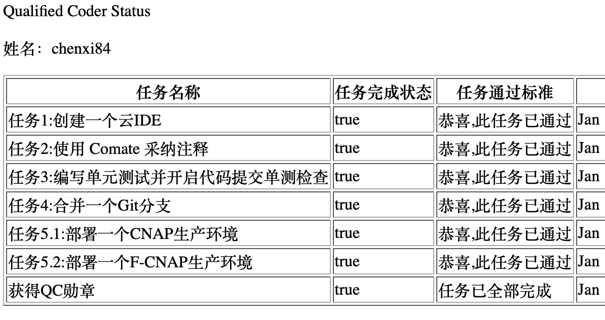
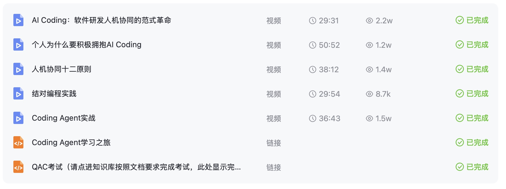
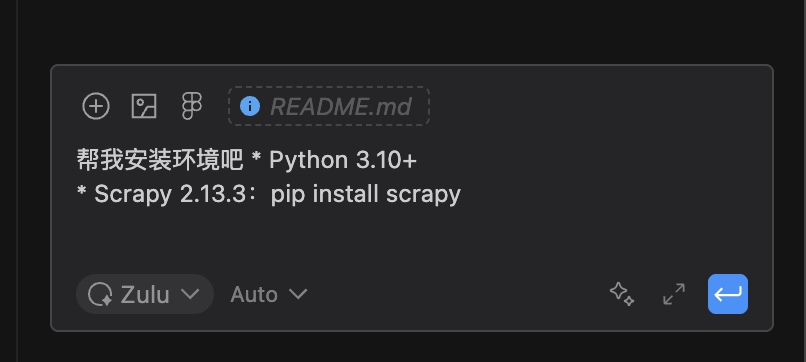
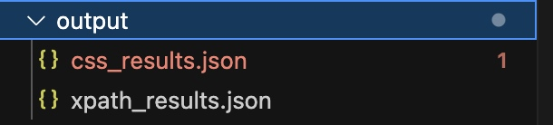
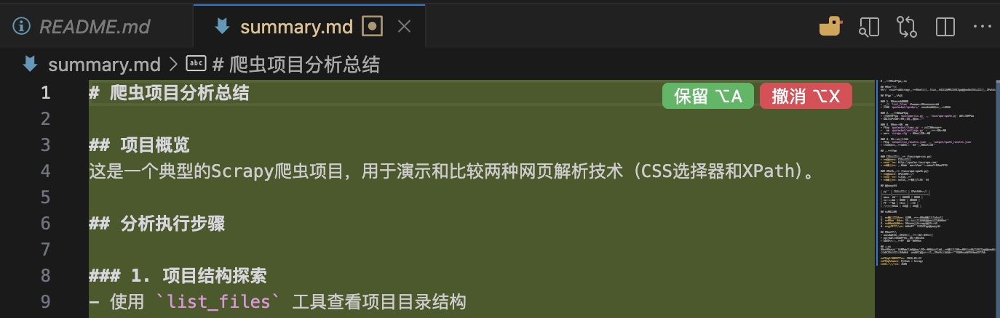
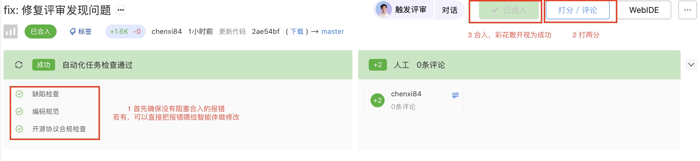

# QAC 考试指南

> QAC 考试是在 QC 的基础上，新增 Coding Agent 使用能力要求。

---

## 一、准备工作

### 1.1 开始 QAC 考试前请先确保通过了 QC 考试，并完成了 QAC 考试的理论学习

- **查看 QC 考试状态**：[QC 考试状态查询](http://example.com)
  > 注意：任务 5.1 和 5.2 只需择一进行完成，不要像笔者冤种一样以为都要完成多花了一些时间




- **完成 QAC 理论课学习**：[QAC 认证课](http://example.com)
  - 视频课程：进度条直接拉到最后
  - 文档课程：页面直接拉到最后




### 1.2 确保下载好了 IDE

- [Comate AI IDE 厂内远程开发](http://example.com)

---

## 二、创建并打开代码库

### 步骤 1

如果你已经完成了 QC 考试，那么肯定已经拥有了个人代码库。

### 步骤 2

创建 QAC 考试专属代码库

- 点击括号内链接即可：[http://console.cloud.baidu-int.com/devops/icode/repos/new?from=qac&template=qac-python](http://console.cloud.baidu-int.com/devops/icode/repos/new?from=qac&template=qac-python)
  > 注：点完就已经完成了创建，可以点击侧边栏代码库确认创建成果，可以看到如下以自己 id 命名的条目


### 步骤 3

在客户端打开代码库

1. 进入上述 QAC 专属代码库
2. 点击右上方「webIDE」，点击「客户端打开」


---

## 三、按步骤完成以下任务

### 步骤 1

在右侧命令行输入以下命令（确保是在 Zulu 智能体模式下），按下回车后它会进行一系列自我思考，执行它给出的命令：

```
帮我安装环境吧
```

- Python 3.10+
- Scrapy 2.13.3：`pip install scrapy`




> 这一步一般会自动构建虚拟环境，并在虚拟环境中安装 scrapy，但也不排除没有建虚拟环境的情况。
> 审阅智能体的执行过程，如果它没有构建虚拟环境，记得在 chat 中及时地提醒它。

**最终确保终端到达这一步：**

```bash
[root@10.00.00.000 chenxi84]$ source venv/bin/activate
(venv) [root@10.00.00.000 chenxi84]$ scrapy version
Scrapy 2.13.3
```

---

### 步骤 2

输入以下提示启动爬虫项目（期间会安装完整的 Scrapy 依赖包，一路点击执行等待终端的包安装完毕即可）：

```
#quotesbot 帮我启动基于 XPath 表达式的爬虫
```

- 这期间观察它是否有执行以下终端命令，若无，则手动执行：

```bash
source scrapy_env/bin/activate && cd quotesbot && scrapy crawl toscrape-xpath
```

- 该步骤结束后会出现 output：




---

### 步骤 3

点击右侧对话框右上角加号，新增对话窗口，输入以下指令：

```
帮看下这个项目中有几个爬虫，代码在什么位置，是如何实现的，有什么差异
```

---

### 步骤 4

输入以下指令进行过程性总结：

```
帮我总结刚刚执行的步骤，并生成一个名为 summary.md 的 markdown 文件，存储在当前项目的根目录下
```

- 该步骤结束后进入根目录下新增的 summary.md，点击保留




---

### 步骤 5

切换到 plan 智能体，在对话框输入以下指令：

```
输出技术方案 MD 文档，可获取当前项目 2 个爬虫的运行结果，自动对比抓取数量、内容是否一致，文档中明确实现功能、关键修改点与实现步骤，方案评审确认后再修改代码
```

> 在这期间它也许会问你是否要保存在 `./comate/plan.md`，但也可能是其他路径其他命名，请关注，如果不是的话可以手动在 chat 中让它保存在 `./comate/plan.md`。也可以在生成 md 后手动移动并重命名到 `./comate/plan.md`


---

### 步骤 6

确保 `./comate` 目录下有 plan.md 后，依旧点击保留，继续在对话框中输入以下指令：

```
设计满足要求，请按照 plan.md 实现步骤完成代码修改，同时完成自测，生成测试报告
```

---

### 步骤 7

目测测试报告，预期效果是：

- ✅ 2 个爬虫的抓取结果应该一致
- ✅ 有 100 条数据且内容一致

> 如果报告里显示与此有出入，比如数据数量、内容不一致，可以输入这句指令：
>
> ```
> 预期 2 个爬虫的抓取结果应该一致，有 100 条数据且内容一致，可以用 diff 工具二次确认
> ```

---

### 步骤 8

输入以下命令，完成结果文件生成：

```
帮我总结刚刚执行的步骤，并生成一个名为 result.md 的 markdown 文件，存储在当前项目的根目录下
```

---

### 步骤 9

手动/让智能体提交代码到个人专属代码库，可自己 +2，之后合并到 master 分支




---

## 四、完成

点击 QAC 任务说明查看是否获得 QAC 勋章认证，如下即成功完成 QAC 考试：


