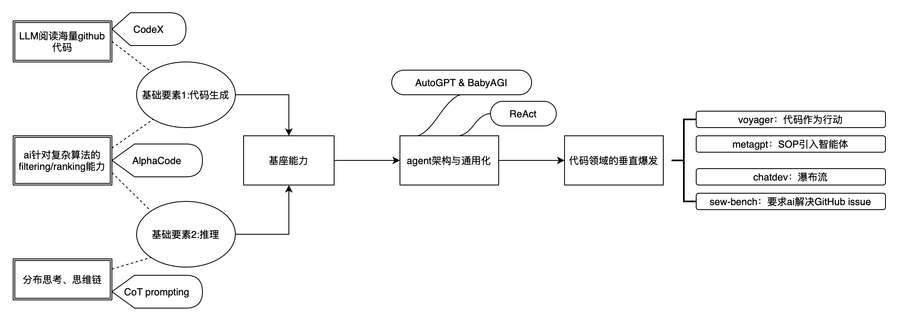
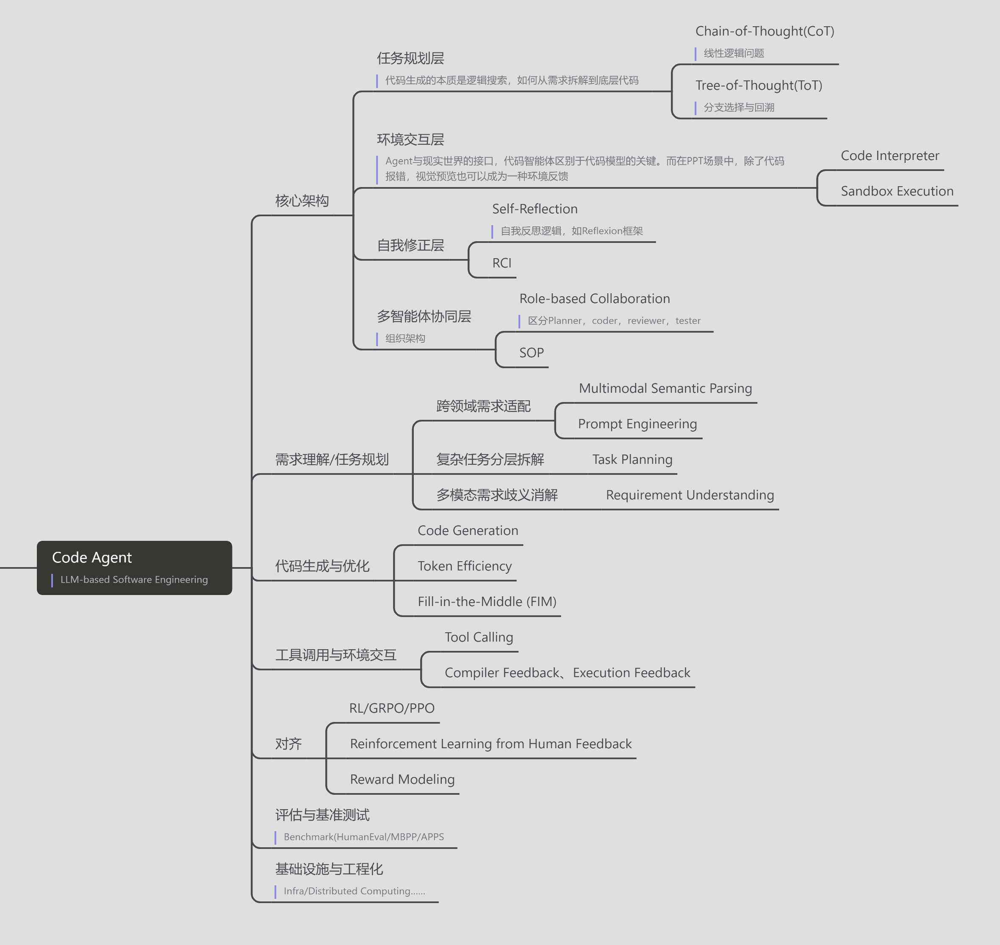
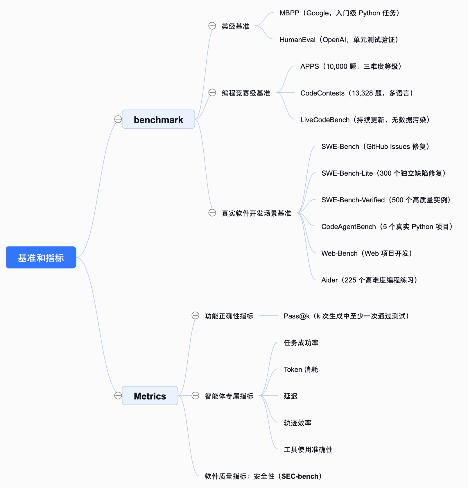
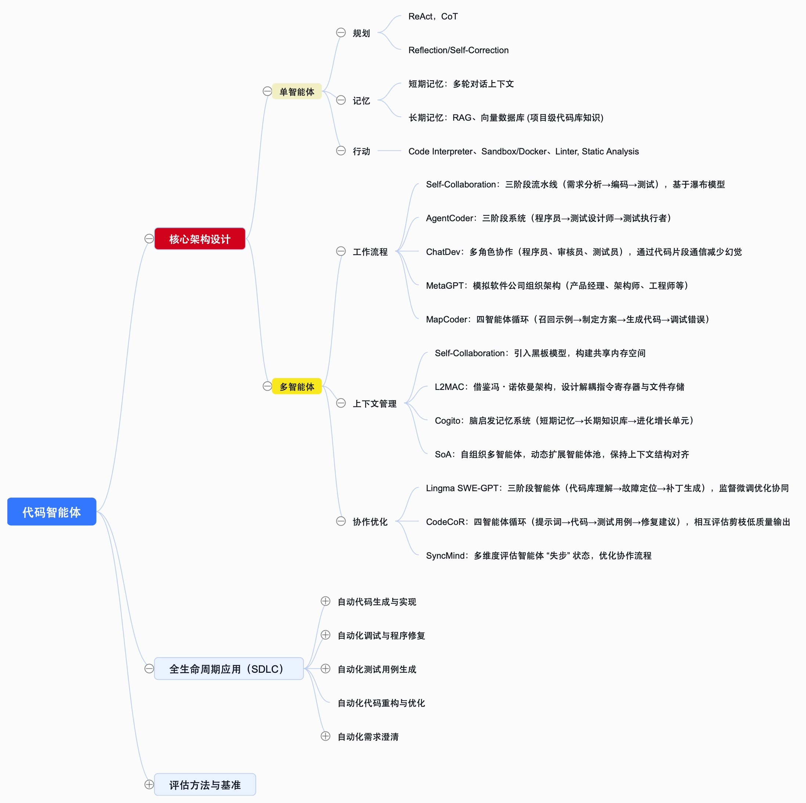
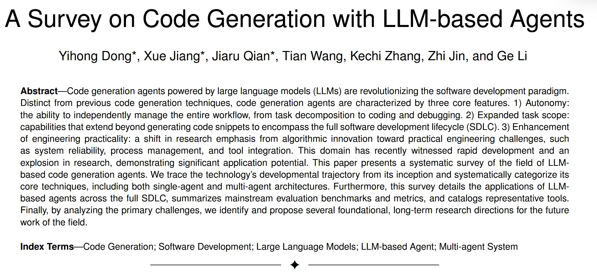
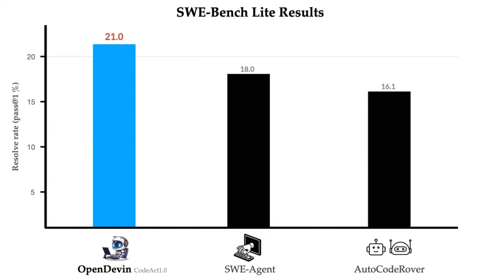
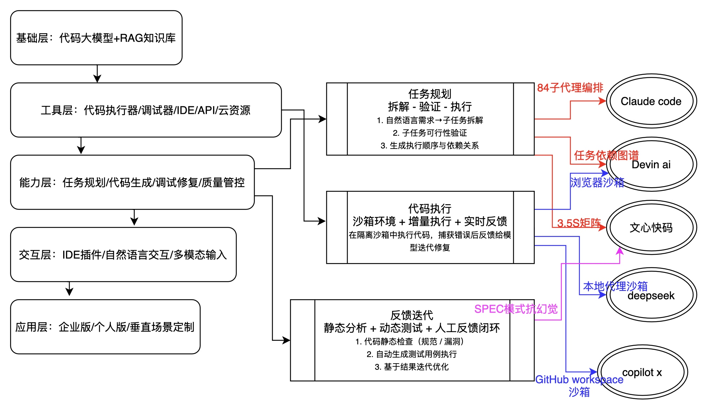

# Code Agent 前沿技术体系调研

> 这是我作为代码智能体领域初学者，开展的一份偏广度优先的调研知识库。

初期并未急于钻入某一技术细节，而是先搭建了全局认知，系统梳理了代码智能体的概念提出（新增）、技术架构、核心方法、产品定位（新增）、业界主流做法（新增）和前沿进展，试图理清其发展脉络与行业趋势。为了方便后续针对具体方向深入学习，我在调研中整理了各类技术对比表、前沿工作清单等结构化内容，作为后续定向深挖的索引。

目前这份知识库以框架性、概览性内容为主，更多技术细节（如具体模型的代码逻辑、业务落地的实操步骤）会随着后续调研逐步补充更新，也希望能通过持续完善，让它成为自己入门与进阶的实用参考。

---

## 目录

- [一、代码智能体概念的提出](#一代码智能体概念的提出)
- [二、有关 Code Agent 的知识拆解](#二有关-code-agent-的知识拆解)
- [三、技术演进的逻辑](#三技术演进的逻辑)
- [四、代码智能体定位分析](#四代码智能体定位分析)
- [五、指令微调数据构造](#五指令微调数据构造)
- [六、工业界主流做法](#六工业界主流做法)
- [七、论文精读笔记](#七论文精读笔记)
- [八、代码阅读](#八代码阅读)

---

## 一、代码智能体概念的提出

在探讨代码智能体这一概念的提出之前，必须厘清它与上一代技术的区别。

| 关键技术 | 描述 |
|---------|------|
| **Code Copilot** | 基于 Next Token Prediction。用户是主导者，AI 仅根据上下文补全代码片段。它是无状态的，不具备对整个项目的感知和规划能力。 |
| **Code Agent** | 基于 Perception-Action-Feedback Loop。AI 具备自主性，能够拆解复杂需求、规划路径、使用工具（编译器、终端），阅读报错并自我修正，最终交付完整的代码仓库或解决 Issue。 |

> **概念提出的核心驱动力**：LLM 推理能力的涌现与上下文窗口的扩大，使得模型不再满足于写代码，而是开始尝试做工程。

需要明确的是「代码智能体」的概念并非由单一文献首次独创，暂且将其的发展分为四个阶段：

### （0）基座能力

在此阶段，代码智能体的概念尚未正式成型，但基础要素，即代码生成与推理已具备。




---

### （1）突破传统代码生成的被动模式：工具调用/规划/反思能力

#### ReAct

首次提出「LLM + 工具调用 +分步推理」的智能体范式

> "LLMs can act as agents by interleaving thought, action, and observation to solve problems."

代码生成从「单轮输出」转向「闭环交互」

[流程图]

| 对比项 | 描述 |
|-------|------|
| Standard Prompt | 只输入问题 |
| CoT | 回答中只保留 thought |
| Act-only | 回答中只保留 action 和 observation（如 SayCan、WebGPT） |
| ReAct | 回答中保留 thought、action 和 observation |

#### Reflexion

「自我反思机制」

> "LLMs self-review previous attempts, identify errors, and refine next actions"

语言反馈信号：将传统梯度更新中的参数信号转变为添加在大模型上下文中的语言总结，agent 在下一个 episode 中能参考上次执行失败的经验

#### Voyager

首个 LLM 驱动的代码生成 + 开放世界交互智能体

虽然是 Minecraft 智能体，但它提出了「Code as Action」和「技能库进化」的概念

---

### （2）多智能体协作框架成型

2024 年顶会论文才开始在表述上将「代码生成」与「智能体」结合，虽术语表述未完全统一，但已形成明确的代码智能体形态

#### ChatDev

首次提出「多 LLM 智能体协作开发框架」，明确用智能体模拟软件开发团队角色，即程序员、测试员、审查员

- 通过对话协作完成端到端开发
- 首个规模化落地的代码智能体系统

> "Multi-LLM agents play different software development roles, collaborate through dialogue to complete end-to-end development"

#### MetaGPT

引入 SOP 构建模拟软件公司的多智能体流水线

---

### （3）正式定义

2025 年综述论文首次系统梳理该领域，明确「代码智能体」术语、定义及核心特征，完成概念的规范化

- **《A Survey on Code Generation with LLM-based Agents》**首次正式定义「代码智能体」：

> "Code generation agents powered by LLMs are revolutionizing software development, characterized by autonomy, expanded task scope, and enhanced engineering practicality"

- **同期综述《Large Language Model Agent: A Survey on Methodology, Applications and Challenges》**进一步佐证：

> "Code agents are a key branch of LLM agents, which integrate planning, tool use and reflection to automate software development"

---

## 二、有关 Code Agent 的知识拆解

### 2.1 我建立的代码智能体知识树




「代码智能体」是一个复合概念，它不仅涉及底层的 Code Generation 能力，更融合了 Planning、Tool Use 以及 Multimodal Understanding 等等。

要对代码智能体这一母题进行系统性的调研，直接检索这一词汇很难具有针对性和深度。为了建立自己的代码智能体知识树，我围绕其进行了一个关键词拆解。

---

### 2.2 前沿工作梳理

我梳理前沿工作的主要思路是先在 benchmarks 和 leaderboards 上选择代表性的工作，再将其按照不同的侧重维度进行分类。以下是几个本文业务最相关的基准和指标：

| 名称 | 核心定位与特点 | 评估维度 | 规模与数据 | 局限性/注意点 |
|------|---------------|---------|-----------|---------------|
| **EvalPlus** | HumanEval 的「压力测试」强化版。通过自动生成大量角落用例，检验代码的健壮性和深度正确性 | 代码功能正确性（严苛版） | 基于 HumanEval 的 164 题，但每题平均测试用例从 ~7.7 个增至约 80+ 个 | 仍局限于单函数生成，不评估多文件、上下文理解或工具使用等 Agent 高级能力 |
| **BigCodeBench** | 面向真实、复杂编程任务的基准。任务源自真实的 GitHub Issue 和 Pull Request，强调实际解决问题的能力 | 真实世界编程任务 | 约 1,140 个高质量任务，覆盖 Python、Java 等多语言，来自真实的开源项目上下文 | 任务描述和上下文可能仍较精简，与处理完整仓库的极端复杂性仍有差距 |
| **Big Code Models Leaderboard** | 代码大模型的综合能力排行榜。汇总多个主流代码基准的结果，提供模型综合评分 | 代码生成综合能力 | 动态更新，收录数十个模型在多个基准上的表现 | 评估的是基座模型的「一次性生成」能力，不直接评估 Agent 特有的规划、工具使用、多轮交互等能力 |
| **Chatbot Arena Leaderboard** | 基于众包人类偏好投票的 LLM 通用能力排行榜。采用「匿名对战」的 Elo 评级机制 | 人类主观偏好 | 超百万次的人类投票，涵盖几乎所有主流开源和闭源模型 | 不专门针对代码，代码能力只是其综合表现的一部分。结果较主观，且可能受模型知名度影响 |




---

### Code Agent 技术栈解耦

Code Agent 的技术栈被我解耦为三个正交的维度：负责代码逻辑生成的（1）**基座模型**，将其视作大脑；负责规划、反思与执行的（2）**Agent 机制**，将其视作 workflow；（3）涉及前端 UI 还原与多模态交互的**垂直场景**，将其视作 perception。分这三个维度去进行前沿探索。

针对这一块，我尚且没有每一篇文章都去细读，只是构建一个自己的知识树，针对每一个模块整理出了经典的/SOTA 的论文，便于日后对具体方向进行深入学习时能精准定位。

---

### （1）Foundation Models

| 工作 | One-liner | 备注 |
|------|-----------|------|
| **Code Llama** (Meta, 2023) | RoPE 扩展上下文和 Code-Infilling 的标准微调范式 | （已读）理解它是为了看懂所有后续模型的「魔改」基础 |
| **DeepSeek-Coder V1** (2024.01) | 引入 FIM 与仓库级数据构建策略 | 学习其如何构建跨文件依赖的数据集，对私有化训练极具参考 |
| **Qwen2.5-Coder** (Alibaba, 2024.09) | 在多语言和指令跟随上表现卓越 | 自己部署模型做后端服务 |
| **DeepSeek-V3** (2024.12) | 通过 MLA 架构和 MoE 实现了推理成本与性能的极致平衡 | API 极其便宜且性能霸榜 |
| **Qwen3-Coder** (Alibaba, 2025.08) | 在 SWE-bench Pro 上击败了早期 GPT-4o，是目前本地部署 Agent 的首选基座 | 私有 Agent |
| **GPT-5.2 Codex** (OpenAI, 2025.12) | 推理天花板：引入了 "Medium/High Reasoning" 模式，专门解决长依赖代码重构 | 目前人类能做到的 AI 编程极限，SWE-bench Pro > 70% |

---

### （2）Agentic Workflow

| 工作 | One-liner | 备注 |
|------|-----------|------|
| **ReAct** (ICLR 2023) | "Reasoning + Acting" 的交替执行范式 | 一切 Agent 的鼻祖，理解了它就理解了 LangChain 的底层逻辑 |
| **OpenCodeInterpreter** (2024.2) | 验证了「执行反馈（Execution Feedback）」对代码修复的决定性作用 | （已读）虽然模型旧了，但它证明了「把报错喂回给模型」这条路是通的 |
| **Agentless** (2024.07) | 反直觉地去掉了复杂的 Planning，只用简单的两阶段流程刷榜 | 启示：与其设计复杂的 Agent 状态机，不如把 Prompt 写好、把基座模型选好 |
| **OpenAI o1 / CoT** (2024.09) | 将搜索和尝试内化为模型的「隐式思维链」，不再依赖外部 Loop | 暗示未来的 Agent 可能不需要复杂的外部框架，而是通过 Test-Time Compute 解决问题 |
| **DeepCode: Open Agentic Coding** (2025.12) | 将代码生成视为「信道优化」问题，解决了上下文过载导致的幻觉 | 提出了蓝图蒸馏（Blueprint Distillation），非常适合咱们处理超长的 PPT XML 结构 |
| **Live-SWE-agent** (2025.11) | 提出了「Runtime Evolution」，Agent 可以在解决 Bug 的过程中修改自己的 Prompt 和工具 | Agent 是活的 |

---

### （3）UI/Design Generation（垂类场景）

| 工作 | One-liner | 备注 |
|------|-----------|------|
| **Design2Code** (2024) | 建立了前端设计图还原的评测基准，关注视觉对齐 | 其中的 Visual Similarity 评估指标，可直接复用于我们的 PPT 还原度测试 |
| **Claude 3.5 Computer Use** (Anthropic, 2024.10) | 展示了模型直接操作 GUI 的能力 | 这种看屏幕操作的能力，是 PPT 生成服务从生成代码转向自动化排版的终极形态 |
| **OmniParser** (Microsoft, 2024.10) | 专门用于解析屏幕截图中的功能区域，转化为结构化数据 | 微软刚发布的屏幕解析器，能极精准地识别 UI 元素，对我们解析 PPT 截图布局极有帮助 |
| **Paper2Code** (2025.4) | 输入一篇 PDF 论文，自动提取公式和逻辑，生成可执行的 Python 代码 | 既然能从论文生成代码，那从产品需求文档 PRD 直接生成 PPT 代码也就指日可待了 |
| **Agent-based Gammapy** (2025.09) | 针对特定科学框架 Gammapy 微调的 Agent | 「通用 Agent 不如专用 Agent」 |
| **VinciCoder** (2025.11) | 摒弃传统基于规则的文本奖励，直接从视觉获取奖励信号 | （已读）见下文 |




上图根据综述 A Survey on Code Generation with LLM-based Agents（2025.7）绘制




通过前期对代码生成智能体的系统性梳理，代码智能体的核心价值在于「自主性」与「工程实用性」的双重突破。

不同于传统代码生成模型的被动响应，智能体通过规划、记忆、工具调用与反思四大核心组件，实现了从任务分解到调试优化的全流程自主闭环，尤其在多智能体系统中，通过流水线分工、角色协作等模式，已能模拟真实软件开发的团队协作逻辑，这与百度文库 PPT 生成、电子相册制作等复杂业务的自动化需求高度契合。另外，应用场景已全面覆盖软件 SDLC，但垂直领域适配仍有深挖空间。

从代码生成、调试修复到测试用例生成、需求澄清，智能体的能力已渗透到开发全流程，但在多模态融合，如图文转 PPT 代码、领域专属数据构造、轻量化部署等场景，现有方案仍需结合业务特性优化，这也正是本文后续调研的核心方向之一。

---

## 三、技术演进的逻辑

在这次调研开始前，我以为 Code Agent 只是更强的 Copilot。但随着调研深入，我发现这不仅仅是模型能力的提升，更是一场关于「容错」与「交互」的范式革命。

### 3.1 范式转移分析：为什么不能只用 LLM？

| 模式 | 流程 | 特点 |
|------|------|------|
| 传统 code-gen | Input → LLM → staticCode | 依赖概率，缺乏容错 |
| Code Agent | Input → Plan → [Act ↔ Observe] → FinalResult | 依赖闭环，具备稳定性 |

在理解了 Agent 需要试错后，就需要进一步探究了它是如何实现的。这里涉及到两个关键器官：

---

### （1）执行与 Sandbox

重点看了两个工作：SWE-agent、OpenDevin

通过开源社区的力量复刻、改进和创新 Devin。OpenDevin CodeAct1.0 在 SWE-Bench-Lite 上在无辅助的情况下实现了 21% 的通过率，相比此前的 SOTA SWE-Agent 提升了 17%。

> "Code Less, Make More"

OpenDevin 系统分为前端和后端两个主要部分。前端负责处理用户交互和显示结果，而后端负责处理业务逻辑和执行 Agent，目前仍在开发中。




代码生成出来得有个地方跑。看过 OpenDevin 和 SWE-agent 后就会发现，它们都做得很重——不仅仅是一个 Python 解释器，而是包含文件系统、Linter 甚至浏览器的完整 Docker 容器。

此外，状态反馈的粒度至关重要。早期的 Agent 只能看到 Exit Code 1 报错，现在的 SOTA Agent 还能看到「文件是否生成成功」、「图片大小是否为 0」。

---

### （2）自我修正机制

跑出报错后，怎么让模型自己修？直接把报错贴回去管用吗？

两个代表工作：**Reflexion**、**OpenCodeInterceptor**

简单的贴报错效率很低。高效的机制需要归因。OpenCodeInterceptor 的源码里甚至会把用户的原始需求再强调一遍，防止模型修 Bug 时修歪了。

---

### 3.2 针对 PPT 生成的几个业务痛点调研出的优化逻辑

#### （1）关于 Token

这部分调研我投入了比较大的精力，因为对于 PPT 生成这种高频、长文本的业务来说，Token 效率直接决定了商业模式是否成立。

---

##### A. 如何省 Token

经过检索，整理出以下四大类主流方法：

| 参考文章/博客 | 方法 | 具体手段 | 原理自述 | 备注 | 适用场景 |
|--------------|------|---------|---------|------|---------|
| DeepSeek-R1 Tokenizer 详解 | 底层 tokenizer 优化（也就是物理层面的改造） | 定制化词汇表、字节级 BPE 增强、领域适配预分词 | 针对代码或者数学场景优化词汇表，新增编程关键字、缩进标记、公式符号的专属子词，减少冗余分词；通过三层架构，也就是预分词 + ByteLevel 编码 + 扩展子词，提升压缩率 | 这种改法成本是不是太高了？如果我们要复用开源的 Llama 3 权重，单纯修改 Tokenizer 会导致权重不匹配，这是否意味着必须从头预训练？ | 全场景代码生成，尤其适配 Python/HTML/ 数学公式混合场景 |
| 暂未找到具体实践的工作 | 代码结构精简（偷懒） | Custom Tags、核心代码片段生成、AST 级冗余裁剪 | 一言以蔽之：用简短标签替代重复样式，仅生成 Body | 这有点像我们在 IDE 里用的 Snippets。既然 HTML 的 `class="container flex-row..."` 每次都一样，为什么要让模型全写出来？我们可以训练模型只输出 `<$c1>`，然后在后端解析时把它展开。我看到有些工作甚至利用 AST 把注释和空行全砍了，只保留逻辑骨架。模型的推理能力会不会因为 Input 分布的改变而下降？这是一个需要实验验证的 Trade-off。 | HTML/PPT 模板生成、重复样式场景 |
| Practical Code RAG at Scale (2025.10) | 外部资源复用 | 任务感知 RAG 检索、API 调用替代内置代码、外部样式库引用 | 按任务类型设计检索策略，将通用代码、样式库、工具逻辑存储于外部知识库，生成时仅调用标识而非完整代码 | 这篇 Practical Code RAG 给了我很大启发。它主张能抄就别写。对于 PPT 里的 CSS 样式，模型不需要生成几百行代码，只需要生成一个 `import style_v1`。这实际上是把代码生成任务降维成了「检索任务」，Token 消耗直接砍半。 | 需复用模板 / 样式的 PPT / 电子相册生成、多工具协同场景 |
| ASAP：高效代码推理剪枝框架 (2026) | 生成轨迹压缩（这是一种最上层的方案，是一个很未来的方向，我们可以持续关注 ASAP 这种新框架） | 推理步骤剪枝、冗余思考过程剔除 | 基于「首 Token 意外度」指标，保留核心推理步骤，剪枝冗余调试、重复探索的 Token，在不损失准确率的前提下压缩生成轨迹 | 这是一个非常前沿且新鲜的方向。现在的 CoT 模型虽然聪明，但太罗嗦了，总是会输出很多「让我再检查一下」这种无效 Token。ASAP 这个框架提出了一种指标，能计算出哪些思考步骤是废话，在生成时直接把这些分支剪掉，只保留通往正确答案的最短路径。 | 复杂代码推理、多轮调试场景 |

---

##### B. 任务感知 RAG 与定制化 Tokenizer

在梳理完方法总览后，发现单一方法的 Token 压缩率有限，比如 Custom Tags 仅能降低 30% 左右 Token，而 2025 年的前沿工作更倾向「多策略协同」，**任务感知 RAG + 定制化 Tokenizer** 的组合方案，既覆盖底层编码优化，又解决上层资源复用问题，且高度适配百度文库 PPT / 电子相册生成业务，因此后面计划重点看一看该方向。

> **我的一些自我提问与解答：**
>
> - **RAG 检索的代码片段是否会二次引入 Token 冗余？**
>
>   Practical Code RAG at Scale：传统 RAG 采用固定 chunking 策略，易检索冗余代码块；该工作中的任务感知 RAG 可按场景动态调整——代码补全任务用轻量稀疏检索，仅检索核心子函数；而 PPT 生成中需复用样式时，检索标签标识 + 极简样式描述，而非完整 CSS 代码，检索结果的 Token 量降低 60% 以上。
>
> - **定制化 Tokenizer 如何为 RAG「赋能」而非「添乱」？**
>
>   结合 DeepSeek-R1 的 Tokenizer 设计可知：其为代码关键字（def、class）、HTML 标签（div、style）、PPT 专属样式标记（align、layout）设计了专属子词，使检索到的标识性内容分词更紧凑；同时支持自定义特殊标记（如 `<｜ppt_style_1｜>`），可直接映射 RAG 知识库中的样式模板，进一步缩短 Token 长度。

---

#### （2）关于端到端的训练

##### A. 主流范式总览

在研究如何训练我们的 PPT Agent 时，2025 年的风向标已经不再是迷信 SFT，而是转向了 Test-Time Scaling 和 Reinforcement Learning from Execution Feedback。

| 参考 | 流派 | 具体 | 思考 |
|------|------|------|------|
| DeepSeek-Coder-V2: 突破闭源模型在代码智能领域的障碍 | Execution-Aware SFT | 先让模型针对一个问题生成 100 个答案，把能跑通且结果正确的挑出来，作为一个新的数据集反向喂给模型微调 | 对于 PPT 这种「视觉任务」，代码能 No Error 不代表 PPT 好看。如果代码生成了一页纯黑的 PPT，Python 解释器是不报错的，但对于用户显然是不可取的。如何把「视觉审美」也变成 SFT 的筛选标准 |
| DeepSeek-R1 | 结果导向 RL | GRPO / PPO with Verifiers，不依赖人类标注 | 这是 DeepSeek-R1 爆火的核心。不需要人类教，只要有一个确定的评判标准，比如给一个数学答案，让模型自己去试错，它能通过强化学习涌现出惊人的推理能力。但是数学题答案是唯一的，但 PPT 设计是主观的。此外还有 reward 太稀疏的问题，模型在中间步骤会不会迷失 |
| 经典重读：Let's Verify Step by Step | 过程奖励 | 训练一个独立的 Critic 模型，给生成的每一行代码打分。发现逻辑不对立刻掐断，而不是等到最后 | OpenAI 的 Prover-Verifier-Guided 策略。标注成本太高了！去哪里找这么多资深程序员来给每一行代码打分？ |
| ReLook: Vision-Grounded RL with a Multimodal LLM Critic for Agentic WebCoding | MLLM 对截图进行多维度评分（布局、色彩、一致性）+ 可执行性零奖励规则 |
| RRVF: Visual Reinforcement Learning with Reasoning, Rendering, and Visual Feedback | 基于「验证不对称性」原则，用视觉验证替代深度推理 |
| PreGenie: An Agentic Framework for High-quality Visual Presentation Generation | 多智能体协作 + 渲染审查循环 |
| 多模态反馈闭环 | 代码生成 → 渲染图片 → 视觉模型打分 → 反向传播更新策略 | 这是让我兴奋的方向。打通代码和视觉的壁垒。模型是看着效果图写 |

---

##### B. VinciCoder（ViRL）：视觉强化学习打通「代码 - 视觉」闭环

在去年年末刷到的 VinciCoder 的 ViRL 框架，知道它能够摒弃传统基于规则的文本奖励，直接从视觉获取奖励信号。如今找回来细读。

[paper](https://arxiv.org/abs/2511.00391)
[code](https://github.com/DocTron-hub/VinciCoder)


正如我前文的描述，长期以来，多模态代码生成的训练是严重依赖于特定任务的 SFT。尽管这种范式在 Chart-to-code 等单一任务上取得了显著成功，但其「狭隘的训练范围」从根本上限制了模型的泛化能力。

同时，SFT-only 的范式在确保代码可执行性和高视觉保真度方面存在显著瓶颈。

在此背景下，VinciCoder 旨在打破 SFT 瓶颈的统一多模态代码生成模型。首次将强化学习的奖励机制从文本域转向视觉域，提出 ViRL，专攻 SFT 无法解决的视觉保真度难题。

其核心突破在于一套 **Coarse-to-fine** 的视觉奖励机制：

1. **渲染与编码**：模型生成的代码被实时渲染成图像
2. **粗粒度/全局**：通过下采样生成缩略图，评估整体结构的相似性
3. **细粒度/局部**：将高分辨率图像分割为多个 patches，精确计算局部细节的保真度
4. **ViT 奖励模型**：使用 DINOv2-L 计算渲染图像与目标图像在两个粒度上的视觉相似度，作为奖励信号
5. **对齐奖励**：引入一个辅助的语言对齐奖励，用于惩罚生成了错误代码语言，比如：要求 Python 却生成了 LaTeX 的行为
6. **策略优化**：采用 GRPO 算法对模型进行微调，显著提升视觉对齐度和代码可执行性

- [ ] 待办：阅读源码 [code]

---

## 四、代码智能体定位分析

这部分注重厘清业界代码智能体在我们的技术栈和业务里扮演的角色

**大模型和开发工具链的协同中枢**

离散的开发动作 → 整合为 → 端到端的任务执行流程

- ✅ 自动化程度 ↑
- ❌ 替代人类开发者
- ✅ 需求理解精度 + ✅ 工具调用稳定性

---

### 业界项目映射

| 产品 | 定位关键词 | 技术亮点 | 个人体会 | 能力维度 |
|------|-----------|---------|---------|---------|
| **文心快码** | 全栈自动编程智能体，工程化与规范 | 3.5S 矩阵（Zulu/Plan/Architect 分层处理）、SPEC 模式抗幻觉 | 工程化智能第一梯队 | 任务规划、代码质量 |
| **通义灵码** | 企业级智能编程，云原生与中文场景优化 | 通义大模型底座，多模态理解 | 生态适配 + 开源双轨 | 云原生 |
| **Trae AI IDE** | AI 原生 IDE，全链路 | SOLO Coder 智能体 | 设计稿直出代码 (98% 准确率)、语音 / 图像输入 | 多模态 |
| **CodeArts Doer** | 代码智能体但人机协同 | 探索、规范双模式、Agent 知识增强，代码质量自动评估 | 生态适配 + 开源双轨 |
| **DeepSeek Code Agent** | 开源 + 闭源，高性能 | DeepSeek-Coder-V3 (128K 上下文)、多轮任务规划 | 数学 / 算法推理 SOTA、全开源可微调 | 本土化开源 + 闭源双轨标杆 | 算法/数学推理 |
| **GitHub Copilot X** | Workspace 流程自动化 | PR 自动提交、GitHub 生态深度集成、150 + 语言支持 | 生态适配 + 开源双轨 |
| **Claude Code** (Opus 4.5) | 长程任务处理 | 84 个专业子代理 + 15 个工作流编排器、30 小时长任务记忆，规划准确率领先 42% | 工程化智能第一梯队 | 任务规划、长程任务、算法/数学推理 |
| **Gemini Code Assist** | 多模态，视觉驱动开发 | Gemini Ultra 底座，边看边做 (UI 截图 → 代码) | 多模态 |
| **CodeLlama 3** | 开源，本地部署 | 70B 参数版本，支持自定义微调 | 安全性 |

---

## 五、关于数据：顶级 Code Agent 模型指令微调数据构造

- [ ] 待办

---

## 六、工业界主流做法（主流趋势 + 比较异同）

### 6.1 工业界主流选型范式

工业界目前主要分为**专用代码大模型**和**通用大模型适配**两大路线

| 技术路线 | 核心 | 代表 | 优势/挑战 |
|---------|------|------|-----------|
| **专用代码大模型原生开发** | 基于纯代码大模型构建智能体，模型训练数据 80%+ 为代码 / 技术文档 | DeepSeek（DeepSeek-Coder-V3）、Meta（CodeLlama 3）、百度（ERNIE-Code 4.0） | ✅ 代码生成准确率高、算法推理能力强、幻觉率低 ❌ 多模态能力弱、通用语义理解稍差 |
| **通用大模型代码方向微调** | 基于通用大模型（GPT-4o/Claude Opus/Gemini Ultra）做代码领域 SFT+RLHF | GitHub Copilot X、Anthropic Claude Code、谷歌 Gemini Code Assist | ✅ 通用能力强、多模态融合易、生态适配性好 ❌ 代码领域专业性稍弱、定制成本高 |
| **混合底座（双模型）** | 用大模型做任务规划 + 专用代码模型做代码生成 | 文心快码、Trae AI IDE、华为 CodeArts Doer | ✅ 兼顾通用性与专业性、工程化能力强 ❌ 架构复杂、资源消耗高 |

---

### 6.2 工业界通用范式

如第一模块中所言，当前代码智能体的主流架构已形成**分层式智能体架构**，替代早期的单一生成模型，核心分为 5 层




---

### 6.3 落地

#### （1）代码生成：从片段生成到项目级生成

- **基础能力**：单函数 / 单文件代码生成基于上下文补全——所有产品标配
- **进阶能力**：项目级代码生成，多文件联动——头部产品核心竞争力
  - 主流做法：架构设计 → 模块拆分 → 代码生成 → 依赖关联四步，先生成项目架构图，再分模块生成代码（文心快码 / Trae AI / Devin AI）

- **差异化优化**
  - 国内厂商侧重：中文注释、本土化业务逻辑
  - 海外厂商侧重：开源项目兼容、多语言适配

---

#### （2）端到端

这一块笔者较为关注

##### A. 业界主流（对标组内现有业务）

**「结构化生成 + 多模块协同」」**

1. **混合式生成路径（国内）**
   - 逻辑：静态分析（文档解析/拆块）+ 大模型（内容生成/布局）+ 模板渲染
   - 案例：中科院 PPTAgent（开源工具），「文档分析→大纲草拟→幻灯片生成→迭代修正」两阶段编辑法，内置 PPT Eval 评估框架
   - 与我们基于 ChatGLM + 静态拆块的国内端到端链路一致，其自评估模块可考虑解决组内效果量化评估痛点

2. **多智能体协同框架（海外）**
   - 逻辑：专项 Agent 分工协作，串联数据、生成、设计、本地化全环节，适配企业复杂场景
   - 案例：Amazon 云方案 - Strands Agents + Bedrock Claude，内置大纲生成、PPT 制作、翻译三大核心 Agent，对接企业异构数据源（RDS/Redis/S3），实现数据调用 → 内容填充 → 可视化 → 多语言适配全自动化
     - Strands Agent：开源 Agent 开发 SDK，2025 年 11 月正式普及，仅需几行代码即可定义、运行与监控 AI Agent，无需开发者关注底层架构
   - 海外版本的 OCR-VL + SAM3 分层链路，可借鉴其 Agent 标准化协作思路，优化图层拆分、背景切割的流程串联

##### B. 较前沿，未在业界成熟落地

1. **多源数据联动（2025.12）**
   - 商汤小浣熊 3.0 实现私域数据 + 外部信息融合。百万级数据秒级处理，自动生成带规范图表的 PPT 并实时更新
   - Amazon 方案可直接从财务数据库提取数据，通过 QuickSight 生成符合企业规范的图表

2. **生成-评估-迭代闭环**
   - PPTAgent 的 Eval 框架，生成后自动校验「内容与文档一致性」「布局合理性」「风格统一性」，对乱码、重复内容、背景不依从等问题自动迭代优化，可将可用率从 83% 向 90%+ 突破
   - 可基于该思路，为国内版本搭建轻量自检模块，针对性解决 Seedream4.5 的乱码、重复问题，减少人工评审成本

3. **跨模态深度联动生成**
   - 核心：融合文本、语音、3D 元素，生成「可交互 + 多感官」PPT，跳出传统静态图文局限
   - Canva Magic Studio 可画最新功能，支持「文本文档 + 语音指令」双输入，生成带动态转场、3D 图表的 PPT，同时支持语音讲解自动匹配页面节奏
   - 微软 Copilot 可将 PPT 内容同步生成演示视频，实现 PPT + 演示脚本一体化输出
   - 多模态 PPT 可延伸该方向，在 Seedream4.5 组图生成基础上，增加图文 → 语音讲解联动，适配出海学习场景

4. **轻量化边缘端端到端**
   - 核心：通过模型量化 + 本地缓存，实现离线端到端生成，解决高清渲染耗时问题
   - 将 Diffusion 模型量化为 4bit，结合本地素材缓存，使 1920×1080 分辨率 PPT 单页渲染耗时从 7s 压缩至 3.5s，同时支持离线分层编辑（OCR+SAM3 本地部署）
   - 参考：http://www.shturl.cc/d170bb33e260af6bedffb590be5685db
   - **本地素材缓存**：通过 AWS 边缘部署方案（Gen AI at the Edge，2025.5），将高频 PPT 素材、模板本地缓存，减少云端调用延迟，进一步优化耗时
   - **OCR+SAM3 本地部署**：SAM3 模型（2025.11，技术解析）
   - 优化国内版本 Inpaint 微调后的推理效率，平衡高清与速度

---

#### （3）多模态能力：视觉驱动开发成趋势

这一块笔者较为关注

- **输入侧**：将自然语言、图像、语音、设计稿、截图、视频等模态信息，转化为代码开发可理解的结构化需求
- **输出侧**：除代码外，可生成可视化流程图、代码执行结果预览、语音解释、图文调试报告等多模态反馈

| 输出类型 | 成熟度 |
|---------|-------|
| 代码 → 可视化图表（流程图 / 架构图） | 成熟（90% 厂商支持） |
| 代码 → 自然语言文档（注释 / 接口文档 / 设计文档） | 成熟（95% 厂商支持） |
| 代码 → 语音 / 视频讲解 | 进阶（70% 厂商支持） |
| 代码 → 执行结果可视化（动态演示） | 进阶（65% 厂商支持） |
| 代码 → 合规化多模态报告（图文 + 数据） | 高端（40% 厂商支持） |

> 核心目标可以被定义为降低代码开发的**模态转换成本**，比如说如设计师 → 开发者的沟通成本，亦或是用户口头需求 → 代码的转化成本

业界多模态能力（专指代码智能体）的能力实现核心差异可以视为在于模态转换的核心载体具体是什么：

| 方案 | 描述 | 代表产品 |
|------|------|---------|
| **端到端多模态大模型** | 基于统一多模态基座直接完成非文本输入到代码的转换 | Gemini Code Assist、GitHub Copilot X、Anthropic Claude Code |
| **模态转换 + 代码大模型** | 分为两步，专用模态解析模型把图像/语音/视频转为结构化文本需求 → 代码大模型。多轮转换易丢失信息 | 文心快码、Trae AI IDE、通义灵码 |
| **插件化模态处理** | 核心代码模型 + 独立多模态插件（OCR 插件/语音转文字插件）。不适合复杂场景，pass |

---

### 针对代码 → 多模态输出的核心技术挑战

| 挑战 | 描述 | 现状 | 解决方案 | 代表产品 |
|------|------|------|---------|---------|
| **逻辑幻觉** | 生成的图表 / 文档与代码实际逻辑不符 | 平均幻觉率 5%-8%（大模型路径）vs 0.5%（静态分析路径） | 静态分析结果作为事实锚点，约束大模型生成，自动校验 | 文心快码、Claude Code |
| **专业性与通俗性平衡** | 技术人员觉得文档太浅，非技术人员觉得太专业 | 仅 30% 厂商支持多风格切换 | 支持受众选择（研发 / 产品 / 审计），自动调整语言风格；关键技术点可展开 / 收起（交互式文档） | Claude Code、通义灵码 |
| **大规模代码库处理效率** | 10 万行以上代码库生成可视化 / 文档耗时超过 10 分钟 | 主流支持增量生成，但全量生成效率仍低 | 分层生成：先生成整体架构，再按需生成模块细节；预缓存：高频代码片段的分析结果缓存 | GitHub Copilot X、JetBrains AI |
| **行业合规适配难** | 不同行业（金融 / 军工 / 医疗）的文档 / 图表规范差异大 | 仅头部厂商支持行业定制模板 | 提供行业模板库（金融 / 军工 / 医疗）；支持企业自定义合规规则，自动校验文档完整性 | 华为 CodeArts Doer、文心快码 |

---

### 6.4 行业趋势

#### （1）主流趋势

- **全流程自动化**：自主完成软件工程生命周期
  - Devin AI、Claude Code

- **垂直场景定制**：针对金融 / 量化 / 嵌入式 / 前端等场景做专用智能体
  - DeepSeek、CodeArts Doer

- **多智能体协作**：跨团队 / 跨工具链的智能体协同，开发智能体 + 测试智能体 + 运维智能体联动

- **开源化**：核心模型 / Agent 框架开源，降低企业定制成本
  - DeepSeek、CodeLlama 3

- 针对多模态这一块：交互式 / 个性化定制深化 / 多模态内容融合

#### （2）核心挑战

- **幻觉问题**：代码逻辑错误 / 依赖缺失仍时有发生，工业界通过「SPEC 模式 / 沙箱执行 / 多轮验证」缓解，但未完全解决
- **长项目理解**：10 万行以上代码库的上下文理解仍有瓶颈，依赖「分层索引 + 关键信息提取」
- **安全合规**：代码智能体生成的代码可能包含开源协议违规 / 漏洞，需强化事前检查
- **成本控制**：大模型推理成本高，工业界通过「模型量化 + 分层推理 + 缓存」降低成本

---

## 七、论文精读笔记

### 7.1 PPTAGENT: Generating and Evaluating Presentations Beyond Text-to-Slides

#### 0) 论文对企业级 PPT 生成问题的定义，和我们业务的对齐方式

论文在摘要里把任务难点定义得很产品化：

> "requires accommodating content quality, visual appeal, and structural coherence."

这句话我读完的第一反应是，它不像学术论文那种指标驱动的表述，更像我们周报里说的「可用率」「美观度」「高度控制」「依从性」「逻辑性」在同一个篮子里。

它也明确指出已有方案的偏科：

> "Existing methods primarily focus on improving and evaluating the content quality in isolation, overlooking visual appeal and structural coherence"

如果只把 word2ppt 当抽取摘要+模板填空，那确实容易出现周报里提到的页面排版、美观度明显不足/内容排版稳定性这类系统性短板。

---

#### 1) PPTAGENT 的核心思路：把 PPT 生成从产物生成改成编辑动作合成

他们在 Problem Formulation 里给了最关键的对比句：

> "Instead of creating slides from scratch, PPTAGENT generates a sequence of executable actions to edit reference slides, thereby preserving their well-designed layouts and styles."

我从企业应用角度读到的隐含假设：

- 企业 PPT 的风格资产在参考演示文稿里（历史宣讲稿、品牌模板、销售 Deck）。现在调研 canva 模板和竞品，其实就是在找参考分布
- 一旦采用 edit-based，优化对象就从生成模型的审美变成参考选择 + 编辑动作的稳定性。这和我们工程化最合拍——因为动作是可回放、可诊断、可统计的

---

#### 2) Stage I：参考 PPT 分析 = 给 router/模板库补上语义层

论文把 Stage I 写得很明确：

> "we analyze reference presentations through slide clustering and schema extraction"

并且把 slide 分两类（这点对演示类 PPT 端到端很关键）：

> "Slides can be categorized into two main types … structural slides … and content slides"

更细一点，它解释结构页怎么做：

> "For structural slides, we leverage LLMs' long-context capability to analyze all slides … identifying structural slides, labeling their structural roles"

**放回业务，我的想法**：

周报里提到 router 在做指令、文档、美化等生成场景分流。如果大胆一点：router 的关键维度应该包含结构页/功能页类型，因为论文 ablation 有说：

> "removing the outline and structural slides significantly degrades coherence"

这直接解释了为什么很多端到端看起来像 PPT，但不像演示，因为没有开场/过渡/结尾，用户体感就是逻辑跳。

---

#### 3) Schema Extraction：其实是企业模板槽位协议的自动抽取

他们对 schema 的定义非常工程友好：

> "each element is represented by its category, description, and content."

读到这里会立刻联想到：

- 传统 PPT 的布局打压策略本质是对 layout space 的先验
- 端到端严格依从（bdjson → 解析 → 拆块 → 每块生成）需要一个块 → 槽位的映射层
- 图片 PPT 编辑/分层（OCR → inpaint → SAM）最终也需要把图层元素归并到可编辑槽位

Schema 在系统里就像一个**中间表示**：生成侧填内容，风格侧换模板/换布局，评估侧做缺槽、超密度、重叠检测。

论文也给了「没有 schema 会怎样」的硬证据：

> "eliminating the slide schema reduces the success rate from 95.0% to 78.8%"

这句对线上系统太重要了，schema 不只是更好看，它是更少出错。

---

#### 4) 为什么他们要把 PPT 从 XML 转成 HTML，以及这对 HTML PPT 的意义

我认为这段是全篇最「工程结论」的地方：

> "given the complexity of the XML format … we render the reference slide into an HTML representation … offering a more precise and intuitive format"

然后他们把收益说得很直白：

> "This HTML-based format, combined with our edit-based APIs, enables LLMs to perform precise content modifications"

再看 ablation 的定量证据：

> "the success rate from 95.0% to 74.6% when removing the Code Render component."

**现状**

现在已经有 HTML PPT、并且在做「高度控制、等比缩放、宽度自动拉伸」等工程策略——论文这组结论等价于：HTML 表示层不是实现细节，而是决定系统成功率的核心模块。这会直接影响：分辨率上到 1920×1080、耗时增加、批量跑数送评——因为一旦 HTML 表示稳定，后续做视觉约束，重叠、对齐、留白，也更容易插入。

---

#### 5) Self-correction：把「线上长尾错误」变成可收敛的调试循环

现在的链路（OCR → inpaint → SAM）遇到的问题，字体大小协调性、背景切割轮廓、文字颜色识别、立体图、乱码重复，本质都是执行后可观测到的失败。把 REPL feedback 的思想迁移过去：把失败结构化成 error code，overflow、overlap、missing layer、font mismatch、inpaint halo，让 agent 改动作重试，而不是全靠下一版模型。

---

#### 6) PPTEVAL：为什么它对「可用率 83%」这类评审最有价值

他们给 PPTEVAL 的定位很明确：

> "a comprehensive framework that evaluates presentation quality from multiple dimensions"

并且输出形式不是单分：

> "provides both numeric scores (1-to-5 scale) and detailed rationales"

三维标准更像「产品验收 checklist」：

- **Content**: Text should be concise and grammatically sound, supported by relevant images.
- **Design**: Harmonious colors and proper layout ensure readability
- **Coherence**: Structure develops progressively, incorporating essential background information.

它还点名了现在我们可能也在纠结的事：

> "current metrics are ineffective for presentation evaluation."

**怎么把 PPTEVAL 变成我组的「离线评测闭环」**

我们现在有「100 个生成 PPT 可用率 83%」。可以把这 83% 拆成 PPTEVAL 三维子 KPI，甚至再拆 overlap/乱码/重复/依从/高度控制。原因是 PPTEVAL 不仅给分，还给 rationale——这对做策略迭代，布局打压、模板检索、内容拆块、配图相关性、router 分流，是直接可用的。

---

#### 7) 最后

两条路线：

1. **生成**（title2ppt/word2ppt/演示类端到端）：把「参考检索 + schema + edit actions + self-correction」做成稳定底座，追求 SR、追求事故率下降

2. **美化/编辑**（HTML PPT、美化通路、图片 PPT 分层）：把渲染后可观测的视觉问题纳入循环，用 error → 修复动作 → 再渲染闭环堆美观度，追求 Design 分、追求付费转化

---

## 八、代码阅读

OpenCodeInterceptor 作为一个模型已经不再霸榜了，现在更多的是 OpenAI o1、DeepSeek-V3、Qwen2.5 的天下，但是它作为一种 Methodology 和工程架构，认为依然是目前构建 Code Agent 的教科书级案例。所以带着兴趣去阅读了一些其中的源码。

[OpenCodeInterceptor 原文]

### 4.1 Demo

### 4.1 核心反馈闭环

SOTA 模型在变强，但执行反馈的闭环逻辑没有变。现在的强模型，比如 DeepSeek 之所以强，是因为它们在预训练阶段就内化了这种逻辑，或者配合了更强的推理，比如 CoT。

#### （1）Method

文章在 Section 2 中提出了 "Iterative Refinement" 的概念，强调利用执行反馈来提升代码质量。

> "OpenCodeInterceptor integrates execution and human feedback for dynamic code refinement."
>
> "...supported by Code-Feedback, a dataset featuring 68K multi-turn interactions..."

#### （2）Code

阅读 demo/chatbot.py 的源码：

```python
while HAS_CODE:
    if attempt > MAX_TRY:
        break
    # if no code then doesn't have to execute it
    generated_text = "" # clear generated text
    yield history, history, jupyter_state, dialog_info
    # replace unknown thing to none ''
    generated_code_block = generated_code_block.replace(
        "<unk>_", ""
    ).replace("<unk>", "")
    if has_input_function_calls(generated_code_block):
        code_block_output = "Please directly assign the value of inputs instead of using input() function in your code."
    else:
        (
            code_block_output,
            error_flag,
        ) = interpreter.execute_code_and_return_output(
            f"{generated_code_block}",
            jupyter_state
        )
        if error_flag == "Timeout":
            logging.info(f"{dialog_info[0]}: Restart jupyter kernel due to timeout")
            jupyter_state = JupyterNotebook()
        code_block_output = interpreter.clean_code_output(code_block_output)

        if code_block_output.strip():
            code_block_output = "Execution result: \n" + code_block_output
        else:
            code_block_output = "Code is executed, but result is empty. Please make sure that you include test case in your code."
    history.append([code_block_output, ""])
    interpreter.dialog.append({"role": "user", "content": code_block_output})
    yield history, history, jupyter_state, dialog_info
    prompt = interpreter.dialog_to_prompt(dialog=interpreter.dialog)
    logging.info(f"generating answer for dialog {dialog_info[0]}")
    _ = interpreter.generate(prompt)
```

在 chatbot.py 的主循环中，找到了 Agent 实现自我修正的关键代码（上述代码块划线部分）

```python
interpreter.dialog.append({"role": "user", "content": code_block_output})
```

核心逻辑是系统将代码执行结果，也就是 code_block_output，包含报错信息或运行结果，强制封装为一条新的 User 消息，追加到对话历史 interpreter.dialog 中。

---

### 4.2 代码标准化与清洗

### 4.2 源码中的一些设计

在看 OpenCodeInterceptor 代码的时候发现有一个不起眼但比较实用的工程细节，它针对 LLM 做 Agent 时比较头疼的问题，Context Window 爆炸，做了一个小的处理：

```python
def clean_code_output(self, output: str) -> str:
    if self.MAX_CODE_OUTPUT_LENGTH < len(output):
        return (
            output[: self.MAX_CODE_OUTPUT_LENGTH // 5]
            + "\n...(truncated due to length)...\n"
            + output[-self.MAX_CODE_OUTPUT_LENGTH // 5 :]
        )
    return output
```

- 当代码执行产生巨量日志，例如循环打印数据处理进度时，它并没有简单地截取前 1000 个字符，而是采用了**保留前 20% + 保留后 20%** 的策略
- 在我以往的经验里，报错场景中，开头通常包含环境信息或 Warning，而结尾才包含真正的 Traceback 或最终状态。中间的日志往往是冗余的。如果不做这个处理，一次死循环输出就能把 Agent 的 Context Window 撑爆，导致后续对话丢失记忆

---

### 4.3 其它发现（待补充）

- [ ] 待办：深入阅读源码
