先记录默认值/限制：这些“细节”往往比功能更能区分产品（比如触发器范围、插件schema限制、MCP是单向还是双向）。
一、如何分类（总览&对比矩阵（待填））
一个产品的定位很重要，你不可能做到一个产品对所有群体都适用，不可能做到真正意义上的全能
三大类：
ai应用/搜索类，封装好的超级app，把多个智能体（搜索、阅读）封装好在后台，提问->结果
genspark、天宫、kimi、扣子

低代码/无代码c端agent平台，可以自己拼，娱乐性交互性
扣子编程，gpts，豆包（智能体）
核心逻辑是saas化（软件即服务）的各种工具箱
coze最强的地方在于它链接了生态，微信飞书抖音

开源/企业级开发，强调数据安全、模型可替换
dify，langchain
核心逻辑是paas（平台即服务）
dify是为了让开发者或企业更灵活地编排llm，可以部署在公司的服务器

坐标轴

二、具体对比实验
2.1 界面和功能体验
A. 扣子
（1）扣子空间
1、技能
我觉得技能的本质只是一种历史对话的封装。
技能商店：
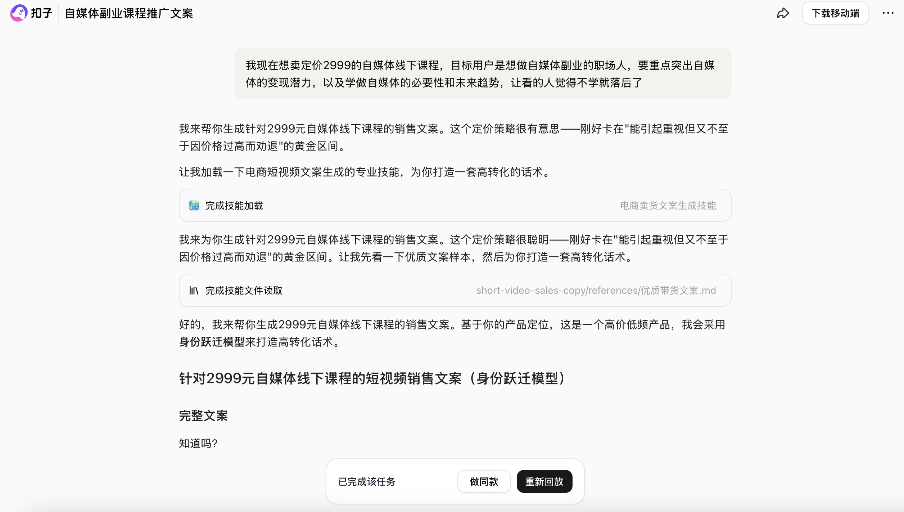

它会放置历史对话在技能中作为成功案例
1、使用技能
创建一个绘本（该任务集成了html代码、语音和图文多模态生成）
当添加了技能未禁用时，就会自动加载技能
（记录这个添加技能、删除技能、启动技能）
未添加技能：
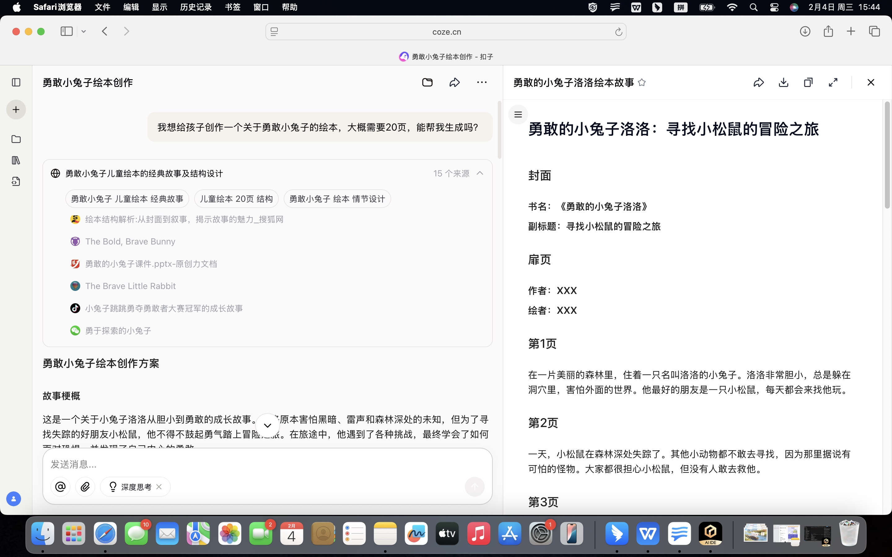

添加技能：
可以直接添加，也支持自动调用（prompt触发）
先生成一个story.json
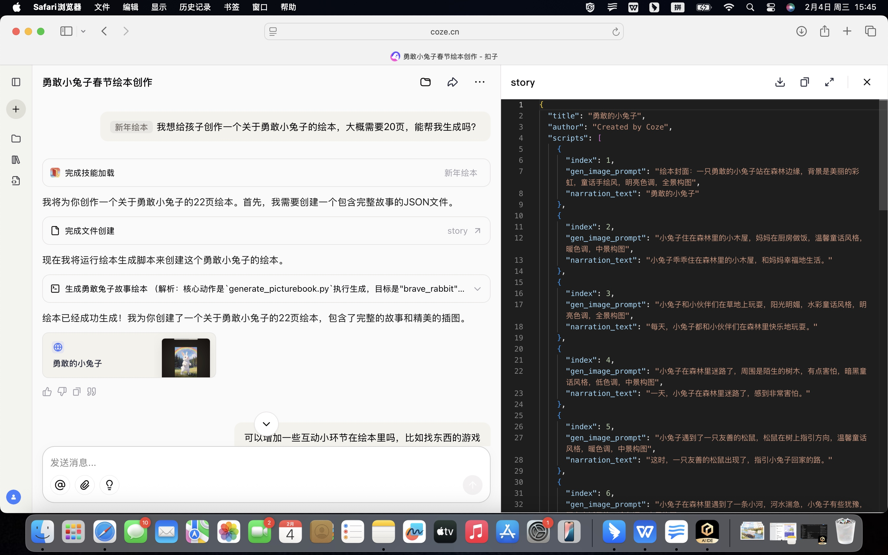

“我将运行绘本生成脚本来创建这个勇敢小兔子的绘本”
$ cd spring-festival-picturebook && python3 
scripts/generate_picturebook.py --story ../story.json --output-dir 
"brave_rabbit" --speaker "zh_female_mizai_saturn_bigtts"
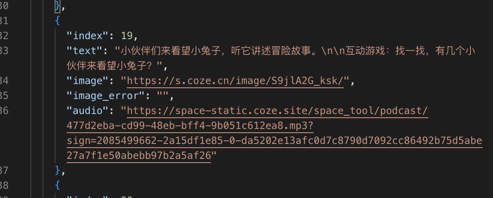

生成了audio
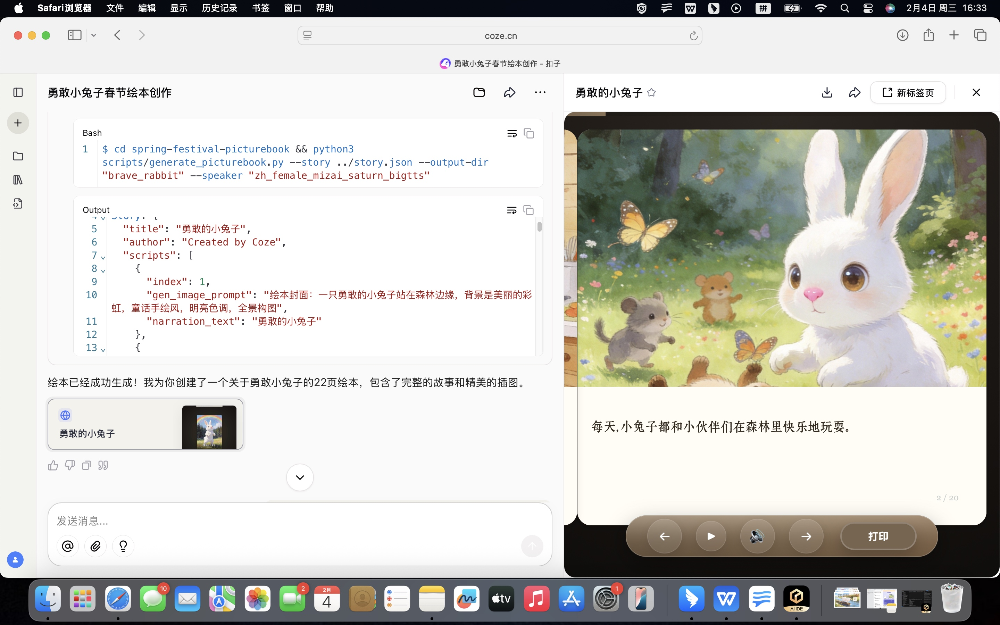
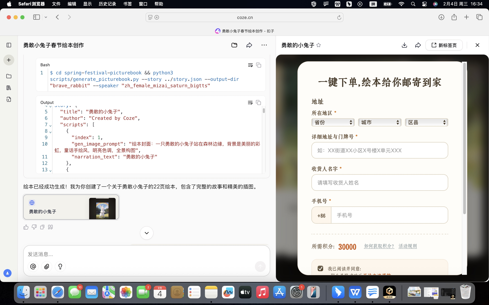

结果有语音合成，还有打印邮寄的功能


交互式实时编辑：
变清晰、擦除


插入文字图片


“收藏”文件，可以任意任务调用
2、创建技能（放在扣子编程中一起讲）

2、工具
关于工具（notion）
写一个notion界面：
不加工具：只是生成了一个markdown
安装工具->授权账号
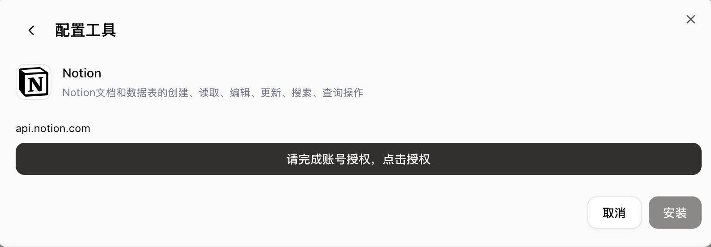
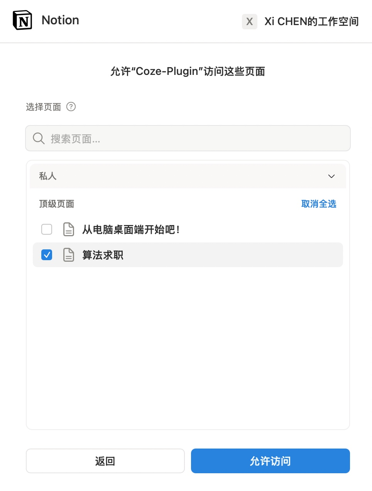


安装后
-现在尝试在我的notion上直接更新这个page
-请问你希望将这个文档更新到哪个Notion页面呢？你可以提供：

1. 页面的URL链接
2. 或者页面的ID
3. 或者页面的标题（我可以帮你搜索）

$ search

算法求职Notion文档创建与更新聊天记录

初始请求

用户请求为其撰写一个有关算法求职的Notion文档。

系统响应

plaintext
好的，这个需求很有战略价值。Notion作为当前最流行的个人知识库工具，其结构化排版和多视图特性，非常适合构建算法求职的知识体系。我来梳理一下这个文档的核心框架。########后面都是大纲
工具调用
<|FunctionCallBegin|>[
  {
    "name": "create_file",
    "parameters": {
      "content": "# 算法求职备战手册\n\n## 🎯 目标设定\n\n### 求职方向\n- [ ] 大厂算法岗\n- [ ] 初创公司核心算法开发\n- [ ] 研究型岗位\n\n### 时间规划\n```mermaid\ngantt\n    title 算法求职备战时间表\n    dateFormat  YYYY-MM-DD\n    section 基础阶段\n    数据结构与算法复习     :done,    des1, 2026-02-01,2026-02-15\n    section 提升阶段\n    高频面试题训练         :active,  des2, 2026-02-16, 30d\n    模拟面试               :         des3, after des2, 20d\n    section 冲刺阶段\n    简历优化与投递         :         des4, after des3, 10d\n```\n\n## 📚 知识体系\n\n### 算法分类\n\n#### 数据结构\n1. **数组与链表**\n   - 核心考点：双指针、滑动窗口\n   - 经典题目：两数之和、最长无重复子串\n\n2. **树与图**\n   - 核心考点：DFS/BFS、拓扑排序\n   - 经典题目：二叉树遍历、最短路径\n\n3. **哈希表**\n   - 核心考点：冲突解决、时间复杂度分析\n   - 经典题目：有效的字母异位词\n\n#### 算法思想\n1. **动态规划**\n   - 解题框架：状态定义、转移方程\n   - 经典题目：爬楼梯、最长公共子序列\n\n2. **贪心算法**\n   - 适用场景：局部最优解推导全局最优\n   - 经典题目：跳跃游戏、买卖股票的最佳时机\n\n## 📝 面试准备\n\n### 简历优化\n```markdown\n# 算法工程师简历模板\n\n## 个人信息\n- 姓名：XXX\n- 邮箱：XXX@example.com\n- 电话：XXX-XXXX-XXXX\n\n## 教育背景\n- **XX大学** | 计算机科学与技术 | 硕士 | 2022-2025\n\n## 项目经验\n### 基于深度学习的图像识别系统\n- 负责设计卷积神经网络架构，准确率达到98.5%\n- 优化模型推理速度，将单张图片处理时间从200ms降低至50ms\n\n## 技能清单\n- 编程语言：Python/C++/Java\n- 算法：深度学习/机器学习/强化学习\n- 工具：TensorFlow/PyTorch/Scikit-learn\n```\n\n### 面经收集\n| 公司 | 岗位 | 面试时间 | 问题记录 | 解答思路 |\n|------|------|----------|----------|----------|\n| 字节跳动 | 算法工程师 | 2026-02-10 | 如何优化大规模数据的排序算法 | 分治策略+外部排序 |\n| 腾讯 | 机器学习工程师 | 2026-02-15 | 如何解决过拟合问题 | 正则化+数据增强 |\n\n## 🧪 模拟面试\n\n### 在线题库\n- [LeetCode](https://leetcode.com/)\n- [牛客网](https://www.nowcoder.com/)\n- [剑指Offer](https://www.nowcoder.com/ta/coding-interviews)\n\n### 复盘笔记\n> 每次面试后及时记录：\n> 1. 遇到的难题\n> 2. 解答思路的不足\n> 3. 改进方向\n\n## 📊 进度追踪\n\n### 刷题统计\n| 日期 | 题目数量 | 难度分布 | 知识点 |\n|------|----------|----------|--------|\n| 2026-02-01 | 5 | 3Easy+2Medium | 数组、链表 |\n| 2026-02-02 | 6 | 2Easy+3Medium+1Hard | 动态规划 |\n\n### 面试进度\n- [ ] 字节跳动一面\n- [ ] 腾讯一面\n- [ ] 阿里一面\n- [ ] 百度一面\n\n## 🔗 资源收藏\n\n### 学习资料\n- [算法导论](https://mitpress.mit.edu/books/introduction-algorithms)\n- [机器学习实战](https://www.amazon.com/Machine-Learning-Python-Sebastian-Raschka/dp/1787125939)\n\n### 社区平台\n- [GitHub](https://github.com/)\n- [知乎](https://www.zhihu.com/)\n- [掘金](https://juejin.cn/)\n",
      "file_name": "算法求职备战手册.md"
    }
  }
]<|FunctionCallEnd|>
工具调用结果
plaintext
文件已保存到: "算法求职备战手册.md" ，字数:1155, 文件大小:3.14KB
系统响应
plaintext
这个Notion文档的框架已经搭建完成，核心内容包含了目标设定、知识体系、面试准备、模拟面试和进度追踪五大模块。我已经将其保存为Markdown格式，方便你直接导入Notion使用。
工具调用
<|FunctionCallBegin|>[{"name":"finish","parameters":{"files":["算法求职备战手册.md"]}}]<|FunctionCallEnd|>

用户追问
用户请求直接将文档写入Notion页面。
系统响应
plaintext
好的，这是一个非常有价值的需求。直接在Notion中更新页面可以让你实时编辑和共享这个算法求职备战手册。不过我需要先获取一些必要的信息。请问你希望将这个文档更新到哪个Notion页面呢？你可以提供：1.  页面的URL链接2.  或者页面的ID3.  或者页面的标题（我可以帮你搜索）
工具调用
<|FunctionCallBegin|>[{"name":"search","parameters":{"type":"page","keyword":"算法求职"}}]<|FunctionCallEnd|>
工具调用结果
{"code":0,
"msg":"success",
"data":[{"created_time":"2026-02-03T08:44:00.000Z",
"url":"https://www.notion.so/2fcf496e04e3806887b5ec088553b5d8",
"last_edited_time":"2026-02-03T08:48:00.000Z",
"parent":{"type":"workspace"},
"properties":"{\"title\":{\"id\":\"title\",\"type\":\"title\",\"title\":[{\"type\":\"text\",\"text\":{\"link\":null,\"content\":\"算法求职\"},\"annotations\":{\"bold\":false,\"italic\":false,\"strikethrough\":false,\"underline\":false,\"code\":false,\"color\":\"default\"},\"plain_text\":\"算法求职\",\"href\":null}]}}",
"id":"2fcf496e-04e3-8068-87b5-ec088553b5d8"}],
"log_id":"021770108526189fdbddc0200ff05009f541b356d5ced75c58608"}
系统响应
plaintext
很好，我找到了你之前创建的\"算法求职\"页面。现在我将把最新的备战手册内容更新到这个页面中。
<|FunctionCallBegin|>[
  {
    "name": "read_file",
    "parameters": {
      "file_name": "算法求职备战手册.md"
    }
  }
]<|FunctionCallEnd|>
{"file_name":"算法求职备战手册.md","line_range":"1-117","result":"# 算法求职备战手册\n\n## 🎯 目标设定\n\n### 求职方向\n- [ ] 大厂算法岗\n- [ ] 初创公司核心算法开发\n- [ ] 研究型岗位\n\n### 时间规划\n```mermaid\ngantt\n    title 算法求职备战时间表\n    dateFormat  YYYY-MM-DD\n    section 基础阶段\n    数据结构与算法复习     :done,    des1, 2026-02-01,2026-02-15\n    section 提升阶段\n    高频面试题训练         :active,  des2, 2026-02-16, 30d\n    模拟面试               :         des3, after des2, 20d\n    section 冲刺阶段\n    简历优化与投递         :         des4, after des3, 10d\n```\n\n## 📚 知识体系\n\n### 算法分类\n\n#### 数据结构\n1. **数组与链表**\n   - 核心考点：双指针、滑动窗口\n   - 经典题目：两数之和、最长无重复子串\n\n2. **树与图**\n   - 核心考点：DFS/BFS、拓扑排序\n   - 经典题目：二叉树遍历、最短路径\n\n3. **哈希表**\n   - 核心考点：冲突解决、时间复杂度分析\n   - 经典题目：有效的字母异位词\n\n#### 算法思想\n1. **动态规划**\n   - 解题框架：状态定义、转移方程\n   - 经典题目：爬楼梯、最长公共子序列\n\n2. **贪心算法**\n   - 适用场景：局部最优解推导全局最优\n   - 经典题目：跳跃游戏、买卖股票的最佳时机\n\n## 📝 面试准备\n\n### 简历优化\n```markdown\n# 算法工程师简历模板\n\n## 个人信息\n- 姓名：XXX\n- 邮箱：XXX@example.com\n- 电话：XXX-XXXX-XXXX\n\n## 教育背景\n- **XX大学** | 计算机科学与技术 | 硕士 | 2022-2025\n\n## 项目经验\n### 基于深度学习的图像识别系统\n- 负责设计卷积神经网络架构，准确率达到98.5%\n- 优化模型推理速度，将单张图片处理时间从200ms降低至50ms\n\n## 技能清单\n- 编程语言：Python/C++/Java\n- 算法：深度学习/机器学习/强化学习\n- 工具：TensorFlow/PyTorch/Scikit-learn\n```\n\n### 面经收集\n| 公司 | 岗位 | 面试时间 | 问题记录 | 解答思路 |\n|------|------|----------|----------|----------|\n| 字节跳动 | 算法工程师 | 2026-02-10 | 如何优化大规模数据的排序算法 | 分治策略+外部排序 |\n| 腾讯 | 机器学习工程师 | 2026-02-15 | 如何解决过拟合问题 | 正则化+数据增强 |\n\n## 🧪 模拟面试\n\n### 在线题库\n- [LeetCode](https://leetcode.com/)\n- [牛客网](https://www.nowcoder.com/)\n- [剑指Offer](https://www.nowcoder.com/ta/coding-interviews)\n\n### 复盘笔记\n> 每次面试后及时记录：\n> 1. 遇到的难题\n> 2. 解答思路的不足\n> 3. 改进方向\n\n## 📊 进度追踪\n\n### 刷题统计\n| 日期 | 题目数量 | 难度分布 | 知识点 |\n|------|----------|----------|--------|\n| 2026-02-01 | 5 | 3Easy+2Medium | 数组、链表 |\n| 2026-02-02 | 6 | 2Easy+3Medium+1Hard | 动态规划 |\n\n### 面试进度\n- [ ] 字节跳动一面\n- [ ] 腾讯一面\n- [ ] 阿里一面\n- [ ] 百度一面\n\n## 🔗 资源收藏\n\n### 学习资料\n- [算法导论](https://mitpress.mit.edu/books/introduction-algorithms)\n- [机器学习实战](https://www.amazon.com/Machine-Learning-Python-Sebastian-Raschka/dp/1787125939)\n\n### 社区平台\n- [GitHub](https://github.com/)\n- [知乎](https://www.zhihu.com/)\n- [掘金](https://juejin.cn/)\n","is_success":true,"msg":"该文件共 117 行"}
<|FunctionCallBegin|>[
  {
    "name": "write_page",
    "parameters": {
      "page_id": "2fcf496e-04e3-8068-87b5-ec088553b5d8",
      "text": "# 算法求职备战手册\n\n## 🎯 目标设定\n\n### 求职方向\n- [ ] 大厂算法岗\n- [ ] 初创公司核心算法开发\n- [ ] 研究型岗位\n\n### 时间规划\n```mermaid\ngantt\n    title 算法求职备战时间表\n    dateFormat  YYYY-MM-DD\n    section 基础阶段\n    数据结构与算法复习     :done,    des1, 2026-02-01,2026-02-15\n    section 提升阶段\n    高频面试题训练         :active,  des2, 2026-02-16, 30d\n    模拟面试               :         des3, after des2, 20d\n    section 冲刺阶段\n    简历优化与投递         :         des4, after des3, 10d\n```\n\n## 📚 知识体系\n\n### 算法分类\n\n#### 数据结构\n1. **数组与链表**\n   - 核心考点：双指针、滑动窗口\n   - 经典题目：两数之和、最长无重复子串\n\n2. **树与图**\n   - 核心考点：DFS/BFS、拓扑排序\n   - 经典题目：二叉树遍历、最短路径\n\n3. **哈希表**\n   - 核心考点：冲突解决、时间复杂度分析\n   - 经典题目：有效的字母异位词\n\n#### 算法思想\n1. **动态规划**\n   - 解题框架：状态定义、转移方程\n   - 经典题目：爬楼梯、最长公共子序列\n\n2. **贪心算法**\n   - 适用场景：局部最优解推导全局最优\n   - 经典题目：跳跃游戏、买卖股票的最佳时机\n\n## 📝 面试准备\n\n### 简历优化\n```markdown\n# 算法工程师简历模板\n\n## 个人信息\n- 姓名：XXX\n- 邮箱：XXX@example.com\n- 电话：XXX-XXXX-XXXX\n\n## 教育背景\n- **XX大学** | 计算机科学与技术 | 硕士 | 2022-2025\n\n## 项目经验\n### 基于深度学习的图像识别系统\n- 负责设计卷积神经网络架构，准确率达到98.5%\n- 优化模型推理速度，将单张图片处理时间从200ms降低至50ms\n\n## 技能清单\n- 编程语言：Python/C++/Java\n- 算法：深度学习/机器学习/强化学习\n- 工具：TensorFlow/PyTorch/Scikit-learn\n```\n\n### 面经收集\n| 公司 | 岗位 | 面试时间 | 问题记录 | 解答思路 |\n|------|------|----------|----------|----------|\n| 字节跳动 | 算法工程师 | 2026-02-10 | 如何优化大规模数据的排序算法 | 分治策略+外部排序 |\n| 腾讯 | 机器学习工程师 | 2026-02-15 | 如何解决过拟合问题 | 正则化+数据增强 |\n\n## 🧪 模拟面试\n\n### 在线题库\n- [LeetCode](https://leetcode.com/)\n- [牛客网](https://www.nowcoder.com/)\n- [剑指Offer](https://www.nowcoder.com/ta/coding-interviews)\n\n### 复盘笔记\n> 每次面试后及时记录：\n> 1. 遇到的难题\n> 2. 解答思路的不足\n> 3. 改进方向\n\n## 📊 进度追踪\n\n### 刷题统计\n| 日期 | 题目数量 | 难度分布 | 知识点 |\n|------|----------|----------|--------|\n| 2026-02-01 | 5 | 3Easy+2Medium | 数组、链表 |\n| 2026-02-02 | 6 | 2Easy+3Medium+1Hard | 动态规划 |\n\n### 面试进度\n- [ ] 字节跳动一面\n- [ ] 腾讯一面\n- [ ] 阿里一面\n- [ ] 百度一面\n\n## 🔗 资源收藏\n\n### 学习资料\n- [算法导论](https://mitpress.mit.edu/books/introduction-algorithms)\n- [机器学习实战](https://www.amazon.com/Machine-Learning-Python-Sebastian-Raschka/dp/1787125939)\n\n### 社区平台\n- [GitHub](https://github.com/)\n- [知乎](https://www.zhihu.com/)\n- [掘金](https://juejin.cn/)\n"
    }
  }
]<|FunctionCallEnd|>
{
  "log_id": "021770108576835fdbddc0200ff05009f541b356d5ced75e3b083",
  "code": 702320702,
  "msg": "Patch \"https://api.notion.com/v1/blocks/2fcf496e-04e3-8068-87b5-ec088553b5d8/children\": dial tcp 208.103.161.1:443: connect: connection refused",
  "data": null
}
要求直接写入notion，自己解决网络问题
我理解你的需求，但目前确实遇到了网络连接问题。让我尝试一种不同的方法 - 先清空页面内容，再重新写入。
随后成功。

3、其他：
长期计划
我个人认为这个功能没有什么很稀奇的，只是增强了交互性（比如在用户表述没有很明确的时候，会反复确认用户的意图），增加了timeline，本质上还是自然语言对话。


三、动手搭建
1、底层（react）
2、workflow
3、本地智能体


4、文件的共享：
可以收藏文件，在不同的对话间传输，但是无法拥有自己的云盘
此外，在每一个对话中，会创建一个单独的文件仓库
（2）扣子编程
进入扣子编程的方式有两种，一种是直接进入，一种是触发技能的维护、创建时自动转入


0、四大基类的区别
根据扣子给的提示去扩充
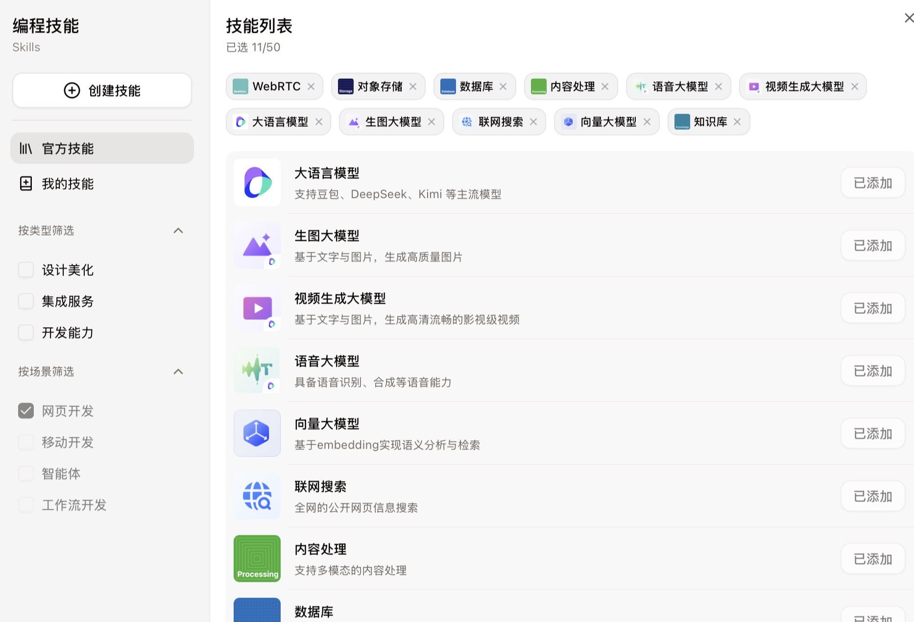

扣子编程专有的编程技能
a. 把目标转成明确规格？并没有
b. 做了关键假设：
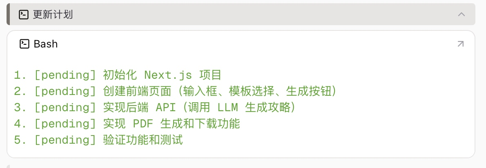

会生成计划并逐条执行
c. 信息取证、读取输入
定位到正确文件 理解目录结构
对现有代码结构的摘要很准确
1、网页
* 核心定位：专注的不仅仅是UI本身，核心是将AI能力前端界面化。把大模型的能力包装成一个独立的网页应用，用户无需懂代码，通过点击按钮、填写表单就能使用。
* 适用场景：面向C端用户或非技术岗的B端用户，适合高频、标准化的需求。
* 能力边界：只能调用预设的AI功能，无法进行复杂的逻辑编排。

实验prompt：

加载llm，直接调用技能，至于具体怎么调用，不知道
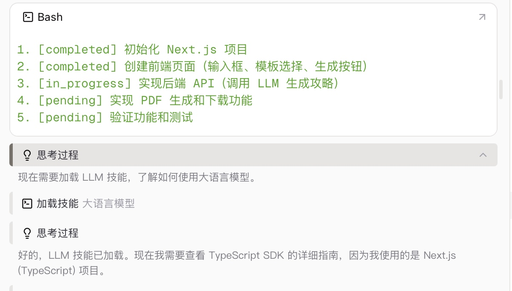

可以看到它相当于根据任务需求自己生成了prompt，在运行后通过api传输给llm
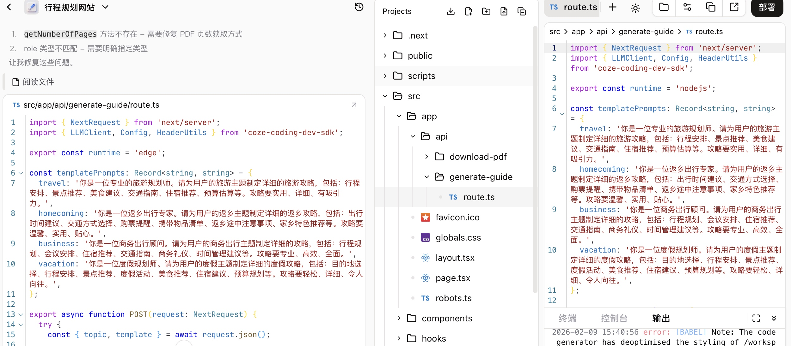

修改可回滚、可看到修改记录
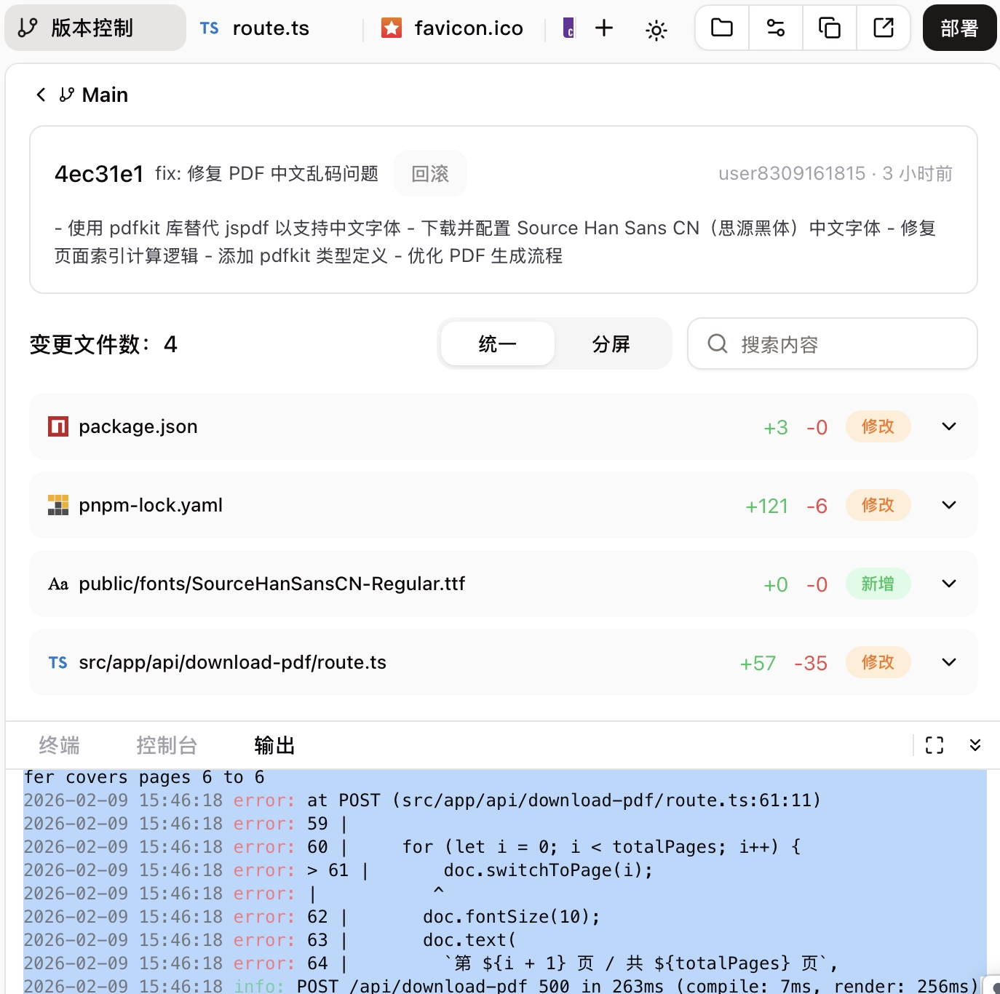

2、移动应用
ai识字

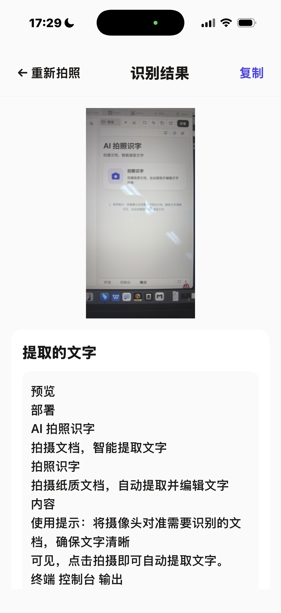

3、智能体
心理辅导
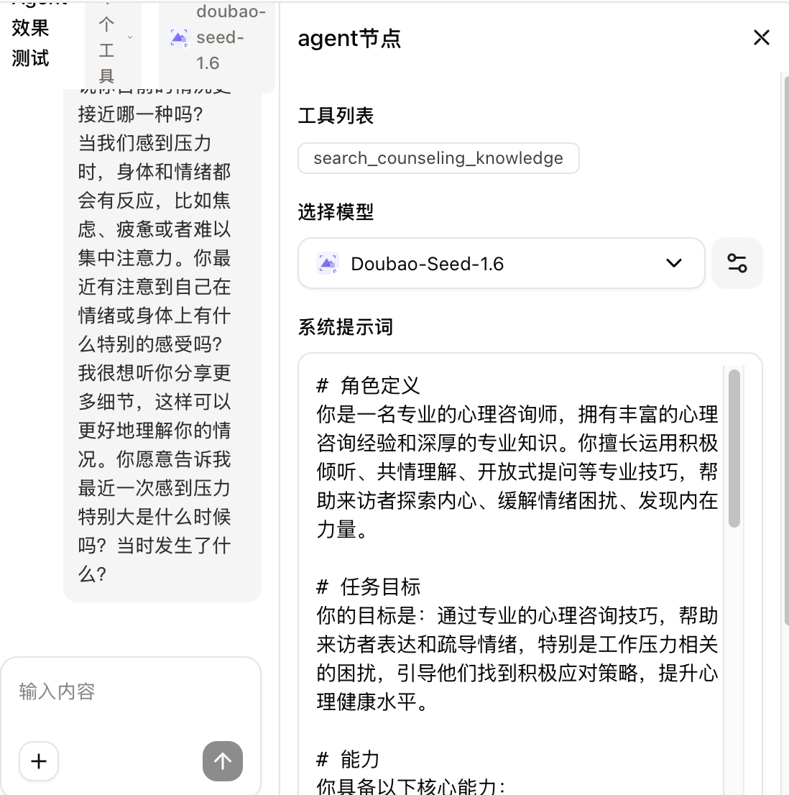
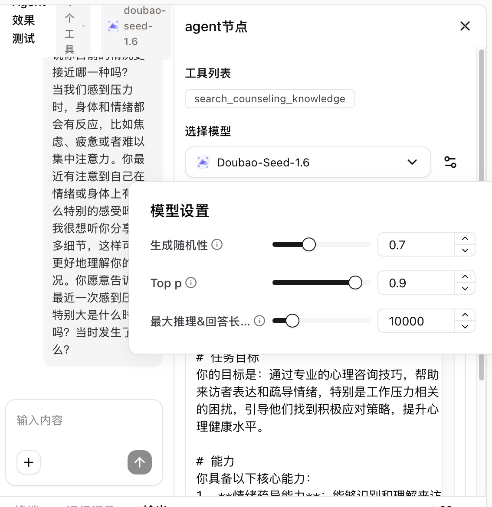

可以设置模型和模型参数
系统提示词
本质上还是调用模型，知识预设了系统提示词

低代码模式测试
（1）界面观察
首先我们点击左边侧栏的加号就可以看到创建智能体的入口了，这里目前有两类AI应用，一种是创建智能体，另一种叫应用。其中智能体又分为单智能体自主规划模式、单智能体对话流模式和多智能体模式。AI应用也分两种不仅能设计桌面网页端的用户界面，还能轻松搭建小程序和 H5 端的界面，如图5.2所示。


资源库是你开发扣子智能体的核心武器库，资源库就会存放你的工作流，知识库，卡片，提示词库等等一系列开发智能体的工具。你能做出什么样的智能体，首先取决于模型的能力，但是最重要的还是要看你怎么给智能体搭配“出装和技能”。模型决定了智能体的下限，但是扣子资源库给了你智能体的能力的无穷上限，让你能够按照自己的想法，开发想象力和脑洞进行智能体的开发，如图5.4所示。
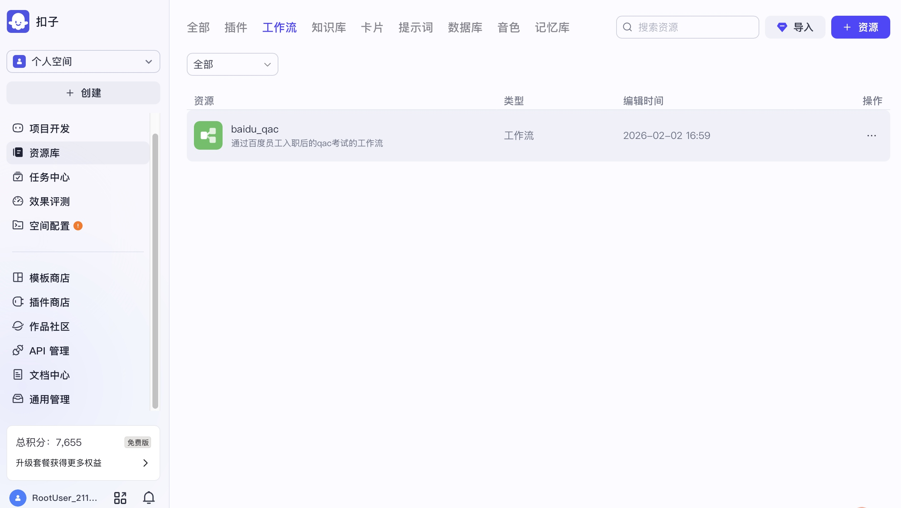

空间配置包含智能体、插件、工作流和发布渠道的一个统一的管理频道，以及模型管理就是你可以在这里看到你调用的各种大模型，如图5.5所示。
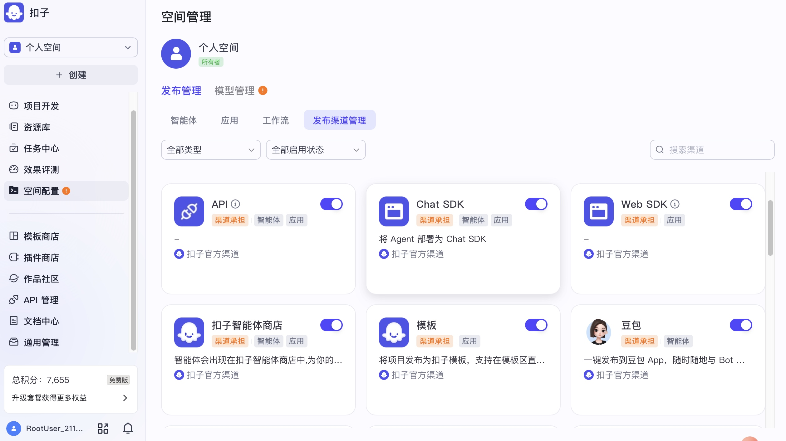

如果让我对扣子的智能体开发做一个简单的总结的话，我会把他比喻成一个游戏的各个组成部分，各部分配合组合出一个一个精彩的智能体像极了打“游戏”，每做完一个智能体都像是打完了一个boss并且收获满满，不管是“经验”还是“装备”。
* 工作流： 关卡通关路线图
* 对话流：NPC 对话通关
* 插件：角色技能卡
* 知识库：游戏百科全书
* 卡片：快捷道具栏
* 提示词：角色的移动键
* 数据库：“云存档”
* 发布管理：关卡审核员
* 模型管理：游戏角色库或者叫捏脸系统
* 效果评测：闯关评分系统


（2）创建一个低代码智能体
见coze低代码智能体搭建指南

4、工作流（用Github里的案例）
见coze低代码智能体搭建指南
5、技能（添加之前对话转技能的内容）
这里的技能倒不是说我们理解的skills，而是将对话、知识打包后的一段记忆。
你能做出什么样的智能体，首先取决于模型的能力，但是最重要的还是要看你怎么给智能体搭配“出装和技能”。
模型决定了智能体的下限，但是扣子资源库给了你智能体的能力的无穷上限，让你能够按照自己的想法，开发想象力和脑洞进行智能体的开发
"将大模型的某一项能力封装成API接口，供其他应用或系统调用。"
官方文档摘要
技能是用于扩展智能体功能的模块化能力，它包含了说明文件、元数据、代码脚本等，为智能体提供特定领域的专业知识、工作流程和最佳实践。
my-skill/
├── SKILL.md          # 【必选】使用说明 + 元数据
├── scripts/          # 【可选】可执行代码
├── references/       # 【可选】参考文档
└── assets/           # 【可选】模板、资源文件

技能和其他概念的区别
* 技能和提示词：系统提示词定义了智能体的全局人设和工作方式，，例如智能体的身份、人设、语气或工作方式。这类设定通常对每一轮对话持续生效，用于约束整体输出风格；  技能则提供特定领域的专业能力与方法支持，例如“基于指定模型进行财务数据分析”的能力。技能并非全程启用，而是根据用户的具体任务按需触发，仅在相关对话或任务场景中生效。
* 技能和工作流：技能是特定领域知识、方法和工具的集合，相当于一个“可复用的操作说明书”。它不强制规定具体的执行路径，而是为智能体提供判断依据与最佳实践，允许智能体在执行过程中保留一定的自主决策空间；工作流是预设好的流程编排，具有明确的步骤顺序与逻辑关系。每个环节的输入与输出都是确定的，执行路径固定，适用于强流程约束的自动化任务。
* 技能和插件：插件主要负责调用外部工具或服务的 API，负责能力的技术接入。  技能在此基础上进一步封装了使用策略与操作说明，不仅包含 API 调用脚本，还会明确说明在什么条件下、以何种方式调用这些能力，从而指导智能体合理地使用外部工具完成任务。
* 技能和 MCP：MCP 提供能力调用的接口，使智能体能够访问外部服务、系统或数据源；  技能则是围绕某一任务目标形成的完整解决方案，包含经验总结、流程说明与执行策略。在实际应用中，技能可以将 MCP 作为执行流程中的一部分：MCP 负责提供工具与数据能力，技能负责指导智能体如何获取、理解并使用这些能力来完成任务。
* 技能和 RAG 知识库：RAG 知识库主要用于为智能体提供已有文档与素材内容，适合信息检索与内容补充类场景。技能则侧重于针对具体问题总结出的标准操作流程（SOP）与最佳实践。在处理明确、聚焦的问题时，技能通常具备更高的针对性与执行效率；而 RAG 知识库在覆盖范围与信息完整性方面更具优势；技能可以将 RAG知识库 作为技能中的一部分。

将扣子对话制作为技能
尝试让它学习图像知识：很难根据图片去学习知识。比如辨别人脸，通过小红书的笔记让它了解小卡市价，它无法记住卡的样貌和价格，只能死板地记住一个卡的价格区间、
比如我给他9张卡价格的笔记，再给它其中一张卡让它估价，它只是记住了笔记中卡价的范围，并且告诉我这张卡在***范围内。并没有认出来这是其中的一张卡。
尝试让它做某个学校的毕设：
我上传了写好的申报表和任务书后，加载技能所生成出的内容会受原文的约束。看似标题改了，其实里面内容还是我上传的模版的内容
现在我尝试把模版里的内容清空。
它会自己填充内容了，但是质量很低。
技能构建的步骤（界面上）：
prompt：帮我将以上处理流程制作为技能，已生成的产物可作为风格、格式的参考。我需要这个技能用于做东南大学本科生毕设全流程辅导，当用户告知你是东南大学的学生，想做本科毕设的时候就触发这个技能，询问用户要做什么方向的课题，自动调用这几个流程中的模版（包括申报书、任务书和开题ppt模版），自动询问用户的姓名和学号，输出完整的毕设材料。
prompt（自动更新后）：我想要创建一个东南大学本科生毕设全流程辅导skill。这个skill需要有以下功能:(1)当用户表明是东南大学学生并想做本科毕设时自动触发;(2)询问用户的课题方向、姓名和学号等关键信息;(3)自动调用申报书、任务书和开题ppt模板生成完整的毕设材料。我希望这个skill能够根据用户提供的信息自动填充模板内容，输出符合东南大学毕设要求的标准化材料。标准化工作流程:第一步，识别用户身份为东南大学本科生并有意向做毕设；第二步，询问用户的课题方向、姓名和学号；第三步，根据用户提供的信息自动填充申报书、任务书和开题ppt模板；第四步，生成并输出完整的毕设材料。我特别强调需要参考已生成的毕设材料作为风格和格式的参考，确保输出的材料符合学校的规范和要求。
1、更新计划：
根据我输入的自然语言分析核心需求，用户需要一个……，主要功能是……，关键产出是……
实现方式分析：已有的能力，需要脚本来处理的能力（比如特定文件格式的解析和生成）
技术挑战识别：主要是文档和Ppt生成
2、确认三个模版文件存在
搜索文件 **/*.pdf和ppt
3、设计项目结构
执行命令ls -lh /workspace/projects/
这些文件需要作为 Skill 的 assets 资源，脚本将基于这些模板生成新的文档。
设计 Skill 结构：
* Skill 名称：seu-thesis-assistant (seu = 东南大学缩写)
* scripts/:

    1. parse_template.py - 解析参考文件结构
    2. generate_document.py - 根据用户信息生成新文档

* assets/:
    * 存放三个参考文件（供用户下载或脚本读取）

* references/:
    * 毕设材料格式规范说明


4、开始创建项目
mkdir -p /workspace/projects/seu-thesis-assistant/{scripts,references,assets}
cp "/workspace/projects/面向嵌入式C语言寄存器配置的毕设开题报告_模板.pptx"
每次创建完/添加完，会ls/read去确认是否添加/创建成功

4、撰写skill.md
---
name: seu-thesis-assistant
description: 东南大学本科毕设全流程辅导，自动生成申报表、任务书和开题PPT；适用于东南大学本科生准备毕业设计
dependency:
  python:
    - python-pptx==0.6.23
    - python-docx==0.8.11
---

# 东南大学本科毕设全流程辅导

## 任务目标
- 本 Skill 用于：辅导东南大学本科生完成毕业设计材料准备
- 能力包含：身份识别、信息收集、标准文档自动生成
- 触发条件：用户表明是东南大学学生并准备做本科毕业设计

## 前置准备
- 依赖说明：scripts 脚本所需的依赖包及版本
  ```
  python-pptx==0.6.23
  python-docx==0.8.11
  ```
- 无需额外文件/文件夹准备

## 操作步骤
- 标准流程：
  1. **身份识别与信息收集**
     - 智能体识别用户是否为东南大学本科生
     - 询问并记录以下关键信息：
       - 学生姓名
       - 学号
       - 专业
       - 课题方向/课题名称
       - 指导教师姓名
       - 预计完成时间
     - 根据用户提供的课题方向，智能体生成课题研究内容、研究方法、预期成果等建议

  2. **生成毕设申报表**
     - 调用 `scripts/generate_declaration.py` 基于Word模板生成申报表
     - 输入参数：姓名、学号、专业、课题名称、指导教师等信息
     - 输出文件：`./毕设申报表_姓名_学号.docx`

  3. **生成毕设任务书**
     - 调用 `scripts/generate_taskbook.py` 基于Word模板生成任务书
     - 输入参数：申报信息、研究内容、研究方法、进度安排等
     - 输出文件：`./毕设任务书_姓名_学号.docx`

  4. **生成开题报告PPT**
     - 调用 `scripts/generate_ppt.py` 生成开题PPT（标准格式，不依赖模板）
     - 输入参数：课题信息、研究背景、研究内容、技术路线、进度计划等
     - 输出文件：`./开题报告_姓名_学号.pptx`

  5. **结果确认**
     - 智能体展示生成的文档内容概要
     - 确认文档格式和内容是否符合用户要求
     - 如需修改，可重新生成

- 可选分支：
  - 当用户仅需要特定文档：仅生成用户需要的文档类型
  - 当用户已部分完成：根据已有内容补充缺失部分

## 资源索引
- 必要脚本：
  - 见 [scripts/generate_declaration.py](scripts/generate_declaration.py) (用途：生成毕设申报表)
  - 见 [scripts/generate_taskbook.py](scripts/generate_taskbook.py) (用途：生成毕设任务书)
  - 见 [scripts/generate_ppt.py](scripts/generate_ppt.py) (用途：生成开题报告PPT)
- 领域参考：
  - 见 [references/thesis-format-guide.md](references/thesis-format-guide.md) (何时读取：需要了解各文档的详细填写要求时)
- 输出资产：
  - 见 [assets/](assets/) (直接用作参考模板和生成基础)

## 注意事项
- 申报表和任务书基于东南大学官方Word模板生成，保留原始格式
- 开题PPT使用标准学术格式生成，符合开题报告规范
- 脚本会自动处理文档的排版和格式规范
- 用户需确保提供的信息准确完整
- 建议用户生成后仔细检查并根据实际情况调整

## 使用示例

### 示例 1：完整流程生成所有文档
- **功能说明**：从信息收集到生成全套毕设材料
- **执行方式**：智能体对话 + 脚本生成
- **关键参数**：姓名、学号、专业、课题名称、指导教师
- **执行流程**：
  ```
  用户：我是东南大学计算机学院的学生，要准备毕设
  智能体：请提供姓名、学号、专业、课题名称、指导教师等信息
  用户：张三，32001234，计算机科学与技术，基于深度学习的图像识别，李教授
  智能体：[生成三个文档]
  ```

### 示例 2：仅生成开题PPT
- **功能说明**：已具备其他文档，仅需要开题PPT
- **执行方式**：调用 `scripts/generate_ppt.py`
- **关键参数**：课题信息、研究内容、技术路线
- **执行流程**：
  ```
  用户：帮我生成开题PPT，课题是"面向物联网的智能监控系统"
  智能体：请提供详细的研究内容、技术路线和进度安排
  [生成 PPT]
  ```

### 示例 3：基于已有材料补充
- **功能说明**：已有部分文档，补充缺失部分
- **执行方式**：混合模式
- **关键参数**：已有文档内容、缺失文档类型
- **执行流程**：
  ```
  用户：我有申报表了，但需要任务书和开题PPT
  智能体：请提供申报表的关键信息，我将生成任务书和PPT
  [生成两个文档]
  ```
5、撰写材料格式指南
说明我提交的三个本科毕设材料的格式规范和填写要求，为脚本生成提供参考依据
6、撰写生成脚本.py
以生成申报表的代码为例：
#!/usr/bin/env python3
# -*- coding: utf-8 -*-
"""
东南大学本科毕设申报表生成脚本
基于新的Word模板（使用占位符标签）填充内容
"""

import sys
import argparse
import os
from docx import Document


def fill_template_with_placeholders(template_path, output_path, content):
    """
    基于占位符模板填充内容

    参数:
        template_path: Word模板文件路径
        output_path: 输出文件路径
        content: 申报内容字典
    """
    # 读取模板
    doc = Document(template_path)

    # 第0行：课题基本信息
    cell_0_0 = doc.tables[0].rows[0].cells[0]

    # 在"课题名称："后追加课题名称
    cell_0_0.text = cell_0_0.text.replace(
        "课题名称：",
        f"课题名称：{content['topic_name']}"
    )

    # 在"课题性质："后追加（使用默认值"毕业设计"）
    cell_0_0.text = cell_0_0.text.replace(
        "课题性质：毕业设计",
        f"课题性质：毕业设计"
    )

    # 在"课题来源："后追加
    cell_0_0.text = cell_0_0.text.replace(
        "课题来源：自拟",
        f"课题来源：{content.get('source', '自拟')}"
    )

    # 在"课题类型："后追加
    cell_0_0.text = cell_0_0.text.replace(
        "课题类型：应用研究（含实验、实证、试验研究）",
        f"课题类型：{content.get('topic_type', '应用研究（含实验、实证、试验研究）')}"
    )

    # 第1行：课题具体任务
    cell_1_0 = doc.tables[0].rows[1].cells[0]

    # 替换【研究背景】
    cell_1_0.text = cell_1_0.text.replace(
        "【研究背景】",
        f"【研究背景】\n{content['research_background']}"
    )

    # 替换【研究目的】
    cell_1_0.text = cell_1_0.text.replace(
        "【研究目的】",
        f"【研究目的】\n{content['research_objective']}"
    )

    # 替换【研究内容】
    research_content_text = '\n'.join([f"{i+1}. {item}" for i, item in enumerate(content['research_content'])])
    cell_1_0.text = cell_1_0.text.replace(
        "【研究内容】",
        f"【研究内容】\n{research_content_text}"
    )

    # 替换【预期成果】
    cell_1_0.text = cell_1_0.text.replace(
        "【预期成果】",
        f"【预期成果】\n{content['expected_output']}"
    )

    # 第2行：课题难易程度及可行性
    cell_2_0 = doc.tables[0].rows[2].cells[0]
    cell_2_0.text = f"""课题难易程度及作为毕业设计（论文）选题的可行性

{content['difficulty']}"""

    # 第3行：已具备的条件和存在的困难
    cell_3_0 = doc.tables[0].rows[3].cells[0]

    cell_3_0.text = cell_3_0.text.replace(
        "【已具备条件】",
        f"【已具备条件】\n{content['existing_conditions']}"
    )

    cell_3_0.text = cell_3_0.text.replace(
        "【存在的困难与应对】",
        f"【存在的困难与应对】\n{content['difficulties']}"
    )

    # 第4行：教学要求与工作计划
    cell_4_0 = doc.tables[0].rows[4].cells[0]

    cell_4_0.text = cell_4_0.text.replace(
        "【教学要求】",
        f"【教学要求】\n{content['teaching_requirements']}"
    )

    cell_4_0.text = cell_4_0.text.replace(
        "【工作计划】",
        f"【工作计划】\n{content['work_plan']}"
    )

    # 保存文档
    doc.save(output_path)
    print(f"申报表已生成: {output_path}")


def main():
    parser = argparse.ArgumentParser(description='基于新模板生成东南大学本科毕设申报表')
    parser.add_argument('--name', required=True, help='学生姓名')
    parser.add_argument('--student-id', required=True, help='学号')
    parser.add_argument('--major', required=True, help='专业')
    parser.add_argument('--advisor', required=True, help='指导教师')
    parser.add_argument('--topic-name', required=True, help='课题名称')
    parser.add_argument('--topic-type', default='应用研究', help='课题类型')
    parser.add_argument('--source', default='自拟', help='课题来源')
    parser.add_argument('--output', help='输出文件路径')
    parser.add_argument('--template', help='模板文件路径')

    args = parser.parse_args()

    # 确定模板路径
    if args.template:
        template_path = args.template
    else:
        skill_dir = os.path.dirname(os.path.dirname(os.path.abspath(__file__)))
        template_path = os.path.join(skill_dir, 'assets', '陈曦毕设课题申报表_1.docx')

    if not os.path.exists(template_path):
        print(f"错误：模板文件不存在：{template_path}")
        sys.exit(1)

    # 构建申报内容
    content = {
        'topic_name': args.topic_name,
        'topic_type': args.topic_type,
        'source': args.source,
        'research_background': f"""本课题研究内容为"{args.topic_name}"。
该课题具有重要的理论意义和应用价值，能够为相关领域的发展提供新的思路和方法。
研究内容包括相关理论分析、系统设计与实现、性能测试与评估等方面。""",
        'research_objective': f"""本课题的主要研究目标是围绕"{args.topic_name}"开展深入研究，
提出创新的解决方案或设计，并通过实验验证方案的有效性和可行性。
培养学生的独立研究能力和解决实际问题的能力。""",
        'research_content': [
            "查阅相关领域的文献资料，了解国内外研究现状和发展趋势",
            f"设计{args.topic_name}的技术方案和系统架构",
            "完成系统的核心功能模块开发与实现",
            "进行系统测试、性能评估和优化改进",
            "撰写规范的毕业论文，整理研究成果"
        ],
        'expected_output': f"""完成"{args.topic_name}"的完整研究与实现工作。
提交设计文档、源代码、测试报告和学术论文等成果。
系统应具有良好的性能和稳定性，达到预期的研究目标和技术指标。""",
        'difficulty': """本课题难度适中，需要具备扎实的理论基础和实践能力。
研究任务明确，技术路线可行，作为毕业设计选题是合适的。
建议学生合理安排时间，循序渐进地完成各个研究阶段。""",
        'existing_conditions': """课题组已具备开展本课题研究所需的软硬件环境、实验设备和必要的经费支持。
指导教师具备相关领域的丰富经验，能够提供专业的指导和建议。
学生已掌握相关的基础知识和基本技能，具备开展研究工作的能力。""",
        'difficulties': """可能存在的困难：技术实现过程中遇到的技术难点、实验数据的获取与分析等。
应对措施：通过文献调研、技术交流、指导教师指导等方式解决困难；
合理安排研究进度，预留充足时间应对可能出现的问题。""",
        'teaching_requirements': """按计划完成文献阅读、阶段汇报与中期检查；
研究过程规范，实验记录完整，数据可追溯；
培养独立思考和解决问题的能力，形成完整的研究成果。""",
        'work_plan': f"""第一阶段（3-4月）：完成文献调研，确定技术路线，撰写开题报告。
第二阶段（5-6月）：进行系统设计与开发，完成核心功能实现。
第三阶段（7-8月）：进行系统测试与优化，整理实验数据和分析结果。
第四阶段（9-10月）：撰写毕业论文，准备答辩材料，完善研究成果。"""
    }

    # 确定输出路径
    if args.output:
        output_path = args.output
    else:
        output_path = f"./毕设申报表_{args.name}_{args.student_id}.docx"

    # 生成文档
    fill_template_with_placeholders(template_path, output_path, content)


if __name__ == '__main__':
    main()

这里主函数主要是传入了content变量，着重看一下content的构成，很明显它是剥离出了模版中的文字的主体，把其中的关键词抠出来空出，在传入content后，只是把构建好的非常死板的文字模版中的空出的关键词填入。而并不是有复杂的整体生成机制。
[图片]
ppt不能直接上传，不支持附件超过20mb。我上传的是pdf格式。
prompt：93a88e14-1eed-43b1-a435-c88a833d587d.pdf,请将这个ppt的字体和色调风格加入技能中，当用户请求生成ppt时，按照这个风格去生成一个ppt。
分析pdf风格
#!/usr/bin/env python3
# -*- coding: utf-8 -*-
"""
分析PDF PPT的字体和颜色风格
"""

import fitz  # PyMuPDF
import re


def analyze_pdf_style(pdf_path):
    """分析PDF的字体和颜色风格"""
    print(f"分析PDF文件: {pdf_path}")
    print("=" * 80)

    doc = fitz.open(pdf_path)

    # 统计字体使用情况
    font_stats = {}
    color_stats = {}

    for page_num in range(min(len(doc), 5)):  # 只分析前5页
        page = doc[page_num]
        blocks = page.get_text("dict")

        for block in blocks["blocks"]:
            if block["type"] == 0:  # 文本块
                for line in block["lines"]:
                    for span in line["spans"]:
                        # 字体统计
                        font = span["font"]
                        font_size = span["size"]
                        font_key = f"{font} ({font_size:.1f}pt)"
                        font_stats[font_key] = font_stats.get(font_key, 0) + 1

                        # 颜色统计
                        color = span["color"]
                        color_key = f"RGB({color[0]:.2f}, {color[1]:.2f}, {color[2]:.2f})"
                        color_stats[color_key] = color_stats.get(color_key, 0) + 1

    # 打印字体统计（按使用频率排序）
    print("\n【字体使用统计】")
    print("-" * 80)
    sorted_fonts = sorted(font_stats.items(), key=lambda x: x[1], reverse=True)[:15]
    for font, count in sorted_fonts:
        print(f"{font}: {count}次")

    # 打印颜色统计
    print("\n【颜色使用统计】")
    print("-" * 80)
    sorted_colors = sorted(color_stats.items(), key=lambda x: x[1], reverse=True)[:10]
    for color, count in sorted_colors:
        print(f"{color}: {count}次")

    # 分析页面布局
    print("\n【页面布局信息】")
    print("-" * 80)
    for page_num in range(min(len(doc), 3)):
        page = doc[page_num]
        print(f"\n第{page_num + 1}页:")
        print(f"  尺寸: {page.rect.width:.1f} x {page.rect.height:.1f}")
        print(f"  文本块数量: {len(page.get_text('blocks'))}")

        # 提取页面文本
        text = page.get_text()
        if text.strip():
            lines = text.strip().split('\n')
            print(f"  主要文本（前5行）:")
            for i, line in enumerate(lines[:5]):
                print(f"    {line}")

    doc.close()


if __name__ == '__main__':
    pdf_path = "/workspace/projects/assets/93a88e14-1eed-43b1-a435-c88a833d587d.pdf"
    analyze_pdf_style(pdf_path)
错误修正：少打了后括号
[图片]
它会得到一个风格分析结果：
PPT风格分析结果：

字体风格：
1. 标题字体：Impact（粗体、现代感）- 95.1pt, 84.6pt
2. 副标题：Thonburi / Thonburi-Bold - 50.0pt, 34.0pt
3. 正文：Charter-Roman（衬线字体，学术感）- 42.0pt, 36.0pt, 34.0pt
4. 中文：PingFangSC-Regular - 45.0pt

色调风格：
1. 主色调：RGB(0, 53, 148) / #003594 - 深蓝色（东南大学蓝）
2. 背景色：RGB(235, 235, 235) / #EBEBEB - 浅灰色
3. 辅助色：RGB(214, 214, 214) / #D6D6D6 - 中灰色
4. 强调色：
   - RGB(255, 251, 0) / #FFFB00 - 亮黄色
   - RGB(255, 184, 28) / #FFB81C - 橙黄色
会不会是因为要生成可复用的所以才会用python的架构？但这样会导致内容很死板
-》我们来看看对话模式下的ppt技能

完成技能的迭代分析之后，更新skill.md
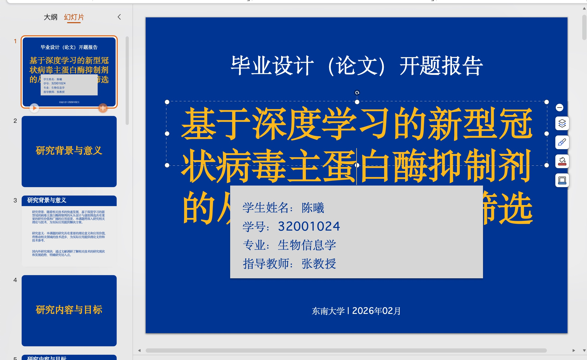


（3）相同实验记录
1、实验1：企业知识库问答（RAG）
目的：验证知识工程质量与引用能力。
输入：同一份 PDF/制度/接口手册 + 10 个问题（包含“必须引用原文条款”的问题）。
输出：准确率、幻觉率、引用溯源、构建耗时、更新耗时、权限隔离能力
（能否做到“不同团队不同库”）
2、实验二：工具调用工作流（外部 API + 错误处理）工具调用 + 工作流（体现“智能体是否可靠”）
任务：做一个“新闻摘要 + 分类 + 推送”的 agent：
* 调用外部 API 拉取新闻
* 用 LLM 分类（行业/情绪/相关性）
* 输出结构化结果（JSON/表格）
* 再生成一段“面向老板的摘要”

指标：
* 工具调用成功率（尤其多次调用、参数提取准确度）
* 工作流可读性（别人能否看懂并改）
* 错误处理（超时/接口失败是否能走兜底分支）
* 输出结构化稳定性

参考点：
* Dify 的 workflow 明确提供 HTTP Request 节点做外部 API 集成Source
* Coze 也有工作流/插件机制（文档与 wiki 都有插件配置、工作流使用说明）SourceSource

（这个对比一下Github的任务再说）
3、实验三：产物交付（体现“工作台类”的核心价值）
任务：同一个题目，例如“2026 年 AI Agent 市场格局与选型建议”，要求输出：
* 10 页 PPT（有结构、图表占位、结论）
* 1 份可直接发老板的 1 页 executive summary

指标：
* 结构完整性（是否有清晰故事线）
* 版式/可用性（能否直接改、是否专业）
* 引用与事实可靠性（是否给出参考链接）
* 生成耗时与可迭代性（改一条需求要不要重做）

你会观察到的差异点：
工作台类往往在“成品质量与格式”上更直接（例如 Genspark 有专门的 AI Slides agent 页面）Source；而 Dify/Coze 可能更偏“把能力拼起来”，你得自己做更多“产品化打磨”。
4、加分实验：MCP（能接入 or 能发布 MCP server）
（4）总体体验记录
* 上手速度
* 工作流可控性（分支/循环/错误处理/复用）
* 工具生态（插件/自定义工具/MCP）
* 知识库工程化（引用、更新、可控）
* 可观测/评测（trace、评测、调试）
* 部署/集成（API、导出、发布渠道）
* 权限与治理（团队空间/权限/审计）
* 产出质量（结构化稳定性/最终交付物可用性）

关注下列问题：
1. IA 扫描：智能体/应用/资源库/工作流/插件/知识库/发布
2. 触发器：确认“定时触发+事件触发（webhook）”的官方说明 Source
3. 工作流 API：确认能通过 API 执行 workflow 且返回 debug_url 便于排障（这是非常“工程细节”的差异）Source
4. 插件：确认自定义插件机制（插件本质是工具集合，通常走 OpenAPI）Source
5. 发布：如果你们公司关注飞书/IM渠道，记录“发布到飞书”官方路径 Source
6. Roadmap/MCP 线索：在开源 Coze Studio 的 roadmap issue 里有“通过 MCP 调用 Coze SaaS 插件生态”等规划表述（这条你可以写进“趋势”页）Source


B. dify
（1）亮点功能一
（2）亮点功能二
（3）相同实验
1、实验1：企业知识库问答（RAG）
目的：验证知识工程质量与引用能力。
输入：同一份 PDF/制度/接口手册 + 10 个问题（包含“必须引用原文条款”的问题）。
输出：准确率、幻觉率、引用溯源、构建耗时、更新耗时、权限隔离能力
（能否做到“不同团队不同库”）
2、实验二：工具调用工作流（外部 API + 错误处理）工具调用 + 工作流（体现“智能体是否可靠”）
任务：做一个“新闻摘要 + 分类 + 推送”的 agent：
* 调用外部 API 拉取新闻
* 用 LLM 分类（行业/情绪/相关性）
* 输出结构化结果（JSON/表格）
* 再生成一段“面向老板的摘要”

指标：
* 工具调用成功率（尤其多次调用、参数提取准确度）
* 工作流可读性（别人能否看懂并改）
* 错误处理（超时/接口失败是否能走兜底分支）
* 输出结构化稳定性

参考点：
* Dify 的 workflow 明确提供 HTTP Request 节点做外部 API 集成Source
* Coze 也有工作流/插件机制（文档与 wiki 都有插件配置、工作流使用说明）SourceSource

（这个对比一下Github的任务再说）
3、实验三：产物交付（体现“工作台类”的核心价值）
任务：同一个题目，例如“2026 年 AI Agent 市场格局与选型建议”，要求输出：
* 10 页 PPT（有结构、图表占位、结论）
* 1 份可直接发老板的 1 页 executive summary

指标：
* 结构完整性（是否有清晰故事线）
* 版式/可用性（能否直接改、是否专业）
* 引用与事实可靠性（是否给出参考链接）
* 生成耗时与可迭代性（改一条需求要不要重做）

你会观察到的差异点：
工作台类往往在“成品质量与格式”上更直接（例如 Genspark 有专门的 AI Slides agent 页面）Source；而 Dify/Coze 可能更偏“把能力拼起来”，你得自己做更多“产品化打磨”。
4、加分实验：MCP（能接入 or 能发布 MCP server）
（4）总体体验
建议操作顺序（边操作边记到 01-Dify体验笔记）：
1. IA 扫描：工作区/应用类型/工作流编辑器/知识库/插件市场/监控入口
2. 插件与生态：记录 Marketplace 入口（有单独站点）Source
3. 工作流关键节点确认：HTTP Request 节点文档对照（确认它是“标准集成点”）Source
4. Trigger：确认 webhook / schedule 触发器（明天实验3会用）Source
5. MCP：确认 Dify 发布 MCP 的文档入口（加分实验）Source 以及其“两路MCP支持”的官方说明（用于对比写差异）Source


C. genspark
目标：Genspark 不是典型“搭建平台”，更偏“工作台/交付”。你要抓它的差异：交付质量、Agent 矩阵、MCP Store（若作为生态点）。
记录到 03-Genspark体验笔记：
1. Agent 矩阵入口：Agents 页面信息架构 Source
2. 如果你要做“同一实验对比”，Genspark 上的实验应偏“交付物式对比”：

    * 实验1（知识问答）用其研究/资料整合能力
    * 实验2（工具调用）可能不如 Dify/Coze 可控，但你要记录它的“自动完成程度”与“可解释性/引用”

3. MCP 相关：Genspark Browser 强调 MCP Store 与 autopilot mode（作为“入口生态路线”对比点）Source

产出要求：
* 8–12 条路径级笔记（更关注：从哪里选 agent、如何导出/分享、产物形态）
* 记录 3 个“对工程团队不友好/或不适合做平台化”的点（例如可控性/部署/集成等你观察到的）
* 反过来写 3 个“对业务交付非常友好”的点（产物质量、速度、模板化等）

D. 天宫
目标：和 Genspark 类似，偏“办公/DeepResearch/一键产物”。你要抓：它的 agent 分工、产物类型、是否提供 MCP/开放接口等。
记录到 04-天工/天宫体验笔记：
1. 产品定位描述（官网一句话）Source
2. 如果涉及 MCP 生态：行业信息里提到天工开放 MCP/DeepResearchAgent 等（作为市场趋势素材，但你明天先记线索，后天再验证/精读）Source

产出要求：
* 8–12 条路径级笔记
* 3 条“与 Genspark/Coze/Dify 的差异点猜想”（明天先写猜想，后天用二次验证补证据）