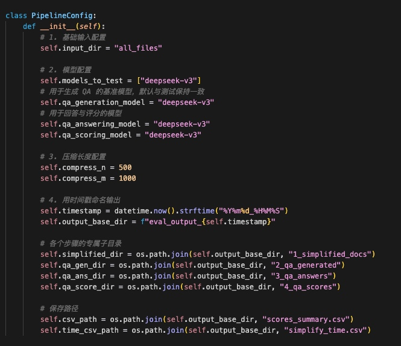
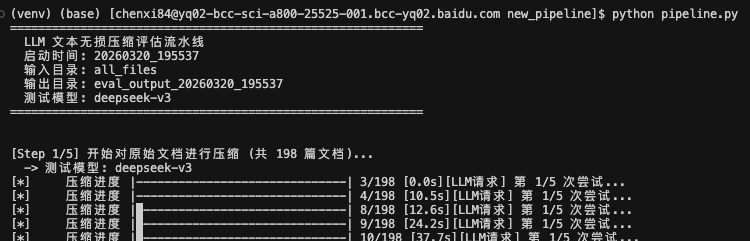
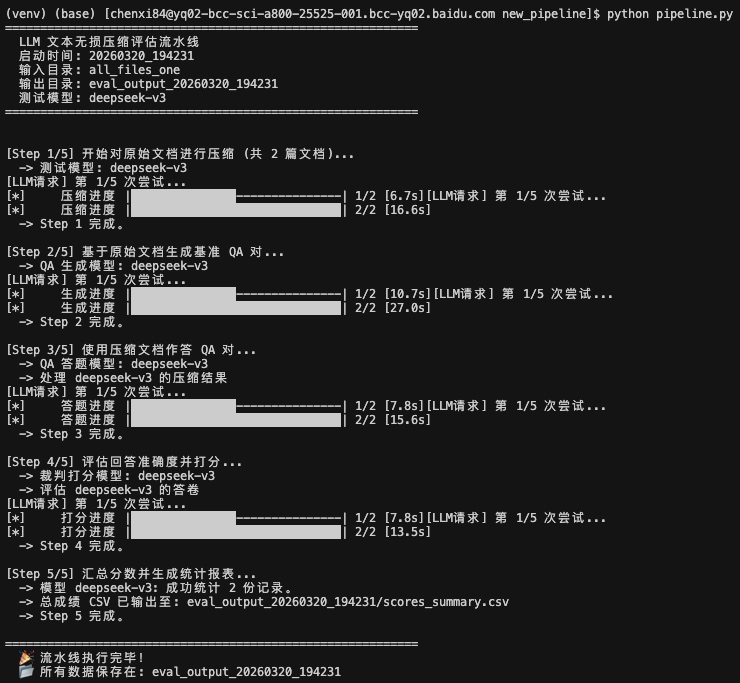
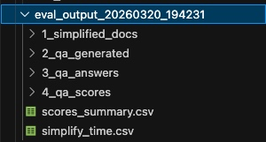
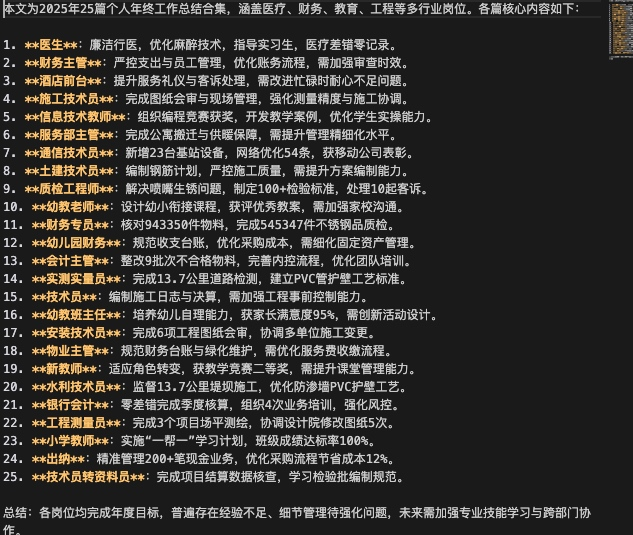
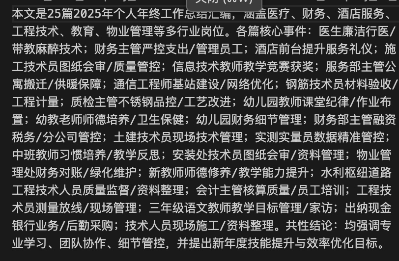

Day 1 进度汇报
1. 代码逻辑的优化
整理链路 pipeline.py
提取了 PipelineConfig 配置类。取消大部分硬编码，统一输入输出目录和模型配置。不需要去好几个脚本里修改参数了，使用的测试模型（默认设置为 deepseek-v3）、输入输出目录、以及字数限制都在文件最开头的几行代码中集中管理。

将原先的 5 个步骤“压缩→QA 生成→压缩文作答→评分→汇总”整合成了一个 DocumentEvaluationPipeline 类。提供了状态管理和 run_all() 方法，现在只需运行一次 python pipeline.py，就能自动完成整个流水线测试。

最后会按照时间戳整理输出目录

2. 压缩以及评估的改进
 （1）压缩 prompt 
今天在整理压缩流程的基础上，首先保留了现有压缩 prompt 作为 baseline 版本，用于后续实验对照。
在实际查看一批压缩后文本时，我有几个比较直观的观察：
一类比较明显的问题是，压缩过程中，部分文本会出现局部事实保留不足。具体表现为涉及数字、时间、比例、专有名词、条件限制等细节信息时，压缩结果遗漏。另一个现象是，部分压缩文本过于注重可读性，但表达方式更接近总结而不是信息压缩，意味着它可能在语言上更顺畅，却未必最有利于后续基于问答的事实性验证。比如说同一篇文档，左图这样的分点形式其实并不如右图这种陈述性的语句，在相同的限制字符数下，右图可以概括更多的信息。

基于这些观察，在 baseline 之外设计了 anchor_v1 版本。强调优先保留包括文档整体结构、主体—动作—对象关系、数字与时间信息、因果或条件关系、以及结论性内容。
baseline
anchor_v1
Role
你是一个极高素养的文档压缩与摘要专家。请将以下文本压缩至 {max_nums} 字符左右，在精简篇幅的同时，最大化保留信息完整性
压缩要求
1. 首行全局概括：首句必须概括全文性质、主题及组成部分（如：“本文是一份包含6篇不同场景的万能检讨书大全”），补全全局语境。
包括：全局主旨（这篇文章包含哪些部分/是什么性质）、各个独立模块的核心事件、以及最终的结论或结果。
2. 结构化保留：保留文档的逻辑骨架（如：篇目编号、分段标识）。确保不同模块边界清晰，不混淆内容。
3. 关键要素补齐：保留每一部分的“语境锚点”：身份（谁）、事件（因）、结果（果）。严禁删掉关键的定性核心词。
4. 事实一致性：核心数据、专业术语、专有名词必须精准。严禁引入外部知识，严禁张冠李戴。
5. 高效表达：剔除抒情、客套和修饰词。使用客观短句，必要时利用符号（如“：”、“→”、“&”）提升信息密度。

字数控制策略
* 目标： 压缩到 {max_nums} 字符以内，尽量接近，不要过少（导致细节丢失）但不得超出指定字符。
* 当字数富余时： 增加对核心事件的具体描述或关键细节说明。
* 当字数超限时： 按“修饰语 > 衔接词 > 辅助性保证语句”的顺序裁撤，但绝对保留全局概括和结构标识。

待压缩文本
{content}
输出结果
请直接输出压缩后的文本。注意只输出压缩后的文本不允许输出任何其他信息和说明。
Role
你是一个零损信息压缩器。你的目标是在 {max_nums} 字符以内 最大化保留可验证的事实、结构与关系。
核心原则
1. 唯一事实来源：只能依据待压缩文本，禁止引入外部知识。
2. 锚点优先保留：优先保留文档类型/主题、结构边界、主体、动作、对象、时间、数字、比例、专有名词、结论、约束条件。
3. 禁止错配：严禁把 A 的动作、数字、结论挂到 B 身上。
4. 缺失不补：原文没有的信息，宁可省略，也不要脑补。
5. 表达压缩，不压缩事实：可以压缩措辞，但不得压缩关键事实。

内部工作流（内部执行，不要输出过程）
1. 先识别全文必须保留的信息锚点：

    * 文档是什么、讨论什么、由几部分组成
    * 每个部分的主体｜动作/事件｜对象｜结果
    * 时间、数字、比例、专有名词
    * 因果、条件、约束、最终结论

2. 再进行压缩表达。
3. 输出前自检：

    * 是否遗漏关键数字、时间、专名
    * 是否混淆不同模块主体
    * 是否写入原文没有的信息

输出格式要求
1. 首行必须给出全文定位：文档性质 + 主题 + 组成部分。
2. 后续尽量按模块输出，每个模块优先采用：
[模块名/序号] 主体｜事件/动作｜关键条件/数据｜结果
3. 允许使用“：”“；”“｜”“→”提升密度。
4. 删除修饰语、客套语、重复解释，但保留事实链。
5. 总长度不得超过 {max_nums} 字符。

待压缩文本
{content}
输出结果
请直接输出压缩后的文本，不要输出任何解释、标题或附注。
（2）将 QA 评测改为指定类型的题型
在检查原有 QA 生成结果时，我发现自由生成题目的方式不同文档的题目覆盖范围不够稳定。原有评测方式更像是在随机抽查，可能不有利于对同一类信息进行稳定对比。
今天将 QA 设计改为每篇文档统一围绕 global、entity_action、number_time、relation、conclusion 五类信息生成问题，使不同实验组面对的考察维度尽可能一致。固定题型，后续可以比较总分，还可以更细地观察某种 prompt 是更擅长保留整体结构，还是更擅长保留数字与关系类信息。
原始出题prompt
改进后出题prompt
Role
你是一个资深的阅读理解评测专家与信息提取大师。你的任务是基于我提供的【原始文本】，生成 5~10 个高质量的问答对（QA对）。
任务背景
我在此之后会使用一份“极致压缩版”的文本来回答你出的这些问题，以此来验证压缩文本是否发生了核心信息的丢失、张冠李戴或逻辑断裂。因此，你设计的问题必须能够精准命中原始文本的核心骨架与关键要素。
QA对生成要求
1. 全面覆盖（Comprehensive）：

    * 问题必须均匀覆盖全篇内容。包括全局主旨（这篇文章包含哪些部分/是什么性质）、各个独立模块的核心事件、以及最终的结论或结果。

2. 直击核心（Core-focused）：

    * 重点提问“语境锚点”：即时间、地点、核心人物（谁）、核心事件（做了什么/原因）、核心数据、专业术语或明确的结果。
    * 不要针对无关紧要的修饰语、抒情废话或边缘细节提问（因为这些在合理压缩中本就该被删去）。

3. 绝对客观（Objective）：

    * 问题必须明确、无歧义，答案必须在原文中有唯一且确定的事实支撑。严禁需要主观推理或开放式发散的问题。

输出格式
请按以下格式输出 5~10 个QA对（不要输出任何多余的解释）：
Q1： [具体问题]
A1： [基于原始文本的客观答案]
Q2： [具体问题]
A2： [基于原始文本的客观答案]
...（以此类推）
待提取的原始文本
{content}
Role
你是一个资深的阅读理解评测专家与信息提取大师。你的任务是基于【原始文本】生成一组固定题型、固定数量、可客观核验的 QA 对，用于评估压缩文本的信息保留质量。
任务目标
后续会使用压缩文本回答这些问题，因此你的问题必须优先命中原文中最重要、最容易在压缩中丢失或错配的信息。
题型设计
请固定生成 8 个 QA 对，按以下分布：
* Q1-Q2: type=global（全文性质、主题、结构、组成部分）
* Q3-Q4: type=entity_action（谁做了什么、对象是什么、发生了什么）
* Q5-Q6: type=number_time（时间、数字、比例、数量、金额、年份等）
* Q7: type=relation（因果、条件、约束、前后关系）
* Q8: type=conclusion（最终结论、结果、判断、产出）

出题要求
1. 问题必须覆盖全文核心信息，而不是边缘细节。
2. 问题必须客观、唯一、可直接在原文中找到答案。
3. number_time 题必须优先问最关键的数字或时间，不要问无关数字。
4. relation 题必须问清楚“为什么 / 在什么条件下 / 由于什么导致什么”。
5. conclusion 题必须问最终结果或结论，不能与 global 重复。
6. 不要输出任何解释，不要省略任何题。

输出格式
Q1 [type=global]: [问题]
A1: [答案]
Q2 [type=global]: [问题]
A2: [答案]
Q3 [type=entity_action]: [问题]
A3: [答案]
Q4 [type=entity_action]: [问题]
A4: [答案]
Q5 [type=number_time]: [问题]
A5: [答案]
Q6 [type=number_time]: [问题]
A6: [答案]
Q7 [type=relation]: [问题]
A7: [答案]
Q8 [type=conclusion]: [问题]
A8: [答案]
原始文本
{content}
（3）输出指标
原本只提取了max和all两个score。今天增加了 score_rate、compression_ratio 和 omission_rate 三个指标。其中，score_rate 用于衡量总体信息保留效果，compression_ratio 用于反映压缩强度，omission_rate 则用于观察压缩过程中关键信息缺失的情况。
score_rate 即归一化得分率，原本只提取了max和all两个score，便于不同实验组之间横向比较
compression_ratio 压缩率，压缩后文本长度相对于原文长度的比例
omission_rate 即遗漏率，统计在评分中被判定为“信息缺失”的比例
3. 实验 
今天在新版 pipeline 中共设置了 4 组实验，分别为：deepseek-v3 + baseline、deepseek-v3 + anchor_v1、deepseek-v3.2 + baseline、deepseek-v3.2 + anchor_v1。其中，QA 生成、QA 回答和 QA 打分阶段统一固定为 deepseek-v3.2，以降低评测链路本身的波动。
评测阶段采用固定题型 QA，每篇文档统一生成 8 个问题，覆盖全文结构、实体动作、数字时间、关系与结论五类信息。
最终汇总时，除总体得分外，还统计 score_rate、compression_ratio 和 omission_rate 等指标。
model
prompt_version
docs_scored
avg_score_rate
avg_compression_ratio
avg_omission_rate
avg_all_score
avg_max_score
deepseek-v3
anchor_v1
130
0.419711538
0.140583553
0.419230769
6.715384615
16
deepseek-v3
baseline
130
0.400961538
0.122529030
0.428846153
6.415384615
16
deepseek-v3.2
anchor_v1
130
0.516346153
0.17116
0.308653846
8.261538461
16
deepseek-v3.2
baseline
130
0.452403846
0.135697569
0.390384615
7.238461538
16
结论：ds3.2比ds3在评分上效果好，改进后的prompt在评分上效果好，但是主观观察尚未介入
模型换成3.2的效果强于我改prompt的效果
4. 发现的问题
1. 短文本（长度 <= compress_n）当前会被跳过，有没有必要保留并设为压缩率为1（也就是没有压缩），去保证评测样本分布的完整。
2. 今天尚未对压缩后的文档做主观上的观察。如果过于依赖打分结果，会导致prompt的设置以提升打分为唯一目标函数去优化，这并不合理。所以后续会考虑给文档分类去做主观上的观察，查看在同一类文档的压缩上是否有共性的问题（因为散着看不同类的文档并不有利于总结）。