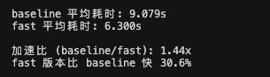

1. 在优化后的prompt_v1基础上跑了qwen3.5-27b和deepseek-v3.1-250821

model
prompt_version
avg_time
avg_score_rate
avg_omission_rate（信息确实率）
avg_compressed_len（字符长度）
avg_all_score
deepseek-v3.1-250821
prompt_v1
13.94706
0.516346153
0.303846153
616.9769231
8.261538461
deepseek-v3.2
prompt_v1
11.17110806
0.516346153
0.308653846
529.6615385
8.261538461
qwen3.5-27b
prompt_v1
7.614083333
0.492788461
0.307692307
489.7692308
7.884615384
deepseek-v3.2
baseline
9.709100271
0.452403846
0.390384615
462.8307692
7.238461538
qwen3.5-27b
baseline
7.746610619
0.426442307
0.394230769
420.1
6.823076923
deepseek-v3
prompt_v1
8.704670782
0.419711538
0.419230769
415.2153846
6.715384615
deepseek-v3.1-250821
baseline
11.562192
0.41875
0.41826923
422.5692308
6.7
deepseek-v3
baseline
7.74572
0.400961538
0.428846153
352.2692308
6.415384615
*按照得分率降序排列
*红色为均耗时超过10s，绿色为均耗时低于10s
*没做到严格低于500字符，考虑超字数在评分里加硬性惩罚

2. 针对耗时做了prompt优化

最高执行指令：反思维链与零废话
你必须直接、立刻输出最终的压缩结果。绝对禁止任何形式的内部推理、分析步骤或分类说明；禁止输出诸如“好的”、“根据要求”、“本文属于XX类型”等任何前缀、后缀。你的首个输出字符必须是压缩文本的实质内容！
强调这一点后选了20个文档试了一下耗时，有变快，明天再整体跑一下所有的文档看下trade off

3. 考虑改进评测方法

考虑引入下游任务导向的评测， 放弃纯粹的抽取式 QA，改为生成对比。
方法： 让一个高性能模型基于未压缩的原文档生成一个特定任务，例如“写一份 500 字的故事大纲”或“提取核心论点及论据列表”。然后，让同一个模型基于压缩后的文档做完全一样的任务。
打分： 使用 LLM-as-a-judge 评估后者相对于前者在逻辑连贯性、关键要素完备度、以及生成质量上的吻合度。

