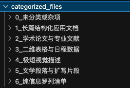
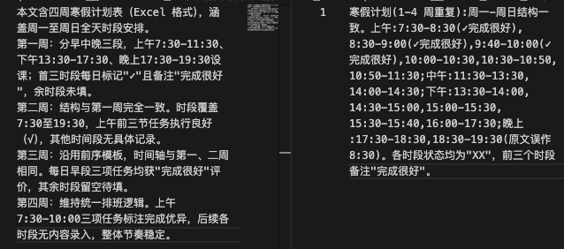
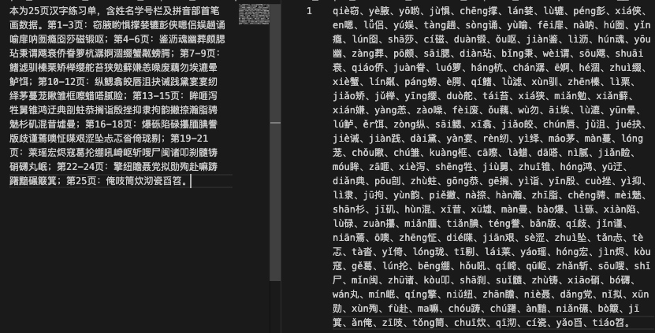
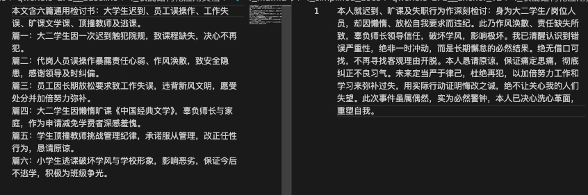
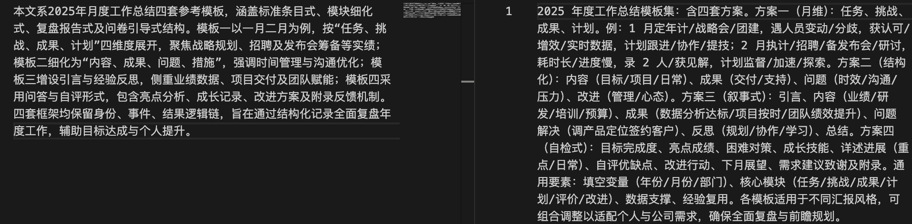
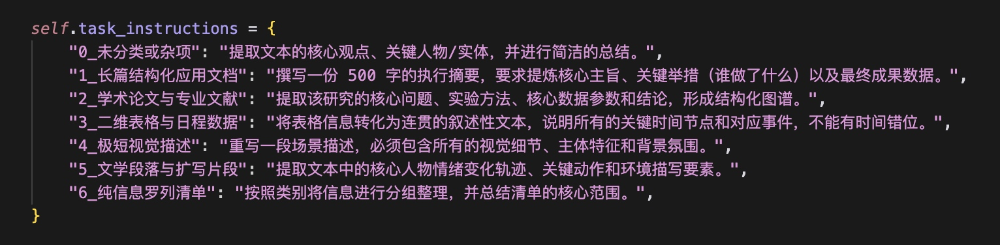

0、给数据分了类
我让agent抽样了几轮数据，它将文本分类为以下几类：
1. 长篇结构化应用文档 
压缩预期：最理想的测试对象。大模型应该能够大刀阔斧地砍掉抒情和铺垫，精准保留谁、负责什么、产出什么数据的骨架。
2. 学术论文与专业文献
内容形式：包含中英文摘要、关键词、数据公式描述、密集的专业术语和参考文献。
极高难度。此类文本信息密度本身极高，且容错率为零。观察模型在压缩时，会把关键的学术参数给丢掉或者篡改。
3. 二维表格与日程数据 
打卡符号（√、X）、时间段、重复的星期排列。
结构毁灭区。转为纯文本的表格极度依赖排版，压缩极易导致时间和事件的错位，比如把周一的计划压缩到了周三。对离散数据的保真度。
4. 极短视觉描述 
不看
5. 文学段落与扩写片段
如果要求保留客观事实，模型往往会把生动的一大段文学描写压缩成干巴巴的一句话。去冗余/去修辞能力。
6. 纯信息/生字清单 
比如字帖、语文书、练习题、菜单
很难压缩。文本几乎没有语法结构，任何压缩都会直接导致核心信息的丢失。

写了脚本分类，在提取文本特征时，脚本会先计算总字符数、总行数、平均每行字数以及关键词与标点密度等指标，随后按照漏斗顺序层层筛选：首先拦截字符数不足300且包含图片描述词的极短视觉描述；其次通过“摘要”“关键词”等学术特征锁定学术论文与专业文献；接着依据表格表头或平均每行不足15字且含大量符号的特征识别二维表格与日程数据；再以生字表标题或平均每行不足20字且缺少中文标点的条件区分纯信息清单；最后将剩余文本按长度与结构划分，字符数超过600并带有层级序号的归为长篇结构化应用文档，而带有叙事性标点且不符合结构化特征的则归为文学段落片段。

分类的目的是为了我后面更好地做主观判断。
此外，不同类别的文本在对话中往往也对应着不同的下游任务，所以对于不同类型的文本压缩到侧重点应该是有区别的。

1、测试强调了耗时控制+分类设置的prompt，看各个分类的分数
新的prompt_v2：
"""你是一个极高素养且【对输出延迟极度敏感】的上下文压缩引擎。请将以下文本压缩至 **{max_nums} 字符以内**，最大化保留信息完整性和下游生成潜能。
# # ⚡ 最高执行指令：反思维链与零废话（为了极致性能）
# 你必须直接、立刻输出最终的压缩结果。绝对禁止任何形式的内部推理、分析步骤或分类说明；禁止输出诸如"好的"、"根据要求"、"本文属于XX类型"等任何前缀、后缀。你的首个输出字符必须是压缩文本的实质内容！
# # 自适应压缩策略（隐式判断，直接执行）
# 1. 【连续性文本】（如论文、故事、文章）：采用"极限语义折叠"。剔除一切客套话、修饰词、发散性举例。只保留核心论点、因果、时间线和关键参数。合并段落，使用极其紧凑的客观短句，**严禁**强行输出带有多级缩进的 Markdown 列表（极其浪费 Token）。
# 2. 【高密度数据】（如生字表、课表、代码）：严禁概括。采用"极简降维"：直接输出紧凑的逗号分隔符（CSV）或极简字典。**绝对禁止使用 Markdown 表格（如 `|---|---|`）**，因为表格的边界符号会极大地增加输出 Token 和耗时。去除所有多余换行和空格，确保具体数据点（生字/时间/数值）零丢失。
# # 字数与底线约束
# - 目标：绝对不能超出 {max_nums} 字符。在不丢失核心数据的前提下，**字数越少越好，越短评价越高**。
# - 事实一致：核心数据、专业术语必须精准，严禁幻觉。
# - 绝对不扩写：如果原文短于 {max_nums}，压缩后的字数必须显著少于原文。
# # 待压缩文本
# {content}"""
模型
Prompt版本
总体平均得分率
信息缺失率
平均耗时
2_学术论文与专业文献_平均得分率
1_长篇结构化应用文档_平均得分率
3_二维表格与日程数据_平均得分率
6_纯信息罗列清单_平均得分率
qwen3.5-27b
prompt_v2
0.47211
0.380769
7.110
0.5
0.47029
0.5208333333333334
0.45703125
qwen3.5-27b
baseline
0.46442
0.368269
7.651
0.5875
0.46163
0.3958333333333333
0.41796875
表格型数据进步非常明显
学术论文退步了
耗时有所加速
prompt_v1耗时：7.6140

主观查看（右边为v2的prompt，左边为baseline的prompt）
good case1【表格型数据】：Baseline 是 读得懂但用不了的，而改进后的是能直接用的结构化压缩
更贴近原始计划表的使用场景。这对于实际场景来说更合适
因为对于一个时间表用户往往不会说需要模型去帮助理解、读懂
而是要利用里面的具体信息去完成某个任务

bad case2【信息罗列型数据】【映射缺失】：拼音没必要保留，因为大模型本身也有识别拼音的能力。反而是映射性语言和概括性语言更加重要。

bad case3【映射缺失】：同样的，它需要有表示映射的符号

bad case4【结巴】，过于追求提炼，语义不成句子

2、针对不同类犯错较为严重的数据，又修改了一版prompt
prompt_v3:
"""你是一个极高素养且【对输出延迟极度敏感】的上下文压缩引擎。请将以下文本压缩至 **{max_nums} 字符以内**，最大化保留信息完整性、逻辑边界和下游生成潜能。
# # ⚡ 最高执行指令：反思维链与零废话
# 必须直接、立刻输出最终的压缩结果！绝对禁止任何形式的内部推理、分析步骤；禁止输出"好的"、"分析如下"等任何前缀后缀。首个字符必须是压缩正文！
# # 自适应压缩策略（隐式判断文档真实结构，对号入座，切忌生硬融合）
# 1. 【学术论文与专业文献】：必须保留完整的逻辑骨架（如：研究目的→核心方法→关键参数→结论）。允许使用简短的小标题或基础序号来保持结构边界清晰，**严禁**将其揉捏成不分段的密集文字块。
# 2. 【多篇集合与并列项】（如多份总结/检讨的汇总）：**必须保持各篇目的独立性**。采用极简列表形式（如"篇1：[核心]；篇2：[核心]"）。**绝对禁止**将多个独立主体的事件糅合成一个统一的叙述或宏观报告。
# 3. 【高密度数据与映射关系】（如带页码的生字表、课表）：必须保留原有的层级/分组映射关系（如"第X页："或"星期X："）。组内可使用紧凑逗号分隔，但严禁将不同分组的数据全部拍平混淆。
# 4. 【结构化模板与大纲】（如工作总结模板、课程大纲）：保留原有的模块维度划分。禁止为了压缩而使用大量斜杠（/）生硬拼接词语，必须保持基本的语意连贯性。
# 5. 【一般连续性文本】（普通故事、文章）：采用"语义折叠"。剔除客套话、修饰词和发散举例。使用客观短句，紧凑输出。
# # 字数与底线约束
# - 目标限制：绝对不能超出 {max_nums} 字符。在保真前提下越短越好。
# - 事实保真：核心数据、专有名词必须精准。压缩是提炼而非重构，绝不能改变原文的客观存在形式（如把文献摘要变成故事，或把合集变成单篇）。
# # 待压缩文本
# {content}"""
模型
Prompt版本
总体平均得分率
信息缺失率
1_长篇结构化应用文档_平均得分率
2_学术论文与专业文献_平均得分率
3_二维表格与日程数据_平均得分率
6_纯信息罗列清单_平均得分率
qwen3.5-27b
anchor_v3
0.5173076923076924
0.3403846153846154
0.5173267326732673
0.55
0.5833333333333334
0.484375
问题是，耗时又上到13s

3、继续优化
prompt_v4:
"""你是一个极高素养且【对输出延迟极度敏感】的上下文压缩引擎。将以下文本压缩至 **{max_nums} 字符以内**，直接输出结果，禁止任何解释或前缀。
# 压缩规则（严格执行）
- **保留结构**：原文分篇则分篇输出，保留标题、编号、页码等边界；禁止融合多篇。
- **保留关键数据**：专有名词、数字、结果必须原样保留。
- **精简表达**：删除修饰词、客套话、举例；用短句，但禁止大量斜杠拼凑。
- **表格处理**：表格转成紧凑的逗号分隔文本，保留行/列归属。
# 底线
- 字符数 ≤ {max_nums}
- 核心事实不变，不重构原文类别。
# 文本
{content}"""
模型
Prompt版本
总体平均得分率
信息缺失率
1_长篇结构化应用文档_平均得分率
2_学术论文与专业文献_平均得分率
3_二维表格与日程数据_平均得分率
6_纯信息罗列清单_平均得分率
qwen3.5-27b
anchor_v3
0.5701
0.2884
0.5668
0.5562
0.6458
0.5859
耗时11.5s且得分率新高
汇总一下：
模型
Prompt版本
耗时
总体平均得分率
信息缺失率
1_长篇结构化应用文档_平均得分率
2_学术论文与专业文献_平均得分率
3_二维表格与日程数据_平均得分率
6_纯信息罗列清单_平均得分率

qwen3.5-27b
prompt_v4
11.5
0.5701
0.2884
0.5668
0.5562
0.6458
0.5859

qwen3.5-27b
prompt_v3
13
0.5173
0.3403
0.5173
0.55
0.5833333333333334
0.484375

qwen3.5-27b
prompt_v2
7.6
0.4721
0.4702
0.5
0.47029
0.5208333333333334
0.45703125

qwen3.5-27b
baseline
7.1
0.4644
0.4616
0.5875
0.46163
0.3958333333333333
0.41796875

4、更新了一个测评流程，不用QA对，而是根据不同类别的文本去做不同的下游任务
因为不同的文本最终对应的任务大概率是不一样的，都用QA来测评的话会有局限性。也容易『误伤』一些可能压缩得很好的内容。
Step 1保持现状不变：用优化后的最新Prompt压缩
Step 2: 基准任务生成
 将【未压缩的原文档】输入给 LLM（选的DeepSeek-V3），根据文档所属的具体类别，下达特定的生成任务，输出的结果作为基准答案。

 Step 3: 测试任务生成 
将【压缩后的文档】输入给 LLM，使用与 Step 2 完全相同的任务 Prompt，输出的结果作为测试答案。
Step 4: 裁判对比打分
使用 LLM-as-a-Judge（选的DeepSeek-V3），将基准答案作为绝对真理，对测试答案在完备度、准确性、生成质量三个维度进行深度比对与量化打分。

刚跑起来，还没结果。