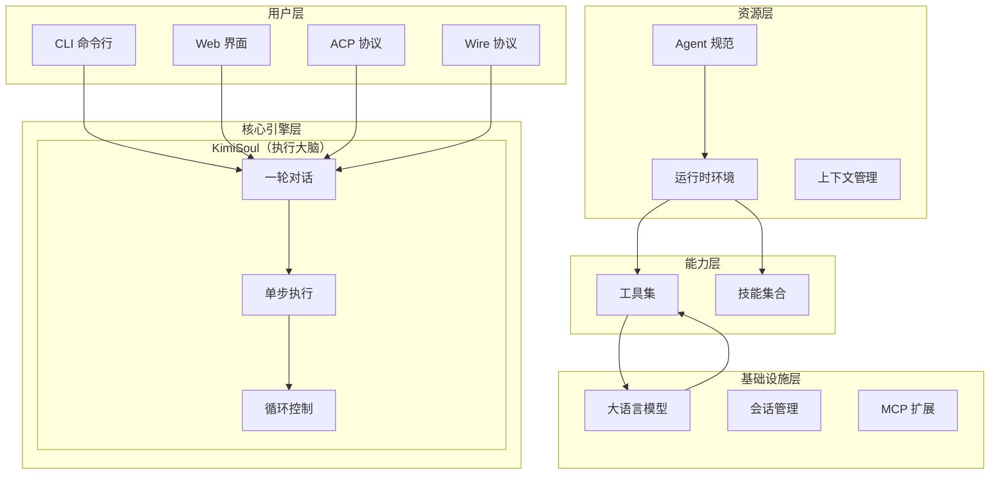
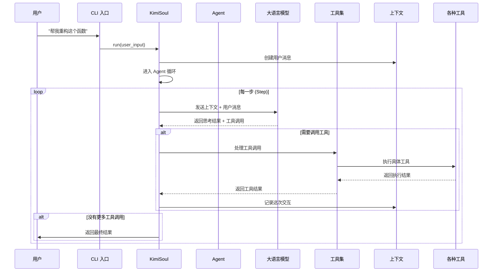
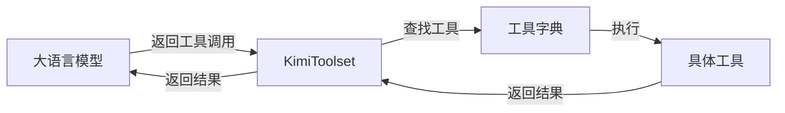
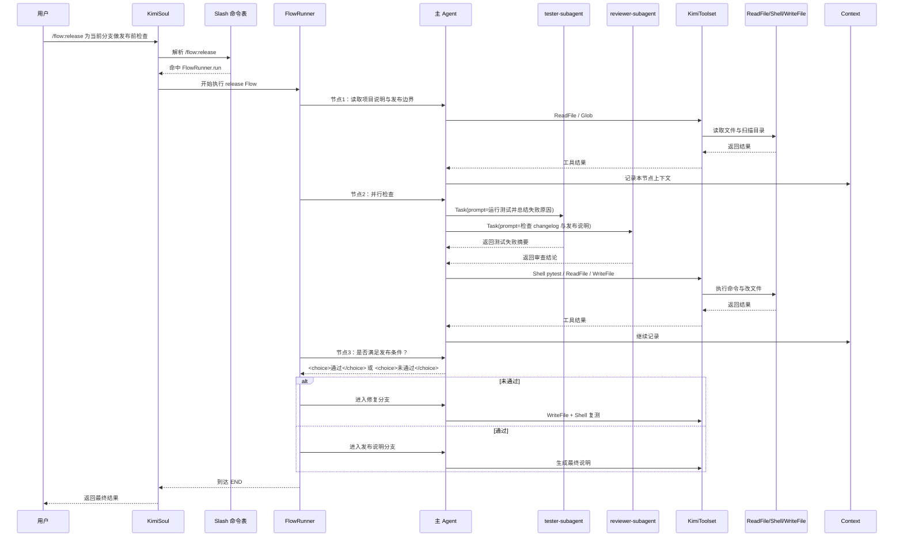

# 总览：Kimi Code CLI 动态执行流程梳理

如果只用一句话来概括 Kimi Code CLI，它就是一个运行在终端里的 AI Agent：你给它一个目标，它会在当前会话和当前工作区里组织上下文、决定是否调用工具、必要时委托子 Agent，并在多轮 step 中持续推进任务，直到没有新的工具调用为止。

当然，这是每一个 AI Agent 都具备的基础属性，那么 Kimi Code CLI 的特别之处又在哪里呢？

很多刚接触 Agent 的开发者，会把这类系统想成"一个大模型 + 一堆工具"。这个理解不算错，但还不够细。真正决定系统能不能跑得稳的，不只是模型够不够强，而是输入如何进入主循环、上下文如何增长、工具如何被注入、技能如何被注册、子 Agent 如何被组织、以及错误历史如何被截断和回放。Kimi Code CLI 值得学习的地方，恰恰就在这些工程细节上。

---

## 一、Kimi Code 的分层协作系统

在 Kimi Code CLI 里，Agent 不是唯一主角。更准确地说，Agent 定义我是谁、我能用什么；Runtime 定义我所处的运行世界；KimiSoul 负责这轮任务怎么推"；Context 负责这轮任务记住了什么；Toolset 负责有哪些可调用动作；Skill 负责有哪些可复用的业务知识和工作流。官方文档把 Agent 定义为由系统提示词、工具和子 Agent 组织方式组成的行为载体，而源码则进一步把 Runtime、Context 和 LaborMarket 从 Agent 本体中拆开，使它们分别承担环境、记忆和多智能体组织的职责。



这张图可以理解成：用户入口只负责把任务送进来，KimiSoul 负责真正调度执行，Runtime/Context 负责提供当前世界和当前记忆，Toolset/Skills 负责提供行动能力，LLM 则是每一步推理的驱动器。读这类的类似项目时，只要先把这几层分开，源码就会一下子清晰很多。

---

## 二、最容易看错的一点：KimiSoul 的角色

第一次看到 KimiSoul 这个名字，会不自觉把它理解成某种"全局人格内核"。但从当前实现看，这个说法并不准确。KimiSoul 构造时接收的是 agent 和 context；它内部拿到 agent.runtime，再通过 run → _turn → _agent_loop → _step 驱动当前会话。也就是说，它的职责不是长期替你记住所有项目偏好，而是在当前 Agent、当前 Runtime、当前 Context 的约束下，把这轮任务跑完。

更进一步看，Runtime.create(...) 会收集当前时间、工作目录、目录 listing、AGENTS.md 内容、可用 Skills、额外目录信息，并把 session、approval、labor_market、environment 等对象挂进去；

而 Context.restore() 会从文件后端恢复消息历史、token 计数和 checkpoint。

于是，KimiSoul 的"记忆感"，其实来自它不断读取和追加 当前会话的 Context，而不是来自某个独立存在、跨项目自动演化的神秘大脑。这个 distinction 很重要，因为它会直接影响以后如何设计 Agent：如果你想让某类规则长期稳定生效，应该优先落在 agent spec、system prompt、skills 或 session state 上，而不是 KimiSoul 会自己默默学会。

可以把这层理解成：**KimiSoul 管执行，Runtime 管环境，Context 管记忆。** 这三者绑在一起，才形成了"这个 Agent 此刻在这个项目里如何行动"的完整状态。这个拆分非常值得学习，因为它让行为、环境和历史不再揉成一个难以维护的大对象。

---

## 三、静态装配：一个 Agent 在启动时究竟是怎么被装起来的

在 Kimi Code CLI 里，Agent 本身其实非常薄。具体的结构在模块一：Agent与loop做了更详细的说明。源码里的 Agent 只有四个核心字段：name、system_prompt、toolset 和 runtime。真正重量级的部分在 Runtime：它持有 config、oauth、llm、session、builtin_args、denwa_renji、approval、labor_market、environment、skills 和 additional_dirs。换句话说，Agent 更像一张角色卡，Runtime 才是这张角色卡所处的"工作现场"。

如果把源码压缩成一段最容易理解的伪代码，它大致是这样的：

```python
runtime = await Runtime.create(config, oauth, llm, session, yolo, skills_dir)
agent = await load_agent(agent_file, runtime, mcp_configs)
soul = KimiSoul(agent=agent, context=context)
```

这段伪代码对应的意义很明确：先构造世界，再装配角色，最后把角色交给执行引擎。

其中 Runtime.create(...) 不只是创建一个对象，它还会顺手做很多非常关键的事情，比如发现 Skills、读取 AGENTS.md、恢复会话里持久化的额外目录、把这些信息格式化后作为 system prompt 的内置参数。这种"先把世界搭好，再把 Agent 放进去"的思路，是它比很多 demo 级 Agent 项目更成熟的地方。

load_agent(...) 这条装配链也很值得看。它先从 YAML agent spec 里加载定义，再渲染 system prompt，然后优先加载 fixed subagents，因为 Task 工具初始化时依赖 LaborMarket；之后再创建 KimiToolset、按工具路径字符串去加载内置工具、必要时连接 MCP 工具，最后再从会话状态里恢复 dynamic subagents。

顺序看似普通，实际很讲究：子 Agent 要先注册，工具才能正确感知可调度的劳动力市场；MCP 要在 Toolset 上统一挂载，模型才能把它们当普通工具使用；session 里的动态子 Agent 要在 agent 恢复阶段补回来，否则同一会话前后行为就会不连续。

官方文档中，Agent 文件是 YAML，支持 extend 继承、tools 显式启用工具、exclude_tools 裁剪能力边界。

---

## 四、动态执行：step 循环

用户真正输入一条指令后，Kimi Code CLI 的核心执行链路是一个多步循环。run() 会先刷新 OAuth，发出 TurnBegin，把输入包装成 user message；如果输入是 slash command，就先走命令分发，否则进入 _turn()。_turn() 做两件很关键的事：一是打 checkpoint，二是把用户消息追加到 Context，然后进入 _agent_loop()。

把这条链压缩成伪代码，会更容易看懂：

```python
async def run(user_input):
    user_message = Message(role="user", content=user_input)
    if is_slash_command(user_message):
        await dispatch_command(...)
    else:
        await _turn(user_message)

async def _turn(user_message):
    await checkpoint()
    await context.append_message(user_message)
    return await _agent_loop()
```

这里最值得注意的是数据的交接顺序：user_input 先被包装成 Message，然后由 _turn() 把它写进 Context，之后 _agent_loop() 再基于整个历史上下文进入下一轮推理。也就是说，模型看到的是"当前 system prompt + 已累积的 history + 这次新消息"。



不过，真正让这张图变成可运行系统的，是 _agent_loop() 和 _step()。

_agent_loop() 会清理 stale steer、等待 MCP 工具就绪、把审批请求转发到 wire 层，然后开始 step 级循环。每次循环里，它都会检查是否要做 context compaction、再打一层 checkpoint、同步 n_checkpoints 给 DenwaRenji，最后调用 _step()。如果 _step() 结果表明没有新的工具调用，那么这轮 turn 就结束；如果还有工具或出现 steer，就继续下一轮。这样一来，一个 turn 可以包含多个 step，而一个 step 才是"模型推理一次并可能触发工具调用"的最小闭环。

_step() 又是整个执行栈里最像 LLM 驱动器的地方。它会收集动态注入内容，必要时把这些 reminder 先写进上下文；然后把历史做 normalize_history；再把 chat_provider、system_prompt、toolset 和 effective_history 一起送进 kosong.step(...)。拿到 StepResult 之后，系统再等待所有工具结果返回，更新 token 统计，并把 assistant message 和 tool results 一起追加进上下文。

可以把它理解成：KimiSoul 负责 orchestration，kosong.step(...) 负责真正把"系统提示词 + 历史 + 工具定义"送进模型并接回结果。

如果再压缩成一段伪代码：

```python
async def _step():
    injections = await collect_injections()
    effective_history = normalize_history(context.history)

    result = await kosong.step(
        chat_provider,
        agent.system_prompt,
        agent.toolset,
        effective_history,
    )

    tool_results = await result.tool_results()
    await grow_context(result.message, tool_results)
```

effective_history 不是简单复制历史，而是喂给模型的规范化上下文；agent.system_prompt 是启动时已经注入工作目录、AGENTS.md、Skills 等运行信息的系统提示；toolset 是模型在这一轮真正可见、可调用的动作集合。

---

## 五、Context：可恢复、可回滚的会话日志

在 Kimi Code CLI 里，context 更接近一个带文件后端的会话日志系统。Context.restore() 会从文件里恢复消息、token 计数和 checkpoint；checkpoint() 会写入 _checkpoint 记录，必要时还会额外插入一条 CHECKPOINT N 的系统消息；revert_to(checkpoint_id) 则会把指定 checkpoint 之后的内容从上下文里截断。

```python
class Context:
    history
    token_count
    next_checkpoint_id

    async def restore():
        # 从 file_backend 重建 history / token_count / checkpoints

    async def checkpoint():
        # 追加一个 _checkpoint 标记

    async def revert_to(checkpoint_id):
        # 截断该 checkpoint 之后的历史
```

这里最值得学习的地方在于：**Kimi Code CLI 的纠错不是单纯靠补一句提示，而是建立在历史可回滚之上的。** 这让长任务里的出错恢复不再只是越补越脏，而是有可能真正回到某个更干净的分叉点继续推理。

这一层也解释了为什么 Kimi Code CLI 里的记忆虽然很强，但依然更接近会话中心。它确实会在会话中持久化历史、额外目录和某些状态，但它不是那种跨所有项目默默累积个性偏好的黑盒记忆体。对开发者来说，这恰恰是一种优点，因为它更可控，也更容易排查问题。

---

## 六、Tool 机制：模型为什么能"伸手去做事"

KimiToolset 做统一管理。KimiToolset 内部有 _tool_dict 存工具实例，有 tools 属性给模型暴露当前可见工具列表，有 handle(tool_call) 负责解析参数并真正执行工具，支持在运行时连接 MCP 服务器，把外部能力接进来。



不过源码里的亮点不只是在有个工具字典。真正值得学习的是：load_tools() 接收的是诸如 `kimi_cli.tools.shell:Shell` 这样的路径字符串，框架会动态 import 这个类，再按构造函数参数类型自动注入依赖；在 load_agent() 里，这些依赖包括 Runtime、Config、Session、Approval、LaborMarket 等。这样一来，工具不需要自己到处找全局单例，而是由装配阶段显式拿到它所需的运行时对象。对 Agent 工程来说，这是一种非常干净的依赖注入思路。

```python
toolset.load_tools(tool_paths, dependencies)

def handle(tool_call):
    tool = _tool_dict[tool_call.function.name]
    arguments = json.loads(tool_call.function.arguments or "{}")
    return asyncio.create_task(tool.call(arguments))
```

这段伪代码想表达的重点有两个：第一，模型返回的不是直接执行命令，而是一个结构化的 tool_call；第二，真正执行工具时，Toolset 先按名字找到工具，再解析 JSON 参数，再异步调用。于是模型和工具之间就形成了清晰的边界：模型决定要调用什么，Toolset 决定怎么安全地把它落到实际执行。

MCP 则是在这套机制上继续扩展的。官方 README 明确写到 Kimi Code CLI 支持 MCP，并可通过 kimi mcp 或配置文件接入外部工具；源码里 load_mcp_tools(...) 会连接 MCP server、列出工具、把它们包装成 MCPTool 再挂回 Toolset。模型并不需要知道这是内置工具还是 MCP 工具，对它来说都只是当前 Toolset 的一部分。

---

## 七、Skill 机制

详见模块三：Skill

---

## 八、一个从输入开始的完整真实执行链

下面这个例子不是仓库内置的某个固定 workflow，而是一个贴近生产场景的组合示例。它的目的是把 Kimi Code CLI 源码里的几个关键层一次串起来：slash command、Flow Skill、主循环、工具调用、子 Agent 协作、decision 路由和 session/context 的变化。这个例子非常适合拿来训练自己的架构感。它的每一步都对应前面讲过的某个机制。

设想在当前仓库中执行这样一条命令：

```
/flow:release 为当前分支做发布前检查；如果测试失败，先修复再继续
```

当这条输入进入 run() 之后，第一件发生的事是 slash command 解析。因为 KimiSoul 启动时已经通过 _build_slash_commands() 把所有 flow skills 注册进命令表，所以 /flow:release 会直接命中 FlowRunner(skill.flow, name="release").run。此时系统已经不再是让模型自由发挥怎么发布，而是先把控制权交给一个图执行器。

随后，FlowRunner 从 BEGIN 开始进入第一个 task 节点。假设这个节点的语义是"读取项目说明、识别发布边界、列出需要检查的对象"。FlowRunner 会把该节点文本包装成一条新的 user message，调用 soul._turn(...)。

在这个 turn 里，主 Agent 看到的 system prompt 已经带有工作目录、目录 listing、AGENTS.md 内容、可用 Skills 和额外目录信息；于是它很可能先调用 ReadFile 去读 AGENTS.md、package.json 或 pyproject.toml，再调用 Glob 或 Grep 去找测试配置和 release 脚本。对我们来说，重要的是要明白：flow 节点内部仍然是一次完整的 agentic turn，它可以像平时一样多 step 使用工具。

接下来，Flow 进入一个更重要的 task 节点。比如并行检查：运行测试、审阅发布说明、核对变更日志。这时候主 Agent 可能不会自己独立完成全部工作，而是调用 Task 工具，把跑测试并总结失败原因交给 tester-subagent，把检查 changelog 是否覆盖主要变更交给 reviewer-subagent。由于子 Agent 运行在独立上下文中，主 Agent 必须在 Task.prompt 里把任务目标、相关文件路径和期望输出说清楚。与此同时，主 Agent 自己也可能调用 Shell 去执行测试命令，或调用 ReadFile 去读 release checklist。也就是说，在这一阶段，系统并不是"主 Agent 停下来等子 Agent"，而更像一个项目经理：它把部分工作外包出去，同时保留自己对主线的控制。

假设测试子 Agent 返回"有 3 个测试失败，问题集中在 release_notes.py 的格式拼装逻辑"，review 子 Agent 返回"changelog 缺少对 breaking change 的说明"。主 Agent 在下一轮 step 中拿到这些结果后，会把它们作为普通 tool result 继续写入上下文；随后它可能选择调用 ReadFile 读取 release_notes.py，调用 StrReplaceFile 或 WriteFile 修复格式逻辑，再次调用 Shell 复跑测试。

这里会看到一个很典型的 Agent 工程特征：**工具调用不是线性的，而是"先探索、再修改、再验证"的闭环。** 这正是 _step() 里"先拿 StepResult，再等 tool_results()，再把结果回写 Context"的价值所在。

当 Flow 走到一个 decision 节点，例如"是否已满足发布条件"，事情会发生一个根本变化：这时模型不再只是给出一段开放式分析，而必须在可选分支之间做结构化选择。FlowRunner 会把当前节点原文改写成"问题 + Available branches + <choice> 输出要求"，比如候选分支是"通过""未通过"。模型仍然可以结合前面主 Agent 自己的工具结果和两个子 Agent 的返回做推理，但最后必须输出诸如 `<choice>未通过</choice>` 这样的结果。程序再把这个 choice 和边标签做匹配，决定到底进入"修复分支"还是"进入发布分支"。

从这里就能看出，Flow Skill 的控制力是来自让模型的思考必须落到图的合法边上。

如果模型选择了"未通过"，Flow 就会进入后续 task 节点，例如"根据失败测试结果修复代码并重新验证"；如果模型选择了"通过"，则进入"生成发布说明并结束"。

在这两个分支里，FlowRunner 并不会代替 Agent 做具体操作，它只是把节点级状态机跑下去；真正调用 WriteFile、Shell、ReadFile、Task 的仍是当前 Agent。这就是 Kimi Code CLI 最值得学习的平衡：**图负责宏观路径，Agent 负责微观执行。**

如果把这条链再抽象成一张图：



这张图里最重要的是应该能看出几层控制关系：slash command 负责入口分流，FlowRunner 负责节点级状态推进，主 Agent 负责节点内部决策，Task 负责把子任务委托给独立上下文的 subagent，Toolset 负责把结构化 tool call 安全落到真实工具上，Context 则把整条链沉淀成可继续推理的历史。

---

## 九、一个高级亮点：它给"历史回滚"留了协议位置

如果想理解 Kimi Code CLI 为什么比很多 demo 级 Agent 项目更像可演进的工程系统，这部分很值得看。

详见模块一：Agent与loop

简单概括：KimiSoul 的 step 循环里不仅会在上下文过长时触发 compaction，还会在检测到 pending D-Mail 时抛出 BackToTheFuture 异常，由主循环捕获后调用 context.revert_to(checkpoint_id)，再把"来自未来自己的消息"注入到更早的分叉点继续跑。它本质上不是科幻彩蛋，而是一种基于 checkpoint 的上下文事务回滚机制。

这套机制带给 Agent 工程师的启发是：**长流程 Agent 的纠错不应该永远靠"继续往上下文里追加补丁提示"，因为那会把历史越堆越脏。** Kimi Code CLI 的设计思路是，在必要时直接回到更干净的 checkpoint，然后带着精炼后的"未来经验"重新推理。哪怕你不打算照搬 D-Mail 设定，这种"checkpoint + revert + replay"的思路本身也非常值得学。

---

## 十、个人认为 Kimi Code CLI 值得 Agent 开发者学习的设计

如果一定要把它最值得学习的亮点压缩成几句话，我会这样概括。

**第一**，它把 Agent 本体压薄了，把 Runtime、Context、Toolset、Skill、LaborMarket 这些高耦合但职责不同的东西拆开了，因此整个系统既能扩展，又能定位问题。

**第二**，它没有把工具系统做成一堆散乱函数，而是通过路径字符串加载、依赖注入和 MCP 统一接入，形成了一个可扩展的动作层。

**第三**，它没有把 Skill 只做成"更长的 prompt"，而是进一步做出了 Flow Skill，把业务流程图转成状态机执行。

**第四**，它对多智能体的设计不是"多开几个窗口"，而是给了 Task、CreateSubagent 和 LaborMarket 这样明确的组织机制。

**第五**，它在会话层面认真对待了恢复、压缩、checkpoint 和回滚，这让长链任务真正有了"工程上的韧性"。

那么和 OpenCode 比起来，它少了 provider 这一关键的抽象层，因此没有 OpenCode 那样强大的适配各类 LLM 的能力。

---

*(End of file)*
