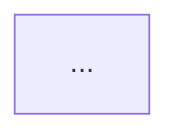

# 模块三：Skill

在 Kimi Code CLI 中，Skill 机制是极其出彩的一环，特别是其首创的 Flow Skill，流式图驱动技能，将传统的代码流程图与大模型的推理能力完美结合。

---

## 0. Skill 在系统里的位置

开始之前再回顾一下skill的前置知识。

按照我的写作思路把 Kimi Code CLI 想成三个主要模块：
- **Agent**：当前这个执行体是谁，默认提示词是什么，工具权限有哪些
- **Tool**：它的手脚，能读文件、写文件、跑 shell、搜网页
- **Skill**：它遇到某类任务时可加载的"经验包 / 操作手册 / 流程模板"

这里最关键的一点是：**Skill 不是一个独立 Agent**。它不会自己拥有新的权限、也不会自己变成另一个会话主体。它只是被当前 Agent 读取和执行的内容。官方文档明确说 `/skill:<name>` 的行为就是把对应 SKILL.md 内容发送给 Agent 作为提示词；而 `/flow:<name>` 则是让 Agent 从 BEGIN 开始按流程图推进。

所以从架构上说：
> **Skill 是给当前 Agent 加知识和流程，不是再造一个新 Agent。**

这句话一定要记住，因为后面看代码时，很多设计都是围绕这个前提展开的。

此外，如果要区分mcp和skill，那就是mcp告诉模型如何连接各种工具，解决的是连接问题。而什么时候用什么工具，是skill关注的问题，它解决的是使用问题。

---

## 1. Skill 如何被发现和加载

代码里实际上定义了内置、用户级、项目级多个候选目录。然后按优先顺序找出实际存在的目录。

在当前的实现里：内置 skills 目录来自包内 `src/kimi_cli/skills`，用户级候选目录包括 `~/.config/agents/skills`、`~/.agents/skills`、`~/.kimi/skills`、`~/.claude/skills`、`~/.codex/skills`，项目级候选目录则对应当前工作目录下的 `.agents/skills`、`.kimi/skills`、`.claude/skills`、`.codex/skills`。

### 1.1 自动发现机制

在 @src/kimi_cli/skill/__init__.py 中，框架会在 `~/.kimi/skills/` 目录下（或者当前项目下的 `.kimi/skills/`）扫描所有的子目录。只要目录中包含 SKILL.md 文件，就会被认为是一个技能。

```python
# @src/kimi_cli/skill/__init__.py 119-127
async def discover_skills_from_roots(skills_dirs: Iterable[KaosPath]) -> list[Skill]:
    """
    遍历传入的目录根节点，寻找并解析其中的 SKILL.md
    """
    skills_by_name: dict[str, Skill] = {}
    for skills_dir in skills_dirs:
        for skill in await discover_skills(skills_dir):
            skills_by_name[normalize_skill_name(skill.name)] = skill
    return sorted(skills_by_name.values(), key=lambda s: s.name)
```

这里需要解释一个术语：KaosPath

> 它是项目内部统一使用的路径抽象，不是直接用pathlib.Path;可以把它理解成 可异步、可跨后端的路径对象。代码里大量对目录和文件的判断都是await candidate.is_dir()、await skill_md.read_text()这种形式。

真正决定"从哪些根目录加载"的函数叫 `resolve_skills_roots(...)`。它的逻辑很简单但很工程化：

1. 如果当前后端支持内置 skills，就先把内置目录放进去。
2. 如果显式传了 skills_dir_override，就只用内置 + override，不再继续找用户/项目目录。
3. 否则依次找用户级目录、项目级目录。

对 agent 工程师来说，这一层最该关注的是：
> Skill 不是只从 ~/.kimi/skills/ 发现的，而是一个分层加载体系。

这意味着在调试"为什么加载了错的 skill"时，首先要查的不是 prompt，而是：
- 当前 root 列表是什么
- 有没有 override
- user-level 和 project-level 是否同名覆盖。

---

### 1.2 Skill 的数据结构与分类

扫描到某个目录后，代码会要求它里面必须有SKILL.md，否则就跳过。真正的扫描函数：`discover_skills(...)`:它遍历skills目录下的子目录找到SKILL.md,读文本，然后调用`parse_skill_text(...)`解析。

解析出来的技能会变成一个 Skill 实例：

```python
# @src/kimi_cli/skill/__init__.py 143-152
class Skill(BaseModel):

Pydantic BaseModel: 一种带校验的数据模型
代码用BaseModel来定义Skill，等于是在说：Skill是一个受约束的数据对象，不是随便塞值的dict。

    name: str                   # 技能名称，例如 code_review
    description: str            # 技能描述
    type: SkillType = "standard" # 技能类型：分为 standard 或 flow
    dir: KaosPath               # 技能所在的目录
    flow: Flow | None = None    # 如果是 flow 类型，这里会存放解析好的有向图
```

这里有一个关键点：如果流程图解析失败，不会直接报废，而是降级成普通standard skill.

代码里这一段非常清楚：`_parse_flow_from_skill(content)` 出错后，会记录 error，然后把 skill_type 改回 "standard"，flow = None。这在工程上很有意思，意味着 Kimi Code CLI 对 flow skill 的处理是"尽量可用"而不是"失败即彻底不可加载"。

这里引出了技能的两大分支：**Standard Skill** 和 **Flow Skill**。

---

## 2. Standard Skill (标准技能) 的实现

Standard Skill 是最简单的技能形态。它本质上就是一段预设好的 Prompt 模板（存储在 SKILL.md 中）。当用户在终端输入 `/skill:<name>` 时，框架会将其作为一个 Slash Command 拦截并执行。

实现逻辑非常直白，在主循环构建斜杠命令时，会为每一个 standard skill 动态创建一个执行函数：

```python
# @src/kimi_cli/soul/kimisoul.py 341-352
def _make_skill_runner(self, skill: Skill) -> Callable[[KimiSoul, str], None | Awaitable[None]]:
    async def _run_skill(soul: KimiSoul, args: str, *, _skill: Skill = skill) -> None:
        # 1. 直接读取 SKILL.md 的文本内容
        skill_text = await read_skill_text(_skill)
        
        # 2. 如果用户在命令后面还带了参数，追加到 Prompt 后面
        extra = args.strip()
        if extra:
            skill_text = f"{skill_text}\n\nUser request:\n{extra}"
            
        # 3. 把拼装好的 Prompt 当作用户输入，塞入主循环执行
        await soul._turn(Message(role="user", content=skill_text))

    return _run_skill
```

> **总结**：Standard Skill 就是快捷短语，用空间（提前写好文件）换取了时间（不用每次敲长长的 Prompt）。

---

## 3. Flow Skill (图驱动技能) —— 本项目的架构灵魂

首先回答一个问题：为什么它能从markdown里找到mermaid/d2代码块

代码把解析markdown做得很朴素：

`_parse_flow_from_skill(...)` 并没有调用大型 Markdown 解析器，而是先用自己的 `_iter_fenced_codeblocks(content)` 扫文件里的围栏代码块，也就是三反引号或三波浪线开头的块，比如：



它会逐行扫描：
- 遇到 fence opening，比如 ```mermaid
- 记录 fence 字符和语言名
- 累积中间内容
- 遇到 fence closing 再 yield 出 (lang, code)。

然后 `_parse_flow_from_skill(...)` 会找第一个语言为 mermaid 或 d2 的代码块：
- mermaid → parse_mermaid_flowchart
- d2 → parse_d2_flowchart

如果全文都没有，就抛出：Flow skills require a mermaid or d2 code block in SKILL.md.

---

Agent 最大的痛点是"幻觉"和"步骤丢失"。

为了解决这个问题，Kimi Code CLI 允许用户在 SKILL.md 中用 Mermaid 或 D2 语法画一张标准的流程图。系统会将这张图解析成带有状态机的代码执行流，强制约束大模型的走向。

### 3.1 图的抽象：四种核心节点

在 @src/kimi_cli/skill/flow/__init__.py 中，任何文本流程图最终都会被解析成这样一个 Python 数据结构：

```python
# @src/kimi_cli/skill/flow/__init__.py 24-44
FlowNodeKind = Literal["begin", "end", "task", "decision"]

@dataclass(frozen=True, slots=True)
class FlowNode:
    id: str             # 节点ID (如 Task1)
    label: str          # 节点上的文本 (实际上就是给大模型的 Prompt)
    kind: FlowNodeKind  # 节点类型

@dataclass(frozen=True, slots=True)
class FlowEdge:
    src: str            # 起点
    dst: str            # 终点
    label: str | None   # 边上的条件文本 (如 "是奇数"、"报错了")

@dataclass(slots=True)
class Flow:
    nodes: dict[str, FlowNode]
    outgoing: dict[str, list[FlowEdge]] # 邻接表，记录节点之间的边
    begin_id: str
    end_id: str
```

**解析规则：**
- 出边数量为 0 的是 end。
- 出边数量为 1 的是普通的执行任务 task。
- 出边数量 > 1 的，系统会自动推断其为决策分支 decision。（对于写flow skill的人来说，它意味着你不用显示声明节点类型，只要它有多条出边，系统会自动把它当做分支节点处理）

---

### 3.2 FlowRunner：代码层面的大管家

当用户调用 `/flow:my_flow` 时，接管执行权的是 FlowRunner 类。它维护了一个 While 循环，按照节点关系一步步推进：

```python
# @src/kimi_cli/soul/kimisoul.py (简化伪代码)
async def run(self, soul: KimiSoul, args: str) -> None:
    current_id = self._flow.begin_id
    
    while True:
        node = self._flow.nodes[current_id]
        edges = self._flow.outgoing.get(current_id, [])
        
        # 如果到了终点，就结束整个流程
        if node.kind == "end": return
        
        # 否则，把当前节点和可走的边交给执行器去跑，跑完会返回下一个节点的 ID
        next_id = await self._execute_flow_node(soul, node, edges)
        
        current_id = next_id
```

FLow在解析后还要做哪些合法性检查呢？

这部分是 Flow 真正工程化的地方。`validate_flow(...)` 会做几件很重要的事：

1. 必须恰好有一个 BEGIN
2. 必须恰好有一个 END
3. 从 BEGIN 做一次可达性遍历，找出所有能走到的节点
4. 对每个"出边数 > 1"的可达节点，要求：
   - 每条出边都必须有 label
   - label 不能重复

5. END 必须从 BEGIN 可达。

对应非常常见的工程故障：
- 没有唯一入口 / 唯一出口 → 流程定义混乱
- decision 边没标签 → 模型无法结构化选路
- decision 边标签重复 → 程序无法确定到底走哪条
- END 不可达 → 这是个跑不完的流程。

换句话说，Flow Skill 不是随便画个图就能跑，而是：
> 只有在图满足最基本的状态机合法性时，才会进入运行阶段。

---

FlowRunner.run() 维护几个核心变量：
- current_id：当前节点 ID，初始是 flow.begin_id
- moves：已经走了多少步
- total_steps：底层总共消耗了多少 Agent step。

主循环的逻辑很清晰：
1. 取出当前节点 node = self._flow.nodes[current_id]
2. 取出它的出边 edges = self._flow.outgoing.get(current_id, [])
3. 如果当前是 end，就结束
4. 如果当前是 begin，不让模型执行，直接跳到第一条边的目标节点
5. 否则调用 _execute_flow_node(...)
6. 得到 next_id 后继续循环。

这里两个概念你要区分：
- move：流程图层面推进了一个节点。
- step：底层 Agent 在某个 turn 里做了多少轮"LLM + 工具"迭代。

这也是为什么 FlowRunner 同时维护 moves 和 total_steps。一个 flow 节点可能只是一句"分析代码并列出问题"，但底层 Agent 可能为完成这一步用了很多 tool calls 和多个 step。

所以：
> **FlowRunner 控制的是节点级状态流转，不是单次模型调用。**

---

### 3.2.1 _execute_flow_node(...) 到底干了什么

这是理解 Flow Skill 的灵魂函数。

它接收：
- soul：当前 Agent 的灵魂引擎
- node：当前节点
- edges：从当前节点可走的边。

执行过程可以拆成四步。

#### 第一步：检查当前节点是不是死路

如果没有出边，就记录错误并停掉。

#### 第二步：为当前节点构造 prompt

调用 `_build_flow_prompt(node, edges)`。对普通 task 节点，prompt 就是 node.label；对 decision 节点，prompt 会被改写成：
- 原始节点说明
- Available branches:
- 每个分支标签
- Reply with a choice using <choice>...</choice>.

#### 第三步：让当前 Agent 真正跑一轮 turn

调用 `_flow_turn(soul, prompt)`，它本质上又是：
- 发 TurnBegin
- await soul._turn(Message(role="user", content=prompt))
- 发 TurnEnd。

> 这一步很重要：FlowRunner 并没有自己直接调 LLM，它是借当前的 KimiSoul 去跑完整的 turn。这意味着 flow 节点内部照样能使用当前 Agent 的工具、上下文、审批流和主循环逻辑。

#### 第四步：决定下一节点

- 如果当前不是 decision，直接走唯一出边的 dst
- 是 decision，就从最终消息里抽 choice，再去匹配边标签。

这就是 Flow 把图结构控制叠加到正常 Agent 执行上的方法。

---

### 3.2.2 Decision 节点的核心：Prompt 约束 + 正则解析 + 边匹配

这是整个 Skill 子系统里最值得反复琢磨的地方。

#### (1) Prompt 约束

`_build_flow_prompt(...)` 对 decision 节点的处理是：
- 拿节点原始 label
- 列出所有边标签作为候选分支
- 明确要求用 <choice>...</choice> 输出。

也就是说，系统不是在问一个完全开放的问题，而是在说：
> 你可以推理、可以调用工具、可以结合上下文，但最后必须把结论压缩成一个标准选择格式。

#### (2) 正则解析

`parse_choice(text)` 使用 `_CHOICE_RE = re.compile(r"<choice>([^<]*)</choice>")`，从文本中找所有 `<choice>...</choice>`，取最后一个匹配并去掉首尾空格。

这段正则你可以这样理解：
- <choice>：必须以这个开始
- ([^<]*)：抓中间内容，直到遇到下一个 <
- </choice>：必须以这个结束。

所以如果模型输出：
```
<choice>奇数</choice>
```
那 parse_choice(...) 返回的就是 "奇数"。

#### (3) 边匹配

`_match_flow_edge(edges, choice)` 会遍历当前可选边，检查是否有 edge.label == choice；匹配成功就返回 edge.dst。

这就完成了从模型自然语言推理到程序图状态跳转的桥接。

---

### 3.3 亮点总结：决策约束工程

整个 Flow 机制最惊艳的地方，在于它如何让随心所欲的大模型，乖乖地顺着图的连线走。这就是 decision 节点的处理逻辑。

在 _execute_flow_node 和 _build_flow_prompt 中，代码强行篡改了给 LLM 的 Prompt：

```python
# @src/kimi_cli/soul/kimisoul.py 816-834
@staticmethod
def _build_flow_prompt(node: FlowNode, edges: list[FlowEdge]) -> str | list[ContentPart]:
    # 如果是普通的单线任务，直接把节点上的字发给 LLM 就行了
    if node.kind != "decision":
        return node.label
        
    # 如果是分支节点 (Decision)！！！
    # 把图上的可选路径拉出来
    choices = [edge.label for edge in edges if edge.label]
    
    # 强行拼接到原 Prompt 的末尾：
    lines = [
        node.label,                                  # 原问题：判断数字是奇数还是偶数？
        "",
        "Available branches:",                       # 可用的分支：
        *(f"- {choice}" for choice in choices),      # - 奇数 \n - 偶数
        "",
        "Reply with a choice using <choice>...</choice>.", # 必须用 <choice> 标签回答！
    ]
    return "\n".join(lines)
```

**执行并路由**

大模型看到这个 Prompt，在调用工具、分析上下文后，会老鼠输出例如 `<choice>偶数</choice>`。

随后，代码利用正则表达式 `_CHOICE_RE = re.compile(r"<choice>([^<]*)</choice>")` 提取出用户的选择，匹配到对应的 FlowEdge，从而拿到下一个节点的 ID (next_id = edge.dst)，流程得以继续推进

---

## 4. Skill 被挂到当前 Agent 上以后，怎么变成斜杠命令

这部分在 kimisoul.py 的 `_build_slash_commands()` 里。

当前 Agent 的 runtime.skills 里已经有所有发现好的 skills。`_build_slash_commands()` 会遍历这些 skills，先为所有 standard 和 flow skill 都注册 `/skill:<name>`；然后再单独为 type == "flow" 且 flow is not None 的 skill 注册 `/flow:<name>`。

这里你要理解两件事：
- 第一，所有 standard 和 flow 都能通过 /skill: 被加载。
- 第二，只有成功解析出 flow 对象的 flow skill，才会额外得到 /flow: 命令。

这正对应官方文档里的规则：
- `/skill:<name>`：把 SKILL.md 内容作为 prompt 发给 Agent
- `/flow:<name>`：从 BEGIN 开始按图执行到 END。

所以在工程上你可以这样记：
> `/skill:` 是"加载内容"，`/flow:` 是"执行图"。

---

## 5. `/skill:<name>` 到底做了什么

这段逻辑比很多人想象的更朴素。`_make_skill_runner(skill)` 返回一个 `_run_skill(...)` 闭包，里面的步骤是：

1. `read_skill_text(_skill)` 读取 SKILL.md
2. 如果用户在命令后面还带了额外参数，比如 `/skill:git-commits 修复登录问题`，就把这段文本拼成：
3. SKILL.md 内容 + "\n\nUser request:\n" + extra
4. 然后把整个东西包装成一条 `Message(role="user", content=skill_text)`，直接丢给 `soul._turn(...)`。

这说明什么？

> 说明 Standard Skill 根本不神秘。它本质上就是："把一份预写好的长 prompt 文件读出来，再当作一次用户输入发给当前 Agent。"

所以你前面说"Standard Skill 就是快捷短语"，这个理解基本对，但可以再精确一点：
- 它不只是快捷短语
- 它是可版本化、可共享、可复用的 prompt 模板文件

而且这个 prompt 模板会进入当前 Agent 现有的上下文和权限边界里执行，不会新开独立 Agent。

---

## 6. `/flow:<name>` 为什么比普通 skill 强很多

到了这里，Flow Skill 才开始显出架构价值。

`/flow:<name>` 注册时绑定的不是 `_make_skill_runner`，而是 `FlowRunner(skill.flow, name=skill.name).run`。也就是说：
- `/skill:` 走"读 Markdown → 发 prompt"
- `/flow:` 走"拿预解析好的图 → 交给 FlowRunner 驱动"。

这意味着 Flow Skill 不再只是"给模型一段很长的说明"，而是：
> 程序自己掌握了流程图结构，并在代码层面推进状态。

这就是它和普通 skill 的本质差异。

---

## 7. 总结：为什么 Flow Skill 是很值得关注的

在当今的大模型应用中，存在两种极端的开发范式：

1. **纯代码硬编排**，如传统工作流引擎：非常可靠，但极其死板，毫无智能可言。
2. **纯 LLM 自主 Agent**，如 AutoGPT：非常智能，但极度不可控，经常在长任务中迷失方向。

kimi-cli 的 Flow Skill 给出了第三种完美解药："宏观确定的控制流"与"微观自主的 Agent"的结合。

- **流程图负责宏观路径**： 开发者用 Mermaid 画出标准的工作流。流程无论如何都不会跑偏。
- **Agent负责微观执行**： 在流程图的每一个节点上，大模型依然保有自由调用工具Tool Calling、查阅上下文的能力。

这种可控性与泛化性深度结合的设计理念，极具工程落地价值，是剖析本项目时必须拿下的重头戏。

> **Flow Skill 真正厉害的地方，是每个节点都是完整的 Agent turn**

这一点特别重要。`_flow_turn(...)` 最后调用的是 `soul._turn(...)`。而 `soul._turn(...)` 不是简单发一次模型请求，它会进入完整主循环：打 checkpoint、进入 _agent_loop()、在 _step() 里可能多轮调用工具、写回上下文，直到 no_tool_calls 才结束。

所以要把一个 flow 节点想成：
> 当前 Agent 在这个节点主题下，完成一次完整的小任务。

而不是图上一格 = 一次 API 调用。

这意味着 Flow Skill 同时拥有两层能力：
- **宏观层**：图在控制去哪里
- **微观层**：Agent 在每个节点里自己想怎么完成这一步。

这就是为什么它比单纯的 prompt template 强很多。

---

*(End of file)*
