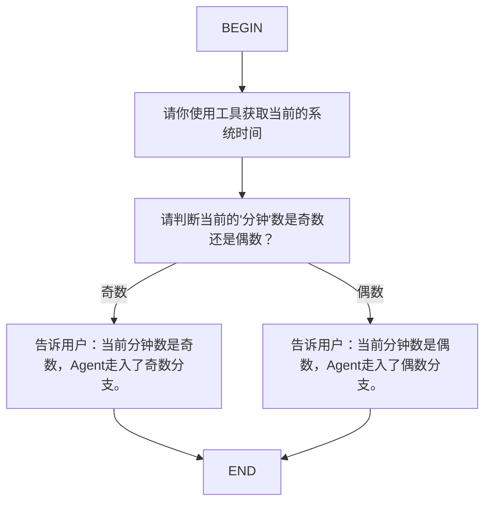

# 模块四：有关 Flow Skill 的调试

Kimi Code CLI - Flow Skill 运行机制与调试分析指南

本文档记录了 kimi-cli 项目中核心特性 —— Flow Skill (图驱动状态机) 的调试过程与执行原理解析。通过将大模型的推理能力与确定的有向图结合，我们可以让 Agent 具备极强的长流程控制力。

---

## 1. 调试环境准备

### 1.1 创建测试用的 Flow Skill

为了观察 Flow 的流转，我们首先在用户技能目录 `~/.kimi/skills/my_flow/SKILL.md` 中创建一个测试技能。它使用 Mermaid 语法定义了一个带有条件分支的图：



> **一些名词**：
> - 单项流转的，算task
> - 多个标签带分支的，算decision

### 1.2 植入观测点

我们在控制图流转的核心函数 `src/kimi_cli/soul/kimisoul.py`中的 `FlowRunner._execute_flow_node` 方法中加入了调试打印代码，用以观测每次流转时当前节点 (node) 和可选的后继分支 (edges)。

```python
async def _execute_flow_node(
    self,
    soul: KimiSoul,
    node: FlowNode,
    edges: list[FlowEdge],
) -> tuple[str | None, int]:
    # DEBUG: 观察传入的node和edges参数
    print(f"[DEBUG] _execute_flow_node called with node={node}, edges={edges}")
    import pprint
    pprint.pprint({"node_id": node.id, "node_label": node.label, "node_kind": node.kind, "edges_count": len(edges)})
    print(f"  Node details: {node}")
    print(f"  Edge destinations: {[e.dst for e in edges]}")
    print(f"  Edge labels: {[e.label for e in edges]}")
    
    if not edges:
        ...
```

---

## 2. 调试运行过程与输出分析

通过非交互命令 `uv run -- python -m kimi_cli.cli -c "/flow:my_flow" --yolo` 触发该技能后，我们捕获到了详细的执行日志。

以下是对整个执行生命周期的逐节点解析：

---

### 阶段 1：进入 Task1 节点，工具调用任务

**内部状态：**

```
[DEBUG] _execute_flow_node called with node=FlowNode(id='Task1', label='请你使用工具获取当前的系统时间', kind='task'), edges=[FlowEdge(src='Task1', dst='Dec1', label=None)]
{'edges_count': 1,
 'node_id': 'Task1',
 'node_kind': 'task',
 'node_label': '请你使用工具获取当前的系统时间'}
  Edge destinations: ['Dec1']
  Edge labels: [None]
```

**Agent 行为：**

- 用户想要获取当前的系统时间。我可以使用 Shell 工具来执行 date 命令来获取系统时间。
- Used Shell (date)
- 成功获取了系统时间。现在我可以回复用户。

**解析：**

1. 框架自动跳过了 BEGIN 节点，直接将执行权交给 Task1。
   > begin和end只是流程控制标记，不是真正要执行的任务，直接进入begin下一个节点

2. 这是一个纯 task 节点，因此只连接了一条无条件的出边 (dst='Dec1')。

3. 大模型接收到task1的任务说明后，也就是 node_label（即 Prompt），开始自己想办法完成。它理解到需要获取系统时间，自主调用了 Shell (date) 工具，并在上下文中记录了结果（tool执行后的结果记录到context）。完成此 Prompt 后，状态机自动走向 Dec1 节点。
   > 在我们的flow里是没有规定它要用shell，也没有规定用date，这是模型自己决定了最合理的工具。也就是微观执行交给模型。

---

### 阶段 2：进入 Dec1 节点，决策分支任务

**内部状态：**

```
[DEBUG] _execute_flow_node called with node=FlowNode(id='Dec1', label="请判断当前的'分钟'数是奇数还是偶数？", kind='decision'), edges=[FlowEdge(src='Dec1', dst='Task2', label='奇数'), FlowEdge(src='Dec1', dst='Task3', label='偶数')]
{'edges_count': 2,
 'node_id': 'Dec1',
 'node_kind': 'decision',
 'node_label': "请判断当前的'分钟'数是奇数还是偶数？"}
  Edge destinations: ['Task2', 'Task3']
  Edge labels: ['奇数', '偶数']
```

**Agent 行为：**

- 当前系统时间是：2026年3月10日 星期二 16:47:32 CST
- 用户问当前时间的分钟数是奇数还是偶数。根据之前的 Shell 命令结果，时间是 16时47分32秒，所以分钟数是 47。
  47 是一个奇数。
  需要在以下选项中选择：
  - 奇数
  - 偶数
  所以答案是 奇数。
- (在内部最终输出会包含 `<choice>奇数</choice>`)

**解析：**

1. 图解析器识别到该节点有两条带 label 的出边，因此将其 node_kind 标记为 decision。

2. 对于决策节点，底层的 `_build_flow_prompt` 函数会在原始 Prompt 后强行拼接约束指令，把边上的 label 转换成选项提供给 LLM，并要求以 `<choice>...</choice>` 的格式返回。

   > 如果把『请判断当前的分钟数是奇数还是偶数』给到模型，它会返回很多种格式。分钟数是奇数。47是奇数。但是程序需要的是一个可机器识别的标准答案。所以底层_build_flow_prompt会偷偷给这个prompt加一层格式要求。

   这一步很重要，把原本开放式自然语言回答收缩成了可程序解析的标准输出。

   [图片]

3. 大模型结合了上一轮 Task1 留在 Context 中的记忆（当前时间为 16:47），进行数学推理：分钟数 47，因此是奇数。

4. 状态机通过正则匹配到 `<choice>奇数</choice>`，成功将其与 `Edge labels: ['奇数', '偶数']` 进行匹配，最终决定将执行流推向 Task2。

---

### 阶段 3：进入 Task2 节点 (终局任务)

**内部状态：**

```
[DEBUG] _execute_flow_node called with node=FlowNode(id='Task2', label='告诉用户：当前分钟数是奇数，Agent走入了奇数分支。', kind='task'), edges=[FlowEdge(src='Task2', dst='END', label=None)]
{'edges_count': 1,
 'node_id': 'Task2',
 'node_kind': 'task',
 'node_label': '告诉用户：当前分钟数是奇数，Agent走入了奇数分支。'}
  Edge destinations: ['END']
  Edge labels: [None]
```

**Agent 行为：**

- 用户要求我告诉他们：当前分钟数是奇数，Agent走入了奇数分支。
  这是一个简单的消息通知，不需要使用任何工具，直接回复即可。
- 当前分钟数是奇数，Agent走入了奇数分支。

**解析：**

1. 节点成功流入奇数分支 Task2。
2. 同样是一个 task 节点，模型执行 Prompt 并向终端输出了最终的话术。
3. 执行完毕后，指向 END，状态机循环终止，本次 Flow 完美闭环。

---

## 3. 架构总结与优势

通过这次调试实战，我们可以清晰地看到 kimi-cli 采用的这套 **Graph + Agent 架构** 的精妙之处：

> 把流程从模型脑子中拿出来交给程序去做，交给程序强控。也就是下文要说的graph小脑，Agent大脑

### 1. 宏观控制（Graph 小脑）

大模型的"幻觉"和"步骤丢失"是工业界痛点。本项目通过 Mermaid 流程图在代码层面（FlowRunner）维护了一个严格的状态机。流程走到哪、下一步能去哪，由代码死死卡住。

### 2. 微观执行（Agent 大脑）

在每一个具体的节点上，大模型依然保有完全的自主性（如自主判断是否调用 Shell、读取文件、计算逻辑）。

### 3. 上下文继承

状态机推进的过程中，底层的 Context 是贯通的。Dec1 之所以能判断，是因为它记得 Task1 调用工具产生的结果。

### 4. 决策约束工程

对于分支选择，通过在 Prompt 层面的巧妙拼接（Available branches... Reply with a choice）结合正则解析，将模糊的自然语言输出收敛到了确定的图边游走上。**这是最优工程价值的一点。**

---

kimi code cli项目里自带的flow运行机制，官方文档：

> 普通节点会把节点文本发给 Agent，分支节点则要求 Agent 用 `<choice>分支名</choice>` 的格式输出，来选择下一步。

分支选择+`<choice>`解析本身就是flow skill框架的一部分

这是一种将确定性流程与生成式AI能力完美结合的现代化架构。

---

*(End of file)*
