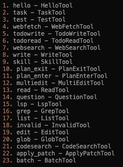
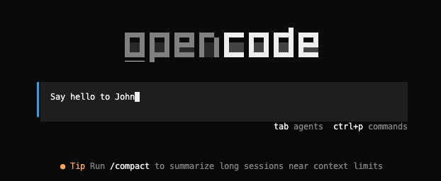
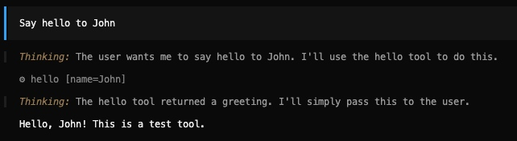

# OpenCode Tool 系统

OpenCode 的 Tool 系统是整个 Agent 架构的核心组件之一，负责执行具体的操作（如读写文件、执行命令、网络请求等）。Tool 通过 Tool.define() 定义，通过 ToolRegistry 注册，由 LLM 生成调用请求，最后通过 SessionProcessor 处理执行结果。

---

## 一、核心代码文件

### 1.1 Tool 核心定义与接口

| 文件 | 说明 |
|------|------|
| `packages/opencode/src/tool/tool.ts` | Tool 核心定义，包含 Tool.Info 接口、Tool.define() 函数、Tool.Context 上下文接口 |
| `packages/opencode/src/tool/registry.ts` | Tool 注册中心，负责加载和获取所有内置 Tool 和自定义 Tool |
| `packages/opencode/src/tool/truncation.ts` | 防止大量输出消耗llm上下文窗口，完整的内容保存到文件系统 |

---

### 1.2 Tool 调用与执行

| 文件 | 说明 |
|------|------|
| `packages/opencode/src/session/prompt.ts` | resolveTools() 函数：将 Tool 转换为 AI SDK 格式，包含执行前后的 Plugin 钩子 |
| `packages/opencode/src/session/processor.ts` | 处理 Tool 调用、执行、结果返回的完整流程 |
| `packages/opencode/src/session/llm.ts` | Tool 格式转换，传递给 LLM |

---

## 二、Tool 定义与接口

### 2.1 Tool.Info 接口

```typescript
export interface Info<Parameters extends z.ZodType = z.ZodType, M extends Metadata = Metadata> {
  id: string // Tool 唯一标识
  init: (ctx?: InitContext) => Promise<{
    // 初始化函数
    description: string // Tool 描述，供 LLM 理解
    parameters: Parameters // Zod 参数 schema
    execute( // 执行函数
      args: z.infer<Parameters>,
      ctx: Context,
    ): Promise<{
      title: string // 任务标题
      metadata: M // 元数据
      output: string // 输出内容
      attachments?: MessageV2.FilePart[] // 附件（图片等）
    }>
    formatValidationError?(error: z.ZodError): string 
  }>
}
```

---

### 2.2 Tool.Context 上下文

```typescript
export type Context<M extends Metadata = Metadata> = {
  sessionID: string // 当前 Session ID
  messageID: string // 当前 Message ID
  agent: string // 当前 Agent 名称
  abort: AbortSignal // 中止信号
  callID?: string // Tool 调用 ID
  extra?: { [key: string]: any } // 额外参数
  messages: MessageV2.WithParts[] // 消息历史
  metadata(input: { title?: string; metadata?: M }): void // 更新元数据
  ask(input: Omit<PermissionNext.Request, "id" | "sessionID" | "tool">): Promise<void> // 请求权限
}
```

---

### 2.3 Tool.define() 核心逻辑

```typescript
export function define<Parameters extends z.ZodType, Result extends Metadata>(
  id: string,
  init: Info<Parameters, Result>["init"],
): Info<Parameters, Result> {
  return {
    id,
    init: async (initCtx) => {
      const toolInfo = init instanceof Function ? await init(initCtx) : init

      // 包装 execute 函数，添加参数验证和输出截断
      toolInfo.execute = async (args, ctx) => {
        try {
          // 参数验证
          toolInfo.parameters.parse(args)
        } catch (error) {
          // 参数验证失败处理
          throw new Error(`The ${id} tool was called with invalid arguments...`)
        }

        // 执行 Tool
        const result = await execute(args, ctx)

        // 输出截断（如果 Tool 自身未处理）
        if (result.metadata.truncated !== undefined) {
          return result
        }
        const truncated = await Truncate.output(result.output, {}, initCtx?.agent)
        return {
          ...result,
          output: truncated.content,
          metadata: {
            ...result.metadata,
            truncated: truncated.truncated,
            ...(truncated.truncated && { outputPath: truncated.outputPath }),
          },
        }
      }
      return toolInfo
    },
  }
}
```

---

## 三、Tool 注册机制

### 3.1 ToolRegistry 结构

同样是在src/session模块下的prompt.ts中，有一个resolveTools()

在调用 processor.process() 之前，代码调用了 resolveTools()

resolveTools 是一个异步函数，负责解析和配置AI会话中可用的工具。

接收以下参数：

- agent: 代理信息，包含权限配置、模型设置等
- model: 提供者模型配置，这个是因为不同的模型可能会需要不同的api工具
- session: 会话信息，虽然传入了，但是其实最后选tool和会话无关
- tools: 工具启用状态（可选）
- processor: 会话处理器信息
- bypassAgentCheck: 是否绕过代理检查
- messages: 消息列表

这里我在想，那难道是所有的message发出后都要把所有工具都注册到吗？因为有的会话根本不需要工具

答案是：是的，在和llm交互以前，并没有对tool做筛选，而是全部加载了

几乎所有工具都会传给 LLM，由 LLM 自己决定调用哪些。

但是，在resolveTools()的过程中，工具是要做初始化的，这个时候，skill的工具就已经获取了skill列表

OpenCode 在这一阶段不会根据对话内容智能筛选工具，而是采用"全量传递 + LLM 决策"的模式。

```typescript
export namespace ToolRegistry {
  // 状态管理：存储自定义 Tool
  const state = Instance.state(async () => {
    const custom = [] as Tool.Info[]

    // 加载配置目录中的自定义 Tool
    const glob = new Bun.Glob("{tool,tools}/*.{js,ts}")
    const matches = await Config.directories().then((dirs) =>
      dirs.flatMap((dir) => [...glob.scanSync({ cwd: dir, absolute: true })]),
    )

    // 加载插件中的 Tool
    const plugins = await Plugin.list()
    for (const plugin of plugins) {
      for (const [id, def] of Object.entries(plugin.tool ?? {})) {
        custom.push(fromPlugin(id, def))
      }
    }

    return { custom }
  })

  // 获取所有可用 Tool
  async function all(): Promise<Tool.Info[]> {
    return [
      InvalidTool,
      QuestionTool,
      BashTool,
      ReadTool,
      GlobTool,
      GrepTool,
      EditTool,
      WriteTool,
      TaskTool,
      WebFetchTool,
      TodoWriteTool,
      WebSearchTool,
      CodeSearchTool,
      SkillTool,
      ApplyPatchTool,
      // ... 更多内置 Tool
      ...custom, // 自定义 Tool
    ]
  }

  // 3. 获取过滤后的 Tool（根据模型和 Agent）
  async function tools(model, agent?) {
    const tools = await all()
    const result = await Promise.all(
      tools
        .filter((t) => {
          // 模型特定的过滤逻辑
          if (t.id === "codesearch" || t.id === "websearch") {
            return model.providerID === "opencode" || Flag.OPENCODE_ENABLE_EXA
          }
          // apply_patch 与 edit/write 互斥
          if (t.id === "apply_patch") return usePatch
          if (t.id === "edit" || t.id === "write") return !usePatch
          return true
        })
        .map(async (t) => ({
          id: t.id,
          ...(await t.init({ agent })), // 传入 Agent 上下文
        })),
    )
    return result
  }
}
```

---

### 3.2 内置 Tool 列表

| Tool 名称 | 文件 | 功能 |
|-----------|------|------|
| read | tool/read.ts | 读取文件内容 |
| write | tool/write.ts | 写入文件内容 |
| edit | tool/edit.ts | 编辑文件内容 |
| glob | tool/glob.ts | Glob 模式搜索文件 |
| grep | tool/grep.ts | 搜索文件内容 |
| bash | tool/bash.ts | 执行 Shell 命令 |
| task | tool/task.ts | 调用子 Agent |
| webfetch | tool/webfetch.ts | 获取网页内容 |
| websearch | tool/websearch.ts | 网络搜索 |
| codesearch | tool/codesearch.ts | 代码搜索 |
| todowrite/todoread | tool/todo.ts | 读写待办事项 |
| question | tool/question.ts | 向用户提问 |
| plan_enter/plan_exit | tool/plan.ts | 进入/退出计划模式 |
| batch | tool/batch.ts | 批量执行 |
| skill | tool/skill.ts | 技能管理 |
| lsp | tool/lsp.ts | LSP 操作 |

---

## 四、Bash Tool 深入分析

### 4.1 Bash Tool 代码详解

Bash Tool 是 OpenCode 中最复杂最强大的工具之一

执行 Shell 命令。它使用了 tree-sitter 进行命令解析，以实现智能的权限检查和安全控制

**Tool 定义**

```typescript
export const BashTool = Tool.define("bash", async () => {
  const shell = Shell.acceptable()
  log.info("bash tool using shell", { shell })

  return {
    // 从 bash.txt 加载描述，并替换变量
    description: DESCRIPTION.replaceAll("${directory}", Instance.directory)
      .replaceAll("${maxLines}", String(Truncate.MAX_LINES))
      .replaceAll("${maxBytes}", String(Truncate.MAX_BYTES)),

    // 参数定义
    parameters: z.object({
      command: z.string().describe("The command to execute"),
      timeout: z.number().describe("Optional timeout in milliseconds").optional(),
      workdir: z.string().describe("Working directory").optional(),
      description: z.string().describe("命令描述，5-10 个词"),
    }),

    // 执行函数
    async execute(params, ctx) {
      // 执行逻辑...
    },
  }
})
```

---

### 4.2 命令解析与路径分析

Bash Tool 使用 tree-sitter 解析命令，提取涉及的目录和文件：

tree-sitter 是一个开源的「语法解析器生成器」+「增量解析库」，简单来说：它能把「代码 / 命令文本」（比如一条 Bash 命令grep "login" ./src/**/*.py | cat > result.txt），按照对应语言（比如 Bash）的语法规则，拆解成一棵「结构化的语法树」—— 就像把一句话拆成「主语、谓语、宾语」，把命令拆成「操作、参数、目标文件 / 目录」，让程序能精准识别命令里的关键信息，而不是只把命令当成一串无意义的字符串。

人类看rm -rf ./temp，能立刻识别出「要删除的目录是./temp」；

程序如果只看字符串，只能看到一堆字符，但用 tree-sitter 解析后，程序能像人类一样「看懂」：rm是命令、-rf是参数、./temp是目标目录。

如果不用 tree-sitter，Bash Tool 想提取命令里的目录 / 文件，只能用「字符串匹配」，但这种方式漏洞百出

```typescript
async function execute(params, ctx) { //工具传入两个元素：工具本身的参数和上下文
  const cwd = params.workdir || Instance.directory
  const timeout = params.timeout ?? DEFAULT_TIMEOUT

  // 使用 tree-sitter 解析命令
  const tree = await parser().then((p) => p.parse(params.command))
  if (!tree) {
    throw new Error("Failed to parse command")
  }

  const directories = new Set<string>() // 涉及的目录
  const patterns = new Set<string>() // 匹配模式
  const always = new Set<string>() // 总是允许的模式

  // 遍历命令节点
  for (const node of tree.rootNode.descendantsOfType("command")) {
    // 提取命令及其参数
    const command = []
    for (let i = 0; i < node.childCount; i++) {
      const child = node.child(i)
      // 只提取命令名、字符串、文件名
      if (["command_name", "word", "string", "raw_string", "concatenation"].includes(child.type)) {
        command.push(child.text)
      }
    }

    // 分析涉及文件系统的命令
    if (["cd", "rm", "cp", "mv", "mkdir", "touch", "chmod", "chown", "cat"].includes(command[0])) {
      for (const arg of command.slice(1)) {
        if (arg.startsWith("-")) continue // 跳过选项

        // 使用 realpath 解析实际路径
        const resolved = await $`realpath ${arg}`
          .cwd(cwd)
          .quiet()
          .nothrow()
          .text()
          .then((x) => x.trim())

        if (resolved && !Instance.containsPath(resolved)) {
          // 不在项目目录内，添加到外部目录列表
          const dir = (await Filesystem.isDir(resolved)) ? resolved : path.dirname(resolved)
          directories.add(dir)
        }
      }
    }

    // 记录命令模式供权限检查使用
    if (command.length && command[0] !== "cd") {
      patterns.add(commandText)
      always.add(BashArity.prefix(command).join(" ") + " *")
    }
  }
}
```

---

### 4.3 权限检查

```typescript
// 外部目录访问权限
if (directories.size > 0) {
  const globs = Array.from(directories).map((dir) => path.join(dir, "*"))
  await ctx.ask({
    permission: "external_directory",
    patterns: globs,
    always: globs,
    metadata: {},
  })
}

// bash 命令执行权限
if (patterns.size > 0) {
  await ctx.ask({
    permission: "bash",
    patterns: Array.from(patterns),
    always: Array.from(always),
    metadata: {},
  })
}
```

---

### 4.4 命令执行

钩子 = 系统预留的扩展点；插件 = 挂在钩子上的功能；trigger = 触发所有挂在这个点上的插件；目的 = 不改动主代码，无限扩展功能

```typescript
// 触发 Plugin 钩子获取环境变量
const shellEnv = await Plugin.trigger("shell.env", { cwd }, { env: {} })

// spawn 命令进程
const proc = spawn(params.command, {
  shell,
  cwd,
  env: { ...process.env, ...shellEnv.env },
  stdio: ["ignore", "pipe", "pipe"],
  detached: process.platform !== "win32",
})

let output = ""

// 监听 stdout/stderr
const append = (chunk: Buffer) => {
  output += chunk.toString()
  // 更新元数据,限制长度避免过大
  ctx.metadata({
    metadata: {
      output: output.length > MAX_METADATA_LENGTH
        ? output.slice(0, MAX_METADATA_LENGTH) + "\n\n..."
        : output,
      description: params.description,
    },
  })
}

proc.stdout?.on("data", append)
proc.stderr?.on("data", append)

// 处理超时和中止
let timedOut = false
let aborted = false
const timeoutTimer = setTimeout(() => {
  timedOut = true
  void kill()
}, timeout + 100)

// 等待进程结束
await new Promise<void>((resolve, reject) => {
  proc.once("exit", () => { /* ... */ resolve() })
  proc.once("error", (error) => { /* ... */ reject(error) })
})

// 返回结果
return {
  title: params.description,
  metadata: {
    output: output.length > MAX_METADATA_LENGTH ? /* ... */ : output,
    exit: proc.exitCode,
    description: params.description,
  },
  output,
}
```

---

### 4.5 具体执行示例：用户要求安装依赖

**步骤 1: 用户输入 → LLM 分析意图**

用户: "请帮我安装项目依赖"

主 Agent (build) 分析用户请求，决定执行 npm install 命令来安装依赖。

**步骤 2: LLM 生成 Tool Call**

```json
{
  "toolName": "bash",
  "toolCallId": "call_xyz789",
  "input": {
    "command": "npm install",
    "timeout": 180000,
    "workdir": "/Users/chenxi/my_coding/opencode",
    "description": "Install npm dependencies"
  }
}
```

**步骤 3: SessionProcessor 处理 tool-call 事件**

```typescript
case "tool-call": {
  const part = await Session.updatePart({
    ...match,
    tool: "bash",
    state: {
      status: "running",
      input: {
        command: "npm install",
        timeout: 180000,
        workdir: "/Users/chenxi/my_coding/opencode",
        description: "Install npm dependencies"
      },
      time: { start: Date.now() },
    },
  })
  break
}
```

消息状态变为：

```json
{
  "type": "tool",
  "tool": "bash",
  "callID": "call_xyz789",
  "state": {
    "status": "running",
    "input": {
      "command": "npm install",
      "timeout": 180000,
      "workdir": "/Users/chenxi/my_coding/opencode",
      "description": "Install npm dependencies"
    }
  }
}
```

**步骤 4: BashTool.execute() 执行**

**4.1 路径和超时处理**

```typescript
const cwd = params.workdir || Instance.directory
// => "/Users/chenxi/my_coding/opencode"

const timeout = params.timeout ?? DEFAULT_TIMEOUT
// => 180000 (3 分钟)
```

**4.2 命令解析**

```typescript
const tree = await parser().then((p) => p.parse("npm install"))
// 解析结果:
// command[0] = "npm"
// command[1] = "install"
```

**4.3 权限检查**

由于 npm install 不涉及外部目录访问（node_modules 在项目目录内），且 Instance.containsPath(cwd) 为 true，所以 directories.size 为 0。

但是，bash 权限检查仍然会触发：

```typescript
patterns.add("npm install")
always.add("npm *") // 使用 BashArity 计算
```

权限请求：具体模块在permission

```typescript
await ctx.ask({
  permission: "bash",
  patterns: ["npm install"],
  always: ["npm *"],
  metadata: {},
})
```

系统检查 build agent 的权限配置：

- 默认权限中 bash: "allow"，所以无需询问用户

**4.4 执行命令**

```typescript
const shellEnv = await Plugin.trigger("shell.env", { cwd }, { env: {} })

const proc = spawn("npm install", {
  shell: "/bin/zsh", // 或其他可用 shell
  cwd: "/Users/chenxi/my_coding/opencode",
  env: { ...process.env, ...shellEnv.env },
  stdio: ["ignore", "pipe", "pipe"],
})

// 监听输出
proc.stdout?.on("data", (chunk) => {
  output += chunk.toString()
  ctx.metadata({
   
  })
})
proc.stderr?.on("data", (chunk) => {
  output += chunk.toString()
})

// 等待完成
await new Promise((resolve) => proc.once("exit", resolve))

// npm install 输出示例:
// added 1234 packages in 45s
```

**4.5 返回结果**

```typescript
return {
  title: "Install npm dependencies",
  metadata: {
    output: "added 1234 packages in 45s",
    exit: 0, 
    description: "Install npm dependencies",
  },
  output: "added 1234 packages in 45s",
}
```

**步骤 5: SessionProcessor 处理 tool-result 事件**

```typescript
case "tool-result": {
  await Session.updatePart({
    ...match,
    state: {
      status: "completed",
      input: { command: "npm install", ... },
      output: "added 1234 packages in 45s",
      metadata: {
        output: "added 1234 packages in 45s",
        exit: 0,
        description: "Install npm dependencies",
      },
      title: "Install npm dependencies",
      time: { start: 1700000000000, end: 1700000004500 },
    },
  })
  break
}
```

**步骤 6: LLM 接收结果并回复用户**

LLM 收到 Tool 执行结果后，生成最终回复：

依赖安装完成！我执行了 npm install，成功安装了 1234 个包。

---

### 4.6 完整调用序列图

```
┌─────────────────────────────────────────────────────────────────────┐
│                         用户输入                                     │
│              "请帮我安装项目依赖"                                      │
└─────────────────────────────────────────────────────────────────────┘
                              │
                              ▼
┌─────────────────────────────────────────────────────────────────────┐
│                    主 Agent (build)                                 │
│  - 分析用户请求: 需要执行 npm install                                │
│  - 决定调用 bash Tool                                               │
└─────────────────────────────────────────────────────────────────────┘
                              │
                              ▼
┌─────────────────────────────────────────────────────────────────────┐
│                    AI SDK                                           │
│                                                                 │
│  暂停文本生成                                                       │
│  generate tool-call:                                                   │
│  {                                                               │
│    toolName: "bash",                                            │
│    toolCallId: "call_xyz789",                                   │
│    input: {                                                     │
│      command: "npm install",                                    │
│      timeout: 180000,                                           │
│      workdir: "/Users/chenxi/my_coding/opencode",              │
│      description: "Install npm dependencies"                    │
│    }                                                             │
│  }                                                               │
└─────────────────────────────────────────────────────────────────────┘
                              │
                              ▼
┌─────────────────────────────────────────────────────────────────────┐
│              SessionProcessor.process()                            │
│                                                                 │
│  1. tool-call 事件:                                               │
│     - 创建 ToolPart (status: "running")                          │
│                                                                 │
│  2. 执行 BashTool.execute():                                      │
│                                                                 │
│     a) 命令解析:                                                  │
│        - tree-sitter 解析 "npm install"                         │
│        - command = ["npm", "install"]                           │
│                                                                 │
│     b) 路径分析:                                                  │
│        - 不涉及外部目录 (directories.size = 0)                  │
│                                                                 │
│     c) 权限检查:                                                  │
│        - ctx.ask({ permission: "bash", patterns: [...] })       │
│        - build agent 有 bash 权限，直接允许                       │
│                                                                 │
│     d) 命令执行:                                                  │
│        - spawn("npm install", { cwd, shell, env })              │
│        - 监听 stdout/stderr                                      │
│        - 等待进程退出                                            │
│                                                                 │
│     e) 返回结果:                                                  │
│        - { title, metadata: { output, exit }, output }         │
│                                                                 │
│  3. tool-result 事件:                                            │
│     - 更新 ToolPart (status: "completed")                       │
│     - output: "added 1234 packages in 45s"                     │
└─────────────────────────────────────────────────────────────────────┘
                              │
                              ▼
┌─────────────────────────────────────────────────────────────────────┐
│                    LLM 接收结果                                     │
│  "依赖安装完成！我执行了 npm install，成功安装了 1234 个包。"         │
└─────────────────────────────────────────────────────────────────────┘
```

---

## 五、更复杂的示例：访问外部目录

### 5.1 场景

用户要求："帮我把这个文件复制到 /tmp 目录"

LLM 生成：

```json
{
  "toolName": "bash",
  "input": {
    "command": "cp package.json /tmp/package.json",
    "description": "Copy file to tmp directory"
  }
}
```

### 5.2 执行流程（关键差异）

**路径分析阶段：**

```typescript
// packages/opencode/src/tool/bash.ts:116-137

if (["cd", "rm", "cp", "mv", "mkdir", ...].includes(command[0])) {
  for (const arg of command.slice(1)) {
    // cp 命令的第二个参数是目标路径
    const resolved = await $`realpath ${arg}`
      .cwd(cwd).quiet().nothrow().text()

    if (resolved && !Instance.containsPath(resolved)) {
      // /tmp 不在项目目录内！
      const dir = (await Filesystem.isDir(resolved)) ? resolved : path.dirname(resolved)
      directories.add("/tmp")  // 添加外部目录
    }
  }
}
```

**权限检查阶段：**

```typescript
// packages/opencode/src/tool/bash.ts:147-155

if (directories.size > 0) {
  // 需要请求外部目录访问权限
  await ctx.ask({
    permission: "external_directory",
    patterns: ["/tmp/*"], // 匹配模式
    always: ["/tmp/*"], // 总是允许
    metadata: {},
  })
}
```

**权限请求弹出：**

由于 /tmp 是外部目录，且默认权限配置中：

```typescript
const defaults = PermissionNext.fromConfig({
  external_directory: {
    "*": "ask", // 默认询问
    [Truncate.GLOB]: "allow",
  },
})
```

系统会弹出权限请求：

⚠️ Bash Tool 请求访问外部目录

权限: external_directory
模式: /tmp/*
操作: cp package.json /tmp/package.json

[允许一次] [总是允许] [拒绝]

用户点击"允许一次"后，命令才会执行。

---

## 六、Tool 调用与执行流程

### 6.1 整体调用流程

```
LLM 生成 Tool Call
    │
    ▼
┌─────────────────────────────────────────┐
│ SessionProcessor.process()               │
│                                          │
│ 1. tool-call 事件                       │
│    - 创建 ToolPart (pending)             │
│    - 检查 doom_loop                      │
│                                          │
│ 2. tool-result 事件                     │
│    - 更新 ToolPart (completed)           │
│    - 返回输出给 LLM                      │
└─────────────────────────────────────────┘
    │
    ▼
LLM 继续生成或结束
```

---

### 6.2 Tool 调用事件处理

```typescript
// Tool 开始调用
case "tool-input-start":
  const part = await Session.updatePart({
    type: "tool",
    tool: value.toolName,
    callID: value.id,
    state: { status: "pending", input: {} },
  })
  toolcalls[value.id] = part
  break

// Tool 实际调用
case "tool-call":
  const part = await Session.updatePart({
    ...match,
    tool: value.toolName,
    state: {
      status: "running",
      input: value.input,
      time: { start: Date.now() },
    },
  })

  // 检测 doom_loop（重复调用同一 Tool）
  const lastThree = parts.slice(-DOOM_LOOP_THRESHOLD)
  if (lastThree.every(p => p.tool === value.toolName && JSON.stringify(p.state.input) === JSON.stringify(value.input))) {
    await PermissionNext.ask({ permission: "doom_loop", ... })
  }
  break

// Tool 执行完成
case "tool-result":
  await Session.updatePart({
    ...match,
    state: {
      status: "completed",
      output: value.output.output,
      metadata: value.output.metadata,
      title: value.output.title,
      time: { start: match.state.time.start, end: Date.now() },
    },
  })
  break

// 4. Tool 执行错误
case "tool-error":
  await Session.updatePart({
    ...match,
    state: {
      status: "error",
      error: value.error.toString(),
    },
  })
  break
```

---

### 6.3 resolveTools 核心逻辑

```typescript
async function resolveTools(input) {
  const tools = {}

  // 创建 Tool 上下文
  const context = (args, options): Tool.Context => ({
    sessionID: input.session.id,
    abort: options.abortSignal!,
    messageID: input.processor.message.id,
    callID: options.toolCallId,
    agent: input.agent.name,
    messages: input.messages,
    // 更新 Tool 状态
    metadata: async (val) => {
      const match = input.processor.partFromToolCall(options.toolCallId)
      if (match && match.state.status === "running") {
        await Session.updatePart({ ...match, state: { ...val, status: "running", input: args } })
      }
    },
    // 请求权限
    async ask(req) {
      await PermissionNext.ask({
        ...req,
        sessionID: input.session.id,
        tool: { messageID, callID: options.toolCallId },
        ruleset: PermissionNext.merge(input.agent.permission, input.session.permission ?? []),
      })
    },
  })

  // 从注册表获取 Tool 并转换格式
  for (const item of await ToolRegistry.tools({ modelID, providerID }, agent)) {
    const schema = ProviderTransform.schema(model, z.toJSONSchema(item.parameters))

    tools[item.id] = tool({
      id: item.id,
      description: item.description,
      inputSchema: jsonSchema(schema),
      async execute(args, options) {
        const ctx = context(args, options)

        // 执行前钩子
        await Plugin.trigger("tool.execute.before", { tool: item.id, sessionID, callID }, { args })

        // 执行 Tool
        const result = await item.execute(args, ctx)

        // 执行后钩子
        await Plugin.trigger("tool.execute.after", { tool: item.id, sessionID, callID }, result)

        return result
      },
    })
  }

  // 加载 MCP Tools
  for (const [key, item] of Object.entries(await MCP.tools())) {
    // MCP Tool 处理...
  }

  return tools
}
```

---

## 七、关键代码位置索引

| 功能 | 文件 | 行号 |
|------|------|------|
| Tool 定义 | tool/tool.ts | 27-88 |
| Tool 注册 | tool/registry.ts | 33-163 |
| Tool 上下文 | tool/tool.ts | 16-26 |
| resolveTools | session/prompt.ts | 676-854 |
| Tool 调用处理 | session/processor.ts | 103-221 |
| 输出截断 | tool/truncation.ts | 50-105 |
| Read Tool | tool/read.ts | 17-154 |
| Bash Tool | tool/bash.ts | 55-269 |
| Task Tool | tool/task.ts | 28-203 |
| 权限检查 | permission/next.ts | 127-157 |

---

## 八、总结

OpenCode 的 Tool 系统采用了以下核心设计：

1. **统一的 Tool 接口**: 通过 Tool.define() 定义，包含 description、parameters 和 execute 三个核心部分
2. **注册与发现机制**: ToolRegistry 负责管理所有内置和自定义 Tool，支持动态加载
3. **参数验证**: 使用 Zod 进行参数验证，验证失败时抛出格式化错误
4. **权限控制**: 每个 Tool 执行前通过 ctx.ask() 检查权限，支持 allow/deny/ask 三种动作
5. **执行上下文**: Tool.Context 提供 sessionID、messageID、abort 等上下文信息
6. **输出截断**: Truncate.output() 自动处理过长输出，保存到文件并返回截断内容和文件路径
7. **事件驱动**: 通过 tool-call、tool-result、tool-error 等事件跟踪 Tool 执行状态
8. **Plugin 钩子**: 支持在 Tool 执行前后触发 Plugin 钩子，实现扩展功能

这种设计使得系统具有良好的可扩展性，既支持内置 Tool 的高性能实现，也支持自定义 Tool 和插件 Tool 的灵活加载。

---

## 九、创建一个工具

```typescript
import z from "zod"
import { Tool } from "./tool"
import DESCRIPTION from "./hello.txt"

export const HelloTool = Tool.define("hello", {
  description: DESCRIPTION,
  parameters: z.object({
    name: z.string().describe("The name to greet"),
  }),
  async execute(params) {
    return {
      title: "Hello Tool",
      metadata: {
        greeted: params.name,
        timestamp: Date.now(),
      },
      output: `Hello, ${params.name}! This is a test tool.`,
    }
  },
})
```

**hello.txt 内容：**

```
- A simple hello tool that returns a greeting
- Takes a name as input and returns a personalized greeting
- Use this tool to test if custom tools are being called correctly
```

**查看已注册的工具列表：**






