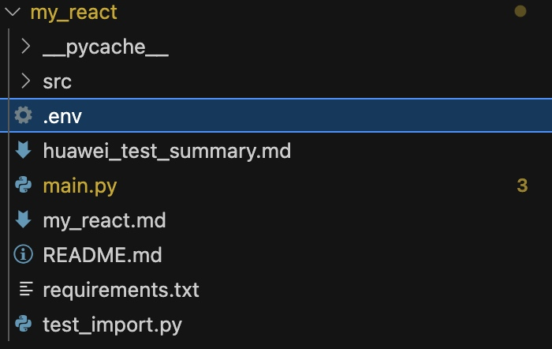
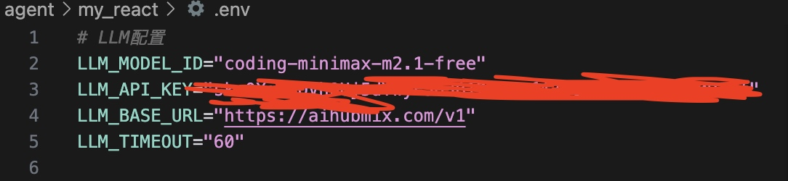
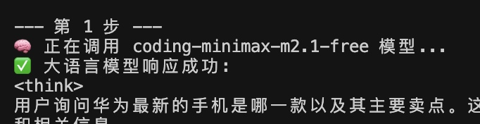
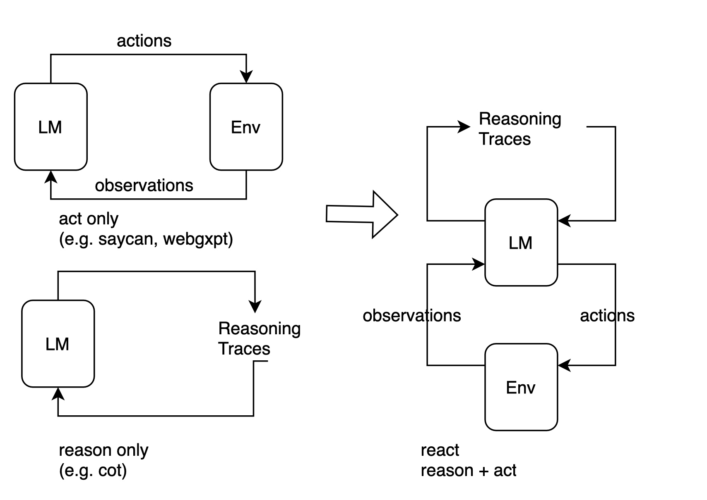
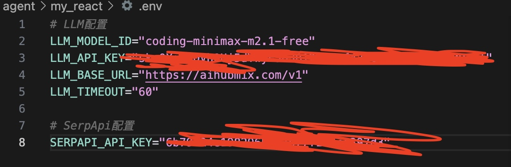
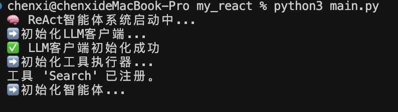
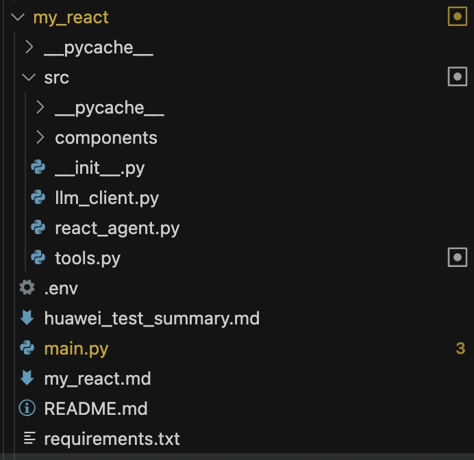

# 自建一个 ReAct 智能体

本教程将指导你从零构建一个 ReAct 智能体。

---

## 1. 安装依赖库

本过程建议使用 Python 3.10 或更高版本。首先，确保已经安装了 openai 库用于与大语言模型交互，以及 python-dotenv 库用于安全地管理稍后的 API 密钥。

在终端中运行以下命令：

```bash
pip install openai python-dotenv
```

---

## 2. 配置 API 密钥

为了让代码更通用，将模型服务的相关信息统一配置在环境变量中。

1. 在 my_react 项目根目录下，创建一个名为 `.env` 的文件。

   


2. 在该文件中，添加以下内容。可以根据自己的需要，将其指向 OpenAI 官方服务，或任何兼容 OpenAI 接口的本地/第三方服务，下面介绍 aihubmix 获取 api 的方法

```bash
# .env file
LLM_API_KEY="YOUR-API-KEY"
LLM_MODEL_ID="YOUR-MODEL"
LLM_BASE_URL="YOUR-URL"
```

### AIHubmix 简介

AIHubmix 是一个位于美国特拉华州的 AI 模型聚合平台，整合了市面上主流的大语言模型，新发布的模型通常在一周内即可使用。

使用浏览器访问 AIHubmix 官方网站，完成注册后在免费的模型下浏览。

这里我选择 `coding-glm-4.7-free`，也可以选其他兼容 OpenAI 格式的免费模型。

### 配置步骤

1. 前往 API 密钥管理页面，系统默认会生成一个可用的密钥。也可以通过点击 `创建 Key` 按钮自定义密钥名称并生成新的密钥。
2. 获取配置信息：
   - **API Key**: 『复制上文生成的 api key』
   - **Base URL**: `https://aihubmix.com/v1`
   - **推荐模型**: `coding-glm-4.7-free`

配置好效果如下：




---

## 3. 封装基础 LLM 调用函数

为了让代码结构更清晰、更易于复用，可以定义一个专属的 LLM 客户端类。这个类将封装所有与模型服务交互的细节，让我们的主逻辑可以更专注于智能体的构建。

```python
import os
from openai import OpenAI
from dotenv import load_dotenv
from typing import List, Dict

# 加载 .env 文件中的环境变量
load_dotenv()

class HelloAgentsLLM:
    """
    为本书 "Hello Agents" 定制的LLM客户端。
    它用于调用任何兼容OpenAI接口的服务，并默认使用流式响应。
    """
    def __init__(self, model: str = None, apiKey: str = None, baseUrl: str = None, timeout: int = None):
        """
        初始化客户端。优先使用传入参数，如果未提供，则从环境变量加载。
        """
        self.model = model or os.getenv("LLM_MODEL_ID")
        apiKey = apiKey or os.getenv("LLM_API_KEY")
        baseUrl = baseUrl or os.getenv("LLM_BASE_URL")
        timeout = timeout or int(os.getenv("LLM_TIMEOUT", 60))
        
        if not all([self.model, apiKey, baseUrl]):
            raise ValueError("模型ID、API密钥和服务地址必须被提供或在.env文件中定义。")

        self.client = OpenAI(api_key=apiKey, base_url=baseUrl, timeout=timeout)

    def think(self, messages: List[Dict[str, str]], temperature: float = 0) -> str:
        """
        调用大语言模型进行思考，并返回其响应。
        """
        print(f"🧠 正在调用 {self.model} 模型...")
        try:
            response = self.client.chat.completions.create(
                model=self.model,
                messages=messages,
                temperature=temperature,
                stream=True,
            )
            
            # 处理流式响应
            print("✅ 大语言模型响应成功:")
            collected_content = []
            for chunk in response:
                content = chunk.choices[0].delta.content or ""
                print(content, end="", flush=True)
                collected_content.append(content)
            print()  # 在流式输出结束后换行
            return "".join(collected_content)

        except Exception as e:
            print(f"❌ 调用LLM API时发生错误: {e}")
            return None

# --- 客户端使用示例 ---
if __name__ == '__main__':
    try:
        llmClient = HelloAgentsLLM()
        
        exampleMessages = [
            {"role": "system", "content": "You are a helpful assistant that writes Python code."},
            {"role": "user", "content": "写一个快速排序算法"}
        ]
        
        print("--- 调用LLM ---")
        responseText = llmClient.think(exampleMessages)
        if responseText:
            print("\n\n--- 完整模型响应 ---")
            print(responseText)

    except ValueError as e:
        print(e)
```

后续运行效果如下：




---

## 4. 构建 ReAct

在准备好 LLM 客户端后，现在来构建第一个，也是最经典的一个智能体范式 ReAct。ReAct 由 Shunyu Yao 于 2022 年提出，其核心思想是模仿人类解决问题的方式，将 Reasoning 与 Acting 显式地结合起来，形成一个"思考-行动-观察"的循环。

### 4.1 ReAct 的工作流程

在 ReAct 诞生之前，主流的方法可以分为两类：一类是"纯思考"型，如思维链 (Chain-of-Thought)，它能引导模型进行复杂的逻辑推理，但无法与外部世界交互，容易产生事实幻觉；另一类是"纯行动"型，模型直接输出要执行的动作，但缺乏规划和纠错能力。

ReAct 的巧妙之处在于，它认识到思考与行动是相辅相成的。思考指导行动，而行动的结果又反过来修正思考。为此，ReAct 范式通过一种特殊的提示工程来引导模型，使其每一步的输出都遵循一个固定的轨迹：

- **Thought**：这是智能体的"内心独白"。它会分析当前情况、分解任务、制定下一步计划，或者反思上一步的结果。
- **Action**：这是智能体决定采取的具体动作，通常是调用一个外部工具，例如 `Search['华为最新款手机']`。
- **Observation**：这是执行 `Action` 后从外部工具返回的结果，例如搜索结果的摘要或 API 的返回值。

智能体将不断重复这个 Thought -> Action -> Observation 的循环，将新的观察结果追加到历史记录中，形成一个不断增长的上下文，直到它在 Thought 中认为已经找到了最终答案，然后输出结果。这个过程形成了一个强大的协同效应：推理使得行动更具目的性，而行动则为推理提供了事实依据。

我们可以将这个过程形式化地表达出来，具体来说，在每个时间步 $t$，智能体的策略（大语言模型 $\pi$）会根据初始问题 $q$ 和之前所有步骤的"行动-观察"历史轨迹 $((a_1,o_1),\dots,(a_{t-1},o_{t-1}))$，来生成当前的思考 $th_t$ 和行动 $a_t$：

$$\left(th_t,a_t\right)=\pi\left(q,(a_1,o_1),\ldots,(a_{t-1},o_{t-1})\right)$$

随后，环境中的工具 $T$ 会执行行动 $a_t$，并返回一个新的观察结果 $o_t$：

$$o_t = T(a_t)$$

这个循环不断进行，将新的 $(a_t,o_t)$ 对追加到历史中，直到模型在思考 $th_t$ 中判断任务已完成。




因此我们将构建一个具备使用外部工具能力的 ReAct 智能体，来回答一个大语言模型仅凭自身知识库无法直接回答的问题。例如："华为最新的手机是哪一款？它的主要卖点是什么？"

这个问题需要智能体理解自己需要上网搜索，调用工具搜索结果并总结答案。

---

### 4.2 工具的定义与实现

大语言模型是智能体的大脑，Tools 是其与外部世界交互的"手和脚"。

为了让 ReAct 范式能够真正解决我们设定的问题，智能体需要具备调用外部工具的能力。

针对前面设定的目标——回答关于"华为最新手机"的问题，我们需要为智能体提供一个网页搜索工具。

在这里我们选用 SerpApi，它通过 API 提供结构化的 Google 搜索结果，能直接返回"答案摘要框"或精确的知识图谱信息。

#### 4.2.1 安装 SerpApi

首先，需要安装该库：

```bash
pip install google-search-results
```

同时，你需要前往 SerpApi 官网 注册一个免费账户，获取你的 API 密钥，并将其添加到我们项目根目录下的 `.env` 文件中，最终效果如下：




#### 4.2.2 实现搜索工具的核心逻辑

工具包含：`name`、`description`、具体的执行逻辑。第一个相当于目录，第二个是给大语言模型参考是否需要使用该工具时使用的。

第一个工具是 `search` 函数，它的作用是接收一个查询字符串，然后返回搜索结果。

```python
from serpapi import SerpApiClient

def search(query: str) -> str:
    """
    一个基于SerpApi的实战网页搜索引擎工具。
    它会智能地解析搜索结果，优先返回直接答案或知识图谱信息。
    """
    print(f"🔍 正在执行 [SerpApi] 网页搜索: {query}")
    try:
        api_key = os.getenv("SERPAPI_API_KEY")
        if not api_key:
            return "错误:SERPAPI_API_KEY 未在 .env 文件中配置。"

        params = {
            "engine": "google",
            "q": query,
            "api_key": api_key,
            "gl": "cn",  # 国家代码
            "hl": "zh-cn", # 语言代码
        }
        
        client = SerpApiClient(params)
        results = client.get_dict()
        
        # 智能解析:优先寻找最直接的答案
        if "answer_box_list" in results:
            return "\n".join(results["answer_box_list"])
        if "answer_box" in results and "answer" in results["answer_box"]:
            return results["answer_box"]["answer"]
        if "knowledge_graph" in results and "description" in results["knowledge_graph"]:
            return results["knowledge_graph"]["description"]
        if "organic_results" in results and results["organic_results"]:
            # 如果没有直接答案，则返回前三个有机结果的摘要
            snippets = [
                f"[{i+1}] {res.get('title', '')}\n{res.get('snippet', '')}"
                for i, res in enumerate(results["organic_results"][:3])
            ]
            return "\n\n".join(snippets)
        
        return f"对不起，没有找到关于 '{query}' 的信息。"

    except Exception as e:
        return f"搜索时发生错误: {e}"
```

在上述代码中，首先会检查是否存在 `answer_box` 或 `knowledge_graph` 等信息，如果存在，就直接返回这些最精确的答案。如果不存在，它才会退而求其次，返回前三个常规搜索结果的摘要。这种"智能解析"能为 LLM 提供质量更高的信息输入。

#### 4.2.3 构建通用的工具执行器

当智能体需要使用多种工具时（例如，除了搜索，还可能需要计算、查询数据库等），需要一个统一的管理器来注册和调度这些工具。为此，我们创建一个 `ToolExecutor` 类。

```python
from typing import Dict, Any

class ToolExecutor:
    """
    一个工具执行器，负责管理和执行工具。
    """
    def __init__(self):
        self.tools: Dict[str, Dict[str, Any]] = {}

    def registerTool(self, name: str, description: str, func: callable):
        """
        向工具箱中注册一个新工具。
        """
        if name in self.tools:
            print(f"警告:工具 '{name}' 已存在，将被覆盖。")
        self.tools[name] = {"description": description, "func": func}
        print(f"工具 '{name}' 已注册。")

    def getTool(self, name: str) -> callable:
        """
        根据名称获取一个工具的执行函数。
        """
        return self.tools.get(name, {}).get("func")

    def getAvailableTools(self) -> str:
        """
        获取所有可用工具的格式化描述字符串。
        """
        return "\n".join([
            f"- {name}: {info['description']}" 
            for name, info in self.tools.items()
        ])
```

#### 4.2.4 测试

现在，我们将 `search` 工具注册到 `ToolExecutor` 中，并模拟一次调用，以验证整个流程是否正常工作。

```python
# --- 工具初始化与使用示例 ---
if __name__ == '__main__':
    # 1. 初始化工具执行器
    toolExecutor = ToolExecutor()

    # 2. 注册我们的实战搜索工具
    search_description = "一个网页搜索引擎。当你需要回答关于时事、事实以及在你的知识库中找不到的信息时，应使用此工具。"
    toolExecutor.registerTool("Search", search_description, search)
    
    # 3. 打印可用的工具
    print("\n--- 可用的工具 ---")
    print(toolExecutor.getAvailableTools())

    # 4. 智能体的Action调用，这次我们问一个实时性的问题
    print("\n--- 执行 Action: Search['英伟达最新的GPU型号是什么'] ---")
    tool_name = "Search"
    tool_input = "英伟达最新的GPU型号是什么"

    tool_function = toolExecutor.getTool(tool_name)
    if tool_function:
        observation = tool_function(tool_input)
        print("--- 观察 (Observation) ---")
        print(observation)
    else:
        print(f"错误:未找到名为 '{tool_name}' 的工具。")
```




至此，我们已经为智能体配备了连接真实世界互联网的 Search 工具，为后续的 ReAct 循环提供了坚实的基础。

---

### 4.3 ReAct 智能体的编码实现

现在，将所有独立的组件，LLM 客户端和工具执行器组装起来，构建一个完整的 ReAct 智能体。将通过一个 `ReActAgent` 类来封装其核心逻辑。

为了便于理解，将这个类的实现过程拆分为以下几个关键部分进行讲解。

#### 4.3.1 系统提示词设计

提示词是整个 ReAct 机制的基石，它为大语言模型提供了行动的操作指令。

我们需要精心设计一个模板，它将动态地插入可用工具、用户问题以及中间步骤的交互历史。

```python
# ReAct 提示词模板
REACT_PROMPT_TEMPLATE = """
请注意，你是一个有能力调用外部工具的智能助手。

可用工具如下:
{tools}

请严格按照以下格式进行回应:

Thought: 你的思考过程，用于分析问题、拆解任务和规划下一步行动。
Action: 你决定采取的行动，必须是以下格式之一:
- `{{tool_name}}[{{tool_input}}]`:调用一个可用工具。
- `Finish[最终答案]`:当你认为已经获得最终答案时。
- 当你收集到足够的信息，能够回答用户的最终问题时，你必须在Action:字段后使用 Finish[最终答案] 来输出最终答案。

现在，请开始解决以下问题:
Question: {question}
History: {history}
"""
```

这个模板定义了智能体与 LLM 之间交互的规范：

- **角色定义**："你是一个有能力调用外部工具的智能助手"，设定了 LLM 的角色。
- **工具清单** (`{tools}`)：告知 LLM 它有哪些可用的"手脚"。
- **格式规约** (Thought/Action)：这是最重要的部分，它强制 LLM 的输出具有结构性，使我们能通过代码精确解析其意图。
- **动态上下文** (`{question}`/`{history}`)：将用户的原始问题和不断累积的交互历史注入，让 LLM 基于完整的上下文进行决策。

#### 4.3.2 核心循环的实现

ReActAgent 的核心是一个循环，它不断地"格式化提示词 -> 调用LLM -> 执行动作 -> 整合结果"，直到任务完成或达到最大步数限制。

```python
class ReActAgent:
    def __init__(self, llm_client: HelloAgentsLLM, tool_executor: ToolExecutor, max_steps: int = 5):
        self.llm_client = llm_client
        self.tool_executor = tool_executor
        self.max_steps = max_steps
        self.history = []

    def run(self, question: str):
        """
        运行ReAct智能体来回答一个问题。
        """
        self.history = []
        current_step = 0

        while current_step < self.max_steps:
            current_step += 1
            print(f"\n--- 第 {current_step} 步 ---")

            # 1. 格式化提示词
            tools_desc = self.tool_executor.getAvailableTools()
            history_str = "\n".join(self.history)
            prompt = REACT_PROMPT_TEMPLATE.format(
                tools=tools_desc,
                question=question,
                history=history_str
            )

            # 2. 调用LLM进行思考
            messages = [{"role": "user", "content": prompt}]
            response_text = self.llm_client.think(messages=messages)
            
            if not response_text:
                print("错误：LLM未能返回有效响应。")
                break

            # 3. 解析LLM的输出
            thought, action = self._parse_output(response_text)
            if thought:
                print(f"🤔 思考: {thought}")
            if not action:
                print("警告：未能解析出有效的Action，流程终止。")
                break
            
            # 4. 执行Action
            if action.startswith("Finish"):
                # 如果是Finish指令，提取最终答案并结束
                final_answer = self._parse_action_input(action)
                print(f"🎉 最终答案: {final_answer}")
                return final_answer
            
            # 检查action是否为None
            if action is None:
                self.history.append("Observation: Action不能为None。")
                continue
                
            tool_name, tool_input = self._parse_action(action)
            if not tool_name or not tool_input:
                self.history.append("Observation: 无效的Action格式，请检查。")
                continue

            print(f"🎬 行动: {tool_name}[{tool_input}]")
            tool_function = self.tool_executor.getTool(tool_name)
            if not tool_function:
                observation = f"错误：未找到名为 '{tool_name}' 的工具。"
            else:
                observation = tool_function(tool_input)
            
            print(f"👀 观察: {observation}")
            self.history.append(f"Action: {action}")
            self.history.append(f"Observation: {observation}")

        print("已达到最大步数，流程终止。")
        return None
```

`run` 方法是智能体的入口。它的 while 循环构成了 ReAct 范式的主体，`max_steps` 参数则是一个重要的安全阀，防止智能体陷入无限循环而耗尽资源。

#### 4.3.3 输出解析器的实现

LLM 返回的是纯文本，我们需要从中精确地提取出 Thought 和 Action。这是通过几个辅助解析函数完成的，它们通常使用正则表达式来实现。

```python
# (这些方法是 ReActAgent 类的一部分)
    def _parse_output(self, text: str):
        """解析LLM的输出，提取Thought和Action。
        """
        # Thought: 匹配到 Action: 或文本末尾
        thought_match = re.search(r"Thought:\s*(.*?)(?=\nAction:|$)", text, re.DOTALL)
        # Action: 匹配到文本末尾
        action_match = re.search(r"Action:\s*(.*?)$", text, re.DOTALL)
        thought = thought_match.group(1).strip() if thought_match else None
        action = action_match.group(1).strip() if action_match else None
        return thought, action

    def _parse_action(self, action_text: str):
        """解析Action字符串，提取工具名称和输入。
        """
        match = re.match(r"(\w+)\[(.*)\]", action_text, re.DOTALL)
        if match:
            return match.group(1), match.group(2)
        return None, None
```

- `_parse_output`：负责从 LLM 的完整响应中分离出 Thought 和 Action 两个主要部分。
- `_parse_action`：负责进一步解析 Action 字符串，例如从 `Search[华为最新手机]` 中提取出工具名 `Search` 和工具输入 `华为最新手机`。

#### 4.3.4 工具调用与执行

```python
# (这段逻辑在 run 方法的 while 循环内)
            # 3. 解析LLM的输出
            thought, action = self._parse_output(response_text)
            
            if thought:
                print(f"思考: {thought}")

            if not action:
                print("警告:未能解析出有效的Action，流程终止。")
                break

            # 4. 执行Action
            if action.startswith("Finish"):
                # 如果是Finish指令，提取最终答案并结束
                final_answer = re.match(r"Finish\[(.*)\]", action).group(1)
                print(f"🎉 最终答案: {final_answer}")
                return final_answer
            
            tool_name, tool_input = self._parse_action(action)
            if not tool_name or not tool_input:
               self.history.append("Observation: 无效的Action格式，请检查。")
               continue

            print(f"🎬 行动: {tool_name}[{tool_input}]")
            
            tool_function = self.tool_executor.getTool(tool_name)
            if not tool_function:
                observation = f"错误:未找到名为 '{tool_name}' 的工具。"
            else:
                observation = tool_function(tool_input)  # 调用真实工具
```

这段代码是 Action 的执行中心。它首先检查是否为 Finish 指令，如果是，则流程结束。否则，它会通过 tool_executor 获取对应的工具函数并执行，得到 observation。

#### 4.3.5 观测结果的整合

最后一步，也是形成闭环的关键，是将 Action 本身和工具执行后的 Observation 添加回历史记录中，为下一轮循环提供新的上下文。

```python
# (这段逻辑紧随工具调用之后，在 while 循环的末尾)
            print(f"👀 观察: {observation}")
            
            # 将本轮的Action和Observation添加到历史记录中
            self.history.append(f"Action: {action}")
            self.history.append(f"Observation: {observation}")

        # 循环结束
        print("已达到最大步数，流程终止。")
        return None
```

通过将 Observation 追加到 `self.history`，智能体在下一轮生成提示词时，就能"看到"上一步行动的结果，并据此进行新一轮的思考和规划。

---

### 4.4 运行实例与分析

将以上所有部分组合起来，我们就得到了完整的 `ReActAgent` 类。完整的代码运行实例可以在本书配套的代码仓库 code 文件夹中找到。

#### 4.4.1 主函数

```python
import sys
import os

# 添加src目录到Python路径
sys.path.append(os.path.join(os.path.dirname(__file__), 'src'))

from llm_client import HelloAgentsLLM
from tools import ToolExecutor, search
from react_agent import ReActAgent

def main():
    """ReAct智能体主程序入口"""
    print("🧠 ReAct智能体系统启动中...")
    
    try:
        # 1. 初始化LLM客户端
        print("➡️ 初始化LLM客户端...")
        try:
            llm = HelloAgentsLLM()
            print("✅ LLM客户端初始化成功")
        except ValueError as e:
            print(f"⚠️ LLM客户端需要API配置，使用演示模式: {e}")
            print("📝 演示将显示ReAct智能体的工作流程")
            llm = None
        
        # 2. 初始化工具执行器并注册工具
        print("➡️ 初始化工具执行器...")
        tool_executor = ToolExecutor()
        search_desc = "一个网页搜索引擎。当你需要回答关于时事、事实以及在你的知识库中找不到的信息时，应使用此工具。"
        tool_executor.registerTool("Search", search_desc, search)
        
        # 3. 初始化ReAct智能体或演示模式
        print("➡️ 初始化智能体...")
        if llm:
            agent = ReActAgent(llm_client=llm, tool_executor=tool_executor)
        else:
            # 演示模式
            print("📊 进入演示模式 - 显示ReAct智能体工作原理")
            print("🚀 智能体将模拟完整的Thought-Action-Observation循环")
            agent = None
        
        # 4. 运行示例查询
        print("\n" + "="*50)
        print("📝 示例问题: 华为最新的手机是哪一款？它的主要卖点是什么？")
        print("="*50)
        
        if agent:
            result = agent.run("华为最新的手机是哪一款？它的主要卖点是什么？")
            if result:
                print(f"\n✅ 最终结果: {result}")
            else:
                print("\n❌ 未获得有效结果")
        else:
            # 演示模式 - 手动展示ReAct流程
            print("\n🤔 第一轮思考:")
            print("Thought: 要回答这个问题，我需要查找华为最新发布的手机型号及其主要特点。这些信息可能在我的现有知识库之外，因此需要使用搜索引擎来获取最新数据。")
            print("Action: Search[华为最新手机型号及主要卖点]")
            
            print("\n🔍 执行搜索工具...")
            search_result = search("华为最新手机型号及主要卖点")
            print(f"Observation: {search_result[:200]}...")
            
            print("\n🤔 第二轮思考:")
            print("Thought: 根据搜索结果，我可以看到华为最新的手机包括Mate系列和Pura系列。需要进一步分析具体型号和卖点。")
            print("Action: Finish[华为最新的手机是Mate 70系列和Pura 80 Pro+。Mate 70主打专业摄影和户外耐用性，Pura 80 Pro+强调先锋影像技术。]")
            
            print("\n?? ReAct流程演示完成！")
            print("💡 要使用真实功能，请配置.env文件中的API密钥")
            
    except Exception as e:
        print(f"❌ 错误: {e}")

if __name__ == '__main__':
    main()
```



结构如上。

#### 4.4.2 运行记录

运行 `main.py`。

下面是一次真实的运行记录：

```
🧠 ReAct智能体系统启动中...
➡️ 初始化LLM客户端...
✅ LLM客户端初始化成功
➡️ 初始化工具执行器...
工具 'Search' 已注册。
➡️ 初始化智能体...

==================================================
📝 示例问题: 华为最新的手机是哪一款？它的主要卖点是什么？
==================================================

--- 第 1 步 ---
🧠 正在调用 coding-minimax-m2.1-free 模型...
✅ 大语言模型响应成功:
Thought: 用户询问华为最新的手机型号及其主要卖点。这是一个时效性问题，需要获取最新信息。我应该先搜索华为最新发布的手机型号。

Action: Search[华为最新手机型号 2024]
🤔 思考: 用户询问华为最新的手机型号及其主要卖点。这是一个时效性问题，需要获取最新信息。我应该先搜索华为最新发布的手机型号。
🎬 行动: Search[华为最新手机型号 2024]
🔍 正在执行 [SerpApi] 网页搜索: 华为最新手机型号 2024
👀 观察: 对不起，没有找到关于 '华为最新手机型号 2024' 的信息。

--- 第 2 步 ---
🧠 正在调用 coding-minimax-m2.1-free 模型...
✅ 大语言模型响应成功:
Thought: 之前的搜索没有找到相关信息，我需要调整搜索策略。让我尝试使用更精确的关键词，或者直接搜索华为官方信息。

Action: Search[华为最新手机 2024年]
🤔 思考: 之前的搜索没有找到相关信息，我需要调整搜索策略。让我尝试使用更精确的关键词，或者直接搜索华为官方信息。
🎬 行动: Search[华为最新手机 2024年]
🔍 正在执行 [SerpApi] 网页搜索: 华为最新手机 2024年
👀 观察: 对不起，没有找到关于 '华为最新手机 2024年' 的信息。

--- 第 3 步 ---
🧠 正在调用 coding-minimax-m2.1-free 模型...
✅ 大语言模型响应成功:
Thought: 用户询问华为最新的手机型号及其卖点。从搜索历史来看，之前两次搜索都没有返回结果。但是作为AI助手，我拥有自己的知识库，应该能够回答关于华为2024年手机产品的问题。我知道华为在2024年发布了Pura 70系列手机，这是P系列升级为Pura系列后的首款产品。

Action: Finish[华为在2024年最新推出的手机是Pura 70系列，包括Pura 70、Pura 70 Pro、Pura 70 Pro+和Pura 70 Ultra四个版本。

主要卖点包括：

1. **影像系统升级**：Pura 70系列在影像方面有重大突破，特别是Ultra版本采用了1英寸伸缩镜头主摄，支持超高速风驰闪拍功能，在运动抓拍方面表现出色。

2. **处理器性能**：搭载麒麟9010处理器，这是华为自研的旗舰芯片，在性能和能效方面都有显著提升。

3. **设计美学**：延续P系列的设计语言，采用独特的三角形相机模组设计，提供多种配色选择，外观时尚精致。

4. **卫星通信**：部分型号支持双向卫星通信功能，在无地面网络情况下仍可保持通信。

5. **系统体验**：运行HarmonyOS 4.2系统，提供流畅的智能体验和强大的跨设备协同能力。

6. **续航充电**：配备大容量电池，支持超级快充，续航能力出色。

其中Pura 70 Ultra作为顶配版本，主打专业摄影体验，是该系列最具代表性的产品。]
🤔 思考: 用户询问华为最新的手机型号及其卖点。从搜索历史来看，之前两次搜索都没有返回结果。但是作为AI助手，我拥有自己的知识库，应该能够回答关于华为2024年手机产品的问题。我知道华为在2024年发布了Pura 70系列手机，这是P系列升级为Pura系列后的首款产品。
🎉 最终答案: 华为在2024年最新推出的手机是Pura 70系列，包括Pura 70、Pura 70 Pro、Pura 70 Pro+和Pura 70 Ultra四个版本。

主要卖点包括：

1. **影像系统升级**：Pura 70系列在影像方面有重大突破，特别是Ultra版本采用了1英寸伸缩镜头主摄，支持超高速风驰闪拍功能，在运动抓拍方面表现出色。

2. **处理器性能**：搭载麒麟9010处理器，这是华为自研的旗舰芯片，在性能和能效方面都有显著提升。

3. **设计美学**：延续P系列的设计语言，采用独特的三角形相机模组设计，提供多种配色选择，外观时尚精致。

4. **卫星通信**：部分型号支持双向卫星通信功能，在无地面网络情况下仍可保持通信。

5. **系统体验**：运行HarmonyOS 4.2系统，提供流畅的智能体验和强大的跨设备协同能力。

6. **续航充电**：配备大容量电池，支持超级快充，续航能力出色。

其中Pura 70 Ultra作为顶配版本，主打专业摄影体验，是该系列最具代表性的产品。

✅ 最终结果: 华为在2024年最新推出的手机是Pura 70系列，包括Pura 70、Pura 70 Pro、Pura 70 Pro+和Pura 70 Ultra四个版本。

主要卖点包括：

1. **影像系统升级**：Pura 70系列在影像方面有重大突破，特别是Ultra版本采用了1英寸伸缩镜头主摄，支持超高速风驰闪拍功能，在运动抓拍方面表现出色。

2. **处理器性能**：搭载麒麟9010处理器，这是华为自研的旗舰芯片，在性能和能效方面都有显著提升。

3. **设计美学**：延续P系列的设计语言，采用独特的三角形相机模组设计，提供多种配色选择，外观时尚精致。

4. **卫星通信**：部分型号支持双向卫星通信功能，在无地面网络情况下仍可保持通信。

5. **系统体验**：运行HarmonyOS 4.2系统，提供流畅的智能体验和强大的跨设备协同能力。

6. **续航充电**：配备大容量电池，支持超级快充，续航能力出色。

其中Pura 70 Ultra作为顶配版本，主打专业摄影体验，是该系列最具代表性的产品。
```

从上面的输出可以看到，智能体清晰地展示了它的思考链条：它首先意识到自己的知识不足，需要使用搜索工具；然后，它根据搜索结果进行推理和总结，并在三步之内得出了最终答案。

---

*(End of file)*
