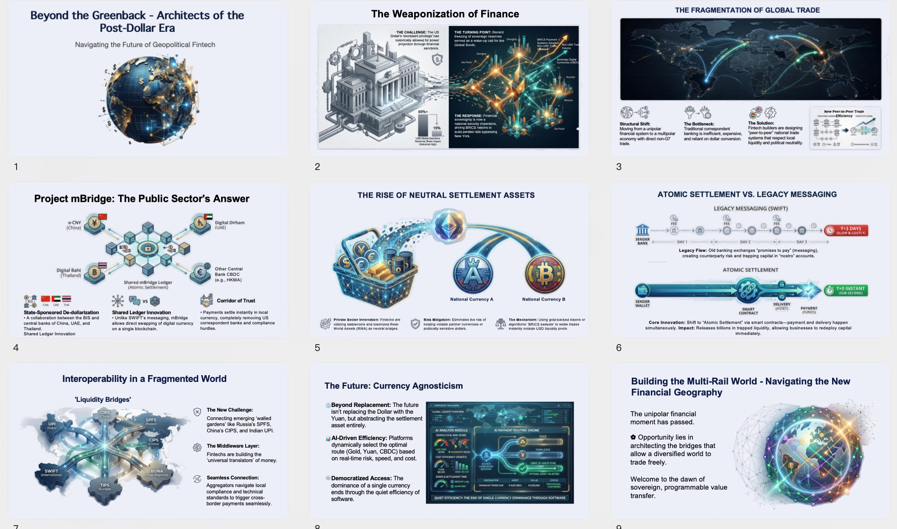
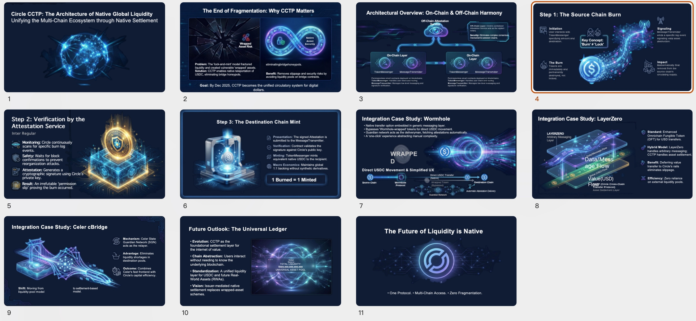
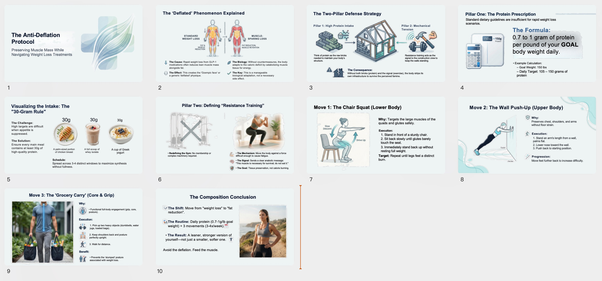
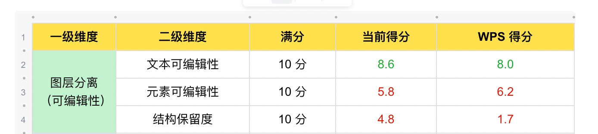
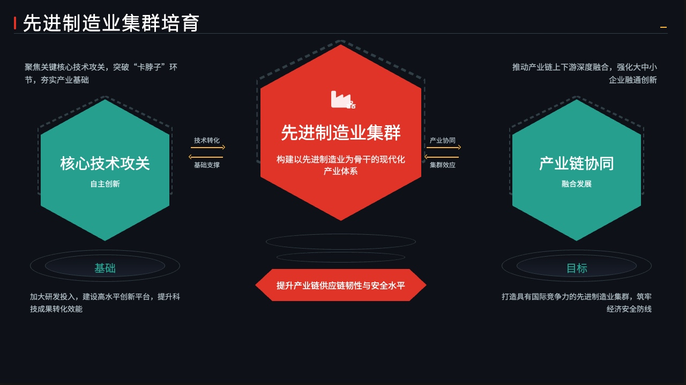
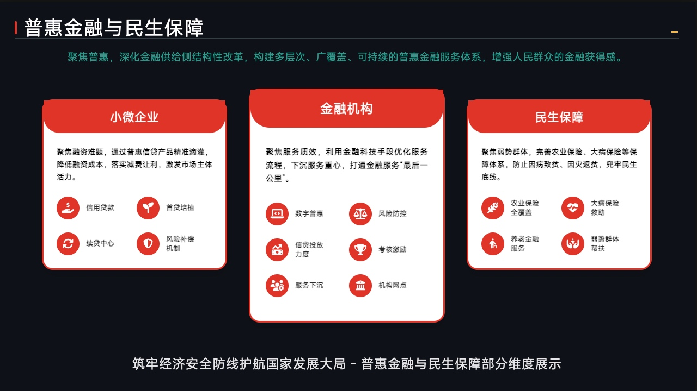

个人本周重点工作
ppt生成：包括title2ppt和word2ppt
* 图片PPT编辑能力：
    * 海外版本
      * 已开始工程化开发，ocr-vl部署、图像分割sam3部署，部署已完成，批量跑数据压测稳定性，已上线；
      * 适配海报等场景，包括艺术字识别（艺术字保留）、文字旋转等，根据产品提供批量数据，评估效果符合预期，已上线

    * 国内版本
      * 目前整体效果汇总：
        * 1. 仅评估文库生图+拆图整体，平均分 79.8 分（满分 100）
        * 2. 拆图部分：对比文库和 WPS，文库优于 WPS -- 19.2 分 VS 15.9 分（满分 30 分）
        * 3. 生图部分：对比竞品Coze和AIPPT的 GSB 效果
          * 文库 : AIPPT = 19:0:2
          * 文库 : Coze = 8:23:4
        * 基于seedream4.5生成，问题主要有背景不依从，内容乱码，内容重复，解决重复问题，加入后处理识别策略，已优化一版，新版待送评
        * 调研seedream5.0效果，自评文字重复、乱码更低、排版不合理 Seedream4.5 vs 5.0 vs qwen-image-2
      * 分层效果
        * 业务接入ppt落地页单独功能模块，工程化开发已完成，联调中，策略已开发完成并上线，与业务联调中。
        * 拆分效果和WPS比看了下，评估整体拆的比 优于WPS 

* 传统PPT：
  * 布局摸底评估进行中，优化任务砍头，短期：模板出现过度裁剪的减少出现，已上线10%小流量；本周回收后验结果后评估推全
  * 调研主体识别策略，对比yolo26和Qwen3-VL-8B-Instruct；初步看Qwen3-VL-8B-Instruct效果优于yolo26；跑批量数据稳定后送评

* PPT智能体：
  * ppt 生成&美化链路前后端梳理
  * 指令生成注入上下文信息，评估效果中，基于搜索文档、用户上传文档，做相关性过滤，大纲依从性改造，已上线
    * 用户指定配图问题，接入理解模块，提取配图信息；
    * 接入htmlppt，已上线一版
  * html上线后，复杂query效果测试，已送评一版数据。
    * 启动router开发改造，做指令、文档、美化等生成场景分流优化，美化通路离线跑通。
  * agentskill调研：kimi cli、ms-agent、agentscope、open-code、openhands；均已跑通，做工程化模块拆解中；
    * pptskill标准化开发中，预计3.3号出一版数据
* aicoding：
  * 2期目前已上线44个垂类，后验订单1800单/日，峰值达到3000单/日，预计Q1上线100+垂类
  * 适配网盘投放页面生成，已初步跑通，测试中

* 国内端到端生成
  * 优化生成效果，高度控制、美观度、内容排版稳定性，目前高度控制稳定性在99%以上，联网搜索、配图相关性优化。已对比竞品kimi、天宫、智谱对比评估，整体优于竞品。【结论】html-ppt 横向评估一期，已在落地页全量上线；后续会端到端回归全链路效果，包括生成效果、导出效果、耗时，对齐后给出结论
  * 优化内容逻辑性，通过RAG逻辑风格参考，收集101套；增强内容生成逻辑性.
  * 配色使用线上传统ppt的色系库，产出一版数据，自评后送评

[10_核电项目与前序项目.html]
[25_制作一份结构清晰、内容专业的PPT.html]

  * 调研特殊页使用艺术字+背景生图生成，已出一版

* 初步调研kimi k2.5效果：
  * kimik2.5视觉风格更优
  * 高度控制基本持平
  * 排版上kimik2.5弱于glm4.7，初步判断可以通过策略手段优化
* 针对kimik2.5，已优化一版策略，自评正向，已送评
chatglm4.7
kimi k2.5

  * 参考海报、ppt截图等风格生成，整体策略逻辑：1、基于截图还原html风格；2、给到截图还原风格描述，预计2.28产出批量数据

效果：

  * 美观度优化，参考cavans爬取模板140+，参考风格品味，高度控制（做高度等比缩放，宽度自动拉伸）优化一版策略。

  * 文档端到端严格依从：
    * 依从文档，跑通从 bdjson -- 解析文本 -- 文本拆块 -- 为每块生成ppt 的链路，初版数据布局多样性较少，优化内容排版多样性，已送评一版数据20260123
      1. bdjson 解析文本同时解析出文档中图片信息，原图利用，走美化相同生成逻辑
      2. 优化内容排版一致性、加强内容紧凑排版
      3. 适配chatglm，加库内背景图优化，页面排版已优化一版，对比 WPS：23:7:0，显著优于竞品WPS；评估结论文档：20260123
        a. 针对模板同质化问题、单页内容过多情况展示溢出页面问题、布局排版对齐问题等优化一版策略，新版数据已送评，对齐结论后同步
        b. 策略工程化开发，预计3月中旬业务上线
        c. 基于k2.5模型，跑新版数据，待送评
      4. 适配用户上传风格截图等优化一版策略，待出批量数据评估

    * 效果如下：
原文档：

生成后：

  * 文档演绎版本：
    * 基于文档解析、大纲生成、内容拆块、html渲染等链路出一版数据，并上线，case如下：

  * PPT美化
    * 严格保持页面内容，调整美化布局，基于html技术方案和传统ppt生成调研效果
      * 基于html链路迁移海外美化流程，适配chatglm，策略适配出一版效果，针对用户访谈case批量数据访谈美化case对比20260112
        * 针对内容排版逻辑性、无意义背景图片通过qwen-vl增加过滤逻辑等优化一版策略；20260202数据
        * 工程化开发，联调，预计2.27提测
        * kimi k2.5效果调研中，预计本周出一版结论
原始ppt：

添加逻辑图美化后：

PPT出海
端到端生成：
* PPT指令端到端生成：
  * 基于Gemini3Falsh调整了一版简约版本效果，针对布局重复和视觉杂乱问题进行了优化：

  * 参考模版，已经整理目前积累的所有海外可画模版，共172套 已经给pm挑选分类。

  * 打通htmlai编辑链路，包括整体自然语言指令修改和框选局部修改；待跟产品 对齐节奏
  * PPT美化，适配用户选中风格模板生成，已上线
  * HMTL和美化导出率在2月5日前后线下降再回升，主要是投放量的波动。

  * 简单学习，适配音、视频、链接转思维导图、记忆卡片、测试题、PPT，策略适配，预计3月中旬上线