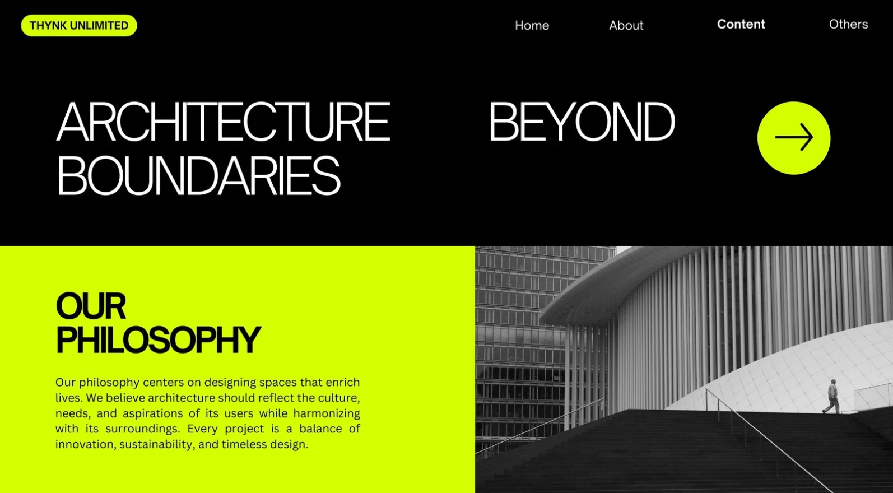
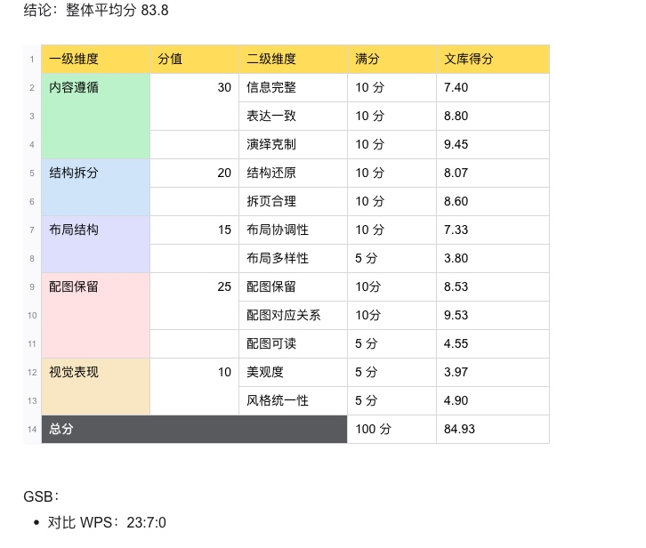
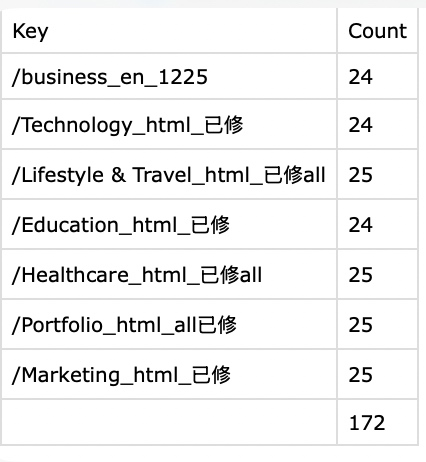
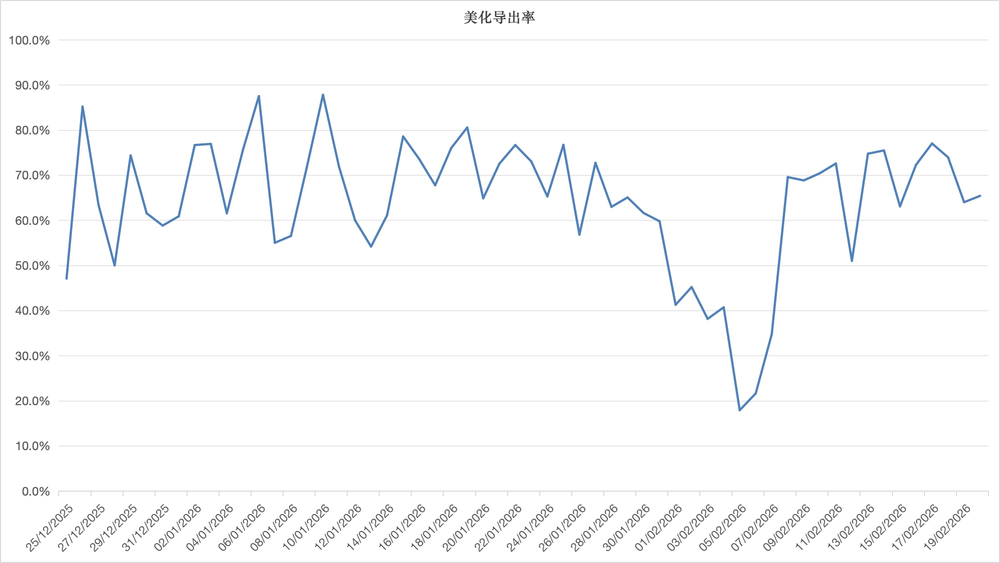

# 个人本周重点工作

本周主要围绕 PPT 生成相关能力开展各项工作，包括图片 PPT 编辑、传统 PPT、PPT 智能体、端到端生成等多个方向的工程化开发和效果优化。

---

## 一、PPT 生成

### 1.1 图片 PPT 编辑能力

#### 海外版本

工程化开发已启动，完成了 ocr-vl 部署和图像分割 sam3 部署，批量跑数据压测稳定性后已上线。在适配海报等场景方面进行了优化，包括艺术字识别（艺术字保留）、文字旋转等，根据产品提供的批量数据评估效果符合预期，已上线。

[ppt50](assets/ppt50-merged.pptx)
[ppt52](assets/ppt52-merged.pptx)
[ppt53](assets/ppt53-merged.pptx)
#### 国内版本

**整体效果汇总：**

1. 仅评估文库生图+拆图整体，平均分 79.8 分（满分 100）
2. 拆图部分：对比文库和 WPS，文库优于 WPS 19.2 分 VS 15.9 分（满分 30 分）
3. 生图部分：对比竞品 Coze 和 AIPPT 的 GSB 效果
   - 文库 : AIPPT = 19:0:2
   - 文库 : Coze = 8:23:4

基于 seedream4.5 生成，问题主要有背景不依从、内容乱码、内容重复。目前已解决重复问题，加入后处理识别策略，已优化一版，新版待送评。同时调研了 seedream5.0 效果，自评文字重复、乱码更低、排版不合理，对比了 Seedream4.5 vs 5.0 vs qwen-image-2。

**分层效果：**

业务接入 ppt 落地页单独功能模块，工程化开发已完成，联调中，策略已开发完成并上线，与业务联调中。拆分效果和 WPS 比看了下，评估整体拆的比 WPS 优秀。

---

### 1.2 传统 PPT

布局摸底评估进行中，优化任务砍头，短期：模板出现过度裁剪的减少出现，已上线 10% 小流量；本周回收后验结果后评估推全。

调研主体识别策略，对比 yolo26 和 Qwen3-VL-8B-Instruct；初步看 Qwen3-VL-8B-Instruct 效果优于 yolo26；跑批量数据稳定后送评。

---

### 1.3 PPT 智能体

**生成链路梳理：**

ppt 生成&美化链路前后端已梳理完成。

**指令生成：**

注入上下文信息，评估效果中，基于搜索文档、用户上传文档，做相关性过滤，大纲依从性改造，已上线。用户指定配图问题，接入理解模块，提取配图信息；接入 htmlppt，已上线一版。

html 上线后，复杂 query 效果测试，已送评一版数据。启动 router 开发改造，做指令、文档、美化等生成场景分流优化，美化通路离线跑通。

**Agent Skill 调研：**

对 kimicli、ms-agent、agentscope、open-code、openhands 均已跑通，目前做工程化模块拆解中。pptskill 标准化开发中，预计 3.3 号出一版数据。

---

### 1.4 AICoding

2 期目前已上线 44 个垂类，后验订单 1800 单/日，峰值达到 3000 单/日，预计 Q1 上线 100+ 垂类。适配网盘投放页面生成，已初步跑通，测试中。

---

### 1.5 国内端到端生成

**效果优化：**

优化生成效果，高度控制、美观度、内容排版稳定性，目前高度控制稳定性在 99% 以上，联网搜索、配图相关性优化。已对比竞品 kimi、天宫、智谱对比评估，整体优于竞品。

**结论：** html-ppt 横向评估一期，已在落地页全量上线；后续会端到端回归全链路效果，包括生成效果、导出效果、耗时，对齐后给出结论。

优化内容逻辑性，通过 RAG 逻辑风格参考，收集 101 套；增强内容生成逻辑性。配色使用线上传统 ppt 的色系库，产出一版数据，自评后送评。
[10_核电项目与前序项目对比1.施工进度_2.工效对比（钢筋、模板）_3.先进建造技术_4.人力资源。生成.html](assets/10_%E6%A0%B8%E7%94%B5%E9%A1%B9%E7%9B%AE%E4%B8%8E%E5%89%8D%E5%BA%8F%E9%A1%B9%E7%9B%AE%E5%AF%B9%E6%AF%941.%E6%96%BD%E5%B7%A5%E8%BF%9B%E5%BA%A6_2.%E5%B7%A5%E6%95%88%E5%AF%B9%E6%AF%94%EF%BC%88%E9%92%A2%E7%AD%8B%E3%80%81%E6%A8%A1%E6%9D%BF%EF%BC%89_3.%E5%85%88%E8%BF%9B%E5%BB%BA%E9%80%A0%E6%8A%80%E6%9C%AF_4.%E4%BA%BA%E5%8A%9B%E8%B5%84%E6%BA%90%E3%80%82%E7%94%9F%E6%88%90.html)
[25_制作一份结构清晰、内容专业的PPT演示文稿。您可以将以下内容直接复制到PPT模板中，每张幻灯片一个部.html](assets/25_%E5%88%B6%E4%BD%9C%E4%B8%80%E4%BB%BD%E7%BB%93%E6%9E%84%E6%B8%85%E6%99%B0%E3%80%81%E5%86%85%E5%AE%B9%E4%B8%93%E4%B8%9A%E7%9A%84PPT%E6%BC%94%E7%A4%BA%E6%96%87%E7%A8%BF%E3%80%82%E6%82%A8%E5%8F%AF%E4%BB%A5%E5%B0%86%E4%BB%A5%E4%B8%8B%E5%86%85%E5%AE%B9%E7%9B%B4%E6%8E%A5%E5%A4%8D%E5%88%B6%E5%88%B0PPT%E6%A8%A1%E6%9D%BF%E4%B8%AD%EF%BC%8C%E6%AF%8F%E5%BC%A0%E5%B9%BB%E7%81%AF%E7%89%87%E4%B8%80%E4%B8%AA%E9%83%A8.html)

调研特殊页使用艺术字+背景生图生成，已出一版。

**模型效果对比：**

初步调研 kimi k2.5 效果：kimik2.5 视觉风格更优；高度控制基本持平；排版上 kimik2.5 弱于 glm4.7，初步判断可以通过策略手段优化。针对 kimik2.5，已优化一版策略，自评正向，已送评。

- chatglm4.7 案例：
  - [19_中深层地热资源PPT核心框架（4大模块）__一、基础认知：资源界定与分布格局__•+明确中深层地热资.html](assets/19_%E4%B8%AD%E6%B7%B1%E5%B1%82%E5%9C%B0%E7%83%AD%E8%B5%84%E6%BA%90PPT%E6%A0%B8%E5%BF%83%E6%A1%86%E6%9E%B6%EF%BC%884%E5%A4%A7%E6%A8%A1%E5%9D%97%EF%BC%89__%E4%B8%80%E3%80%81%E5%9F%BA%E7%A1%80%E8%AE%A4%E7%9F%A5%EF%BC%9A%E8%B5%84%E6%BA%90%E7%95%8C%E5%AE%9A%E4%B8%8E%E5%88%86%E5%B8%83%E6%A0%BC%E5%B1%80__%E2%80%A2+%E6%98%8E%E7%A1%AE%E4%B8%AD%E6%B7%B1%E5%B1%82%E5%9C%B0%E7%83%AD%E8%B5%84.html)

  - [14_帮我生成一个关于大疆产品介绍的PPT，嗯，介绍大疆最新几款机器的功能，附带有最新的图片。+-2-.html](assets/14_%E5%B8%AE%E6%88%91%E7%94%9F%E6%88%90%E4%B8%80%E4%B8%AA%E5%85%B3%E4%BA%8E%E5%A4%A7%E7%96%86%E4%BA%A7%E5%93%81%E4%BB%8B%E7%BB%8D%E7%9A%84PPT%EF%BC%8C%E5%97%AF%EF%BC%8C%E4%BB%8B%E7%BB%8D%E5%A4%A7%E7%96%86%E6%9C%80%E6%96%B0%E5%87%A0%E6%AC%BE%E6%9C%BA%E5%99%A8%E7%9A%84%E5%8A%9F%E8%83%BD%EF%BC%8C%E9%99%84%E5%B8%A6%E6%9C%89%E6%9C%80%E6%96%B0%E7%9A%84%E5%9B%BE%E7%89%87%E3%80%82+(2).html)

- kimi k2.5 案例：
  - [19_中深层地热资源PPT核心框架（4大模块）__一、基础认知：资源界定与分布格局__•+明确中深层地热资+-1-.html](assets/19_%E4%B8%AD%E6%B7%B1%E5%B1%82%E5%9C%B0%E7%83%AD%E8%B5%84%E6%BA%90PPT%E6%A0%B8%E5%BF%83%E6%A1%86%E6%9E%B6%EF%BC%884%E5%A4%A7%E6%A8%A1%E5%9D%97%EF%BC%89__%E4%B8%80%E3%80%81%E5%9F%BA%E7%A1%80%E8%AE%A4%E7%9F%A5%EF%BC%9A%E8%B5%84%E6%BA%90%E7%95%8C%E5%AE%9A%E4%B8%8E%E5%88%86%E5%B8%83%E6%A0%BC%E5%B1%80__%E2%80%A2+%E6%98%8E%E7%A1%AE%E4%B8%AD%E6%B7%B1%E5%B1%82%E5%9C%B0%E7%83%AD%E8%B5%84+(1).html)

  - [14_帮我生成一个关于大疆产品介绍的PPT，嗯，介绍大疆最新几款机器的功能，附带有最新的图片。+-1-.html](assets/14_%E5%B8%AE%E6%88%91%E7%94%9F%E6%88%90%E4%B8%80%E4%B8%AA%E5%85%B3%E4%BA%8E%E5%A4%A7%E7%96%86%E4%BA%A7%E5%93%81%E4%BB%8B%E7%BB%8D%E7%9A%84PPT%EF%BC%8C%E5%97%AF%EF%BC%8C%E4%BB%8B%E7%BB%8D%E5%A4%A7%E7%96%86%E6%9C%80%E6%96%B0%E5%87%A0%E6%AC%BE%E6%9C%BA%E5%99%A8%E7%9A%84%E5%8A%9F%E8%83%BD%EF%BC%8C%E9%99%84%E5%B8%A6%E6%9C%89%E6%9C%80%E6%96%B0%E7%9A%84%E5%9B%BE%E7%89%87%E3%80%82+(1).html)

**风格参考生成：**

参考海报、ppt 截图等风格生成，整体策略逻辑：
1. 基于截图还原 html 风格
2. 给到截图还原风格描述

预计 2.28 产出批量数据。

**效果展示：**

- [12_page_6_中学英语知识点教学设计及课堂展示ppt.html](assets/12_page_6_%E4%B8%AD%E5%AD%A6%E8%8B%B1%E8%AF%AD%E7%9F%A5%E8%AF%86%E7%82%B9%E6%95%99%E5%AD%A6%E8%AE%BE%E8%AE%A1%E5%8F%8A%E8%AF%BE%E5%A0%82%E5%B1%95%E7%A4%BAppt.html)

- 美观度优化，参考 canvas 爬取模板 140+，参考风格品味，高度控制（做高度等比缩放，宽度自动拉伸）优化一版策略。
- [11_12.html](assets/11_12.html)

---

### 1.6 文档端到端严格依从

依从文档，跑通从 bdjson 解析文本、文本拆块、为每块生成 ppt 的链路，初版数据布局多样性较少，优化内容排版多样性，已送评一版数据 20260123。

1. bdjson 解析文本同时解析出文档中图片信息，原图利用，走美化相同生成逻辑
2. 优化内容排版一致性、加强内容紧凑排版
3. 适配 chatglm，加库内背景图优化，页面排版已优化一版，对比 WPS：23:7:0，显著优于竞品 WPS；评估结论文档：20260123
   - 针对模板同质化问题、单页内容过多情况展示溢出页面问题、布局排版对齐问题等优化一版策略，新版数据已送评，对齐结论后同步
   - 策略工程化开发，预计 3 月中旬业务上线
   - 基于 k2.5 模型，跑新版数据，待送评
4. 适配用户上传风格截图等优化一版策略，待出批量数据评估

**效果如下：**

原文档：[db063423da80d4d8d15abe23482fb4daa58d1d26.doc](assets/db063423da80d4d8d15abe23482fb4daa58d1d26.doc)

生成后：[merged_车间管理系统课程设计报告1.html](assets/merged_%E8%BD%A6%E9%97%B4%E7%AE%A1%E7%90%86%E7%B3%BB%E7%BB%9F%E8%AF%BE%E7%A8%8B%E8%AE%BE%E8%AE%A1%E6%8A%A5%E5%91%8A1.html)

**文档演绎版本：**

基于文档解析、大纲生成、内容拆块、html 渲染等链路出一版数据，并上线，case 如下：[word2ppt_0210.html](assets/word2ppt_0210.html)

---

### 1.7 PPT 美化

严格保持页面内容，调整美化布局，基于 html 技术方案和传统 ppt 生成调研效果。

基于 html 链路迁移海外美化流程，适配 chatglm，策略适配出一版效果，针对用户访谈 case 批量数据访谈美化 case 对比 20260112。

针对内容排版逻辑性、无意义背景图片通过 qwen-vl 增加过滤逻辑等优化一版策略；20260202 数据。工程化开发，联调，预计 2.27 提测。kimik2.5 效果调研中，预计本周出一版结论。

**效果展示：**

原始 ppt：[case_26_美化前_0121.html](assets/case_26_%E7%BE%8E%E5%8C%96%E5%89%8D_0121.html)

添加逻辑图美化后：[case_26_美化后_0121.html](assets/case_26_%E7%BE%8E%E5%8C%96%E5%90%8E_0121.html)

---

## 二、PPT 出海

### 2.1 端到端生成

**PPT 指令端到端生成：**

基于 Gemini3Falsh 调整了一版简约版本效果，针对布局重复和视觉杂乱问题进行了优化。

- [_examine+the+major+of+the+biogeochemical+cycles+in+.html](assets/_examine+the+major+of+the+biogeochemical+cycles+in+.html)

- [0202_3flash_demo.tar](assets/0202_3flash_demo.tar)

**模板整理：**

参考模版，已经整理目前积累的所有海外可画模版，共 172 套，已经给 pm 挑选分类。

- [0130_oversea.zip](assets/0130_oversea.zip)

- 

**编辑能力：**

打通 htmlai 编辑链路，包括整体自然语言指令修改和框选局部修改；待跟产品对齐节奏。

**美化能力：**

PPT 美化，适配用户选中风格模板生成，已上线。

**导出率数据：**

HTML 和美化导出率在 2 月 5 日前后线下降再回升，主要是投放量的波动。

---

### 2.2 简单学习

适配音、视频、链接转思维导图、记忆卡片、测试题、PPT，策略适配，预计 3 月中旬上线。

---

*(End of file)*
